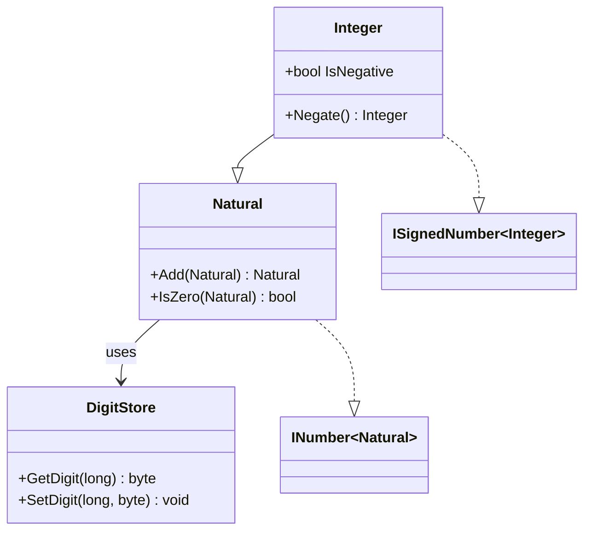

#file:.github/prompts/legacy-knowledge-map.md
#file:.github/prompts/skill-falsify-claims.prompt.md

# Skill: Implementation Completeness

## Purpose
Given a C++ class name, read the corresponding `.hpp` and `.cpp` files from `Legacy/`, map every public method and operator overload to its C# equivalent (including the .NET interface it satisfies), flag stubs or missing implementations, and produce a completeness checklist with a Mermaid class diagram.

## Input (supplied by caller)

```
CppClass:    <C++ class name, e.g. InteiroLovelace>
CsProject:   <Target C# project, e.g. Lovelace.Integer>
```

## Procedure

### Step 1 — Read the legacy source

Read `Legacy/<CppClass>.hpp` and `Legacy/<CppClass>.cpp` in full.  
List every **public** method and operator overload found in the header.

### Step 2 — Read the C# counterpart

Read all `*.cs` files in `<CsProject>/`.  
Note which methods already exist and which are stubs (empty body, `throw new NotImplementedException()`, or missing entirely).

### Step 3 — Build the mapping table

For each C++ public method:

| C++ Method | C# Equivalent | .NET Interface | Status |
|---|---|---|---|
| `somar(B)` | `Add(B)` / `operator+` | `IAdditionOperators<T,T,T>` | ⬜ Missing |
| `eZero()` | `static IsZero(T)` | `INumber<T>` | ✅ Implemented |
| ... | ... | ... | ... |

Use these status symbols:
- ✅ **Implemented** — full implementation exists in C#
- 🔧 **Stub** — method exists but body is empty or throws `NotImplementedException`
- ⬜ **Missing** — no C# counterpart found

Also flag any C++ methods that are themselves stubs (empty body or TODO comment in the `.cpp`).

### Step 4 — Run Falsify Claims on each mapping

Collect every "C++ method X maps to C# method Y" claim as a numbered list and invoke the Falsify Claims skill.  
Revise any Falsified mappings and repeat until zero Falsified rows remain.

### Step 5 — Produce the Mermaid class diagram

Generate a Mermaid `classDiagram` showing:
- `Lovelace.Representation` as the base storage layer
- The full C# class hierarchy (`Natural` → `Integer` → `Real`)
- All .NET interfaces implemented by each class
- The target class highlighted

Example skeleton:



### Step 6 — Produce the checklist

Output a markdown checklist of every missing or stub method, in dependency order (simpler / prerequisite methods first):

```
## Completeness Checklist for `InteiroLovelace` → `Lovelace.Integer`

- [ ] `IsZero` (static predicate — `INumber<T>`) [prerequisite for many others]
- [ ] `Add(Integer)` → `operator+` (`IAdditionOperators<T,T,T>`)
- [ ] `Subtract(Integer)` → `operator-` (`ISubtractionOperators<T,T,T>`)
- [ ] `Negate()` → unary `operator-` (`IUnaryNegationOperators<T,T>`)
...
```

## Output

1. Mapping table (after Falsify Claims passes)
2. Mermaid class diagram
3. Completeness checklist (unchecked items only, ordered by dependency)
