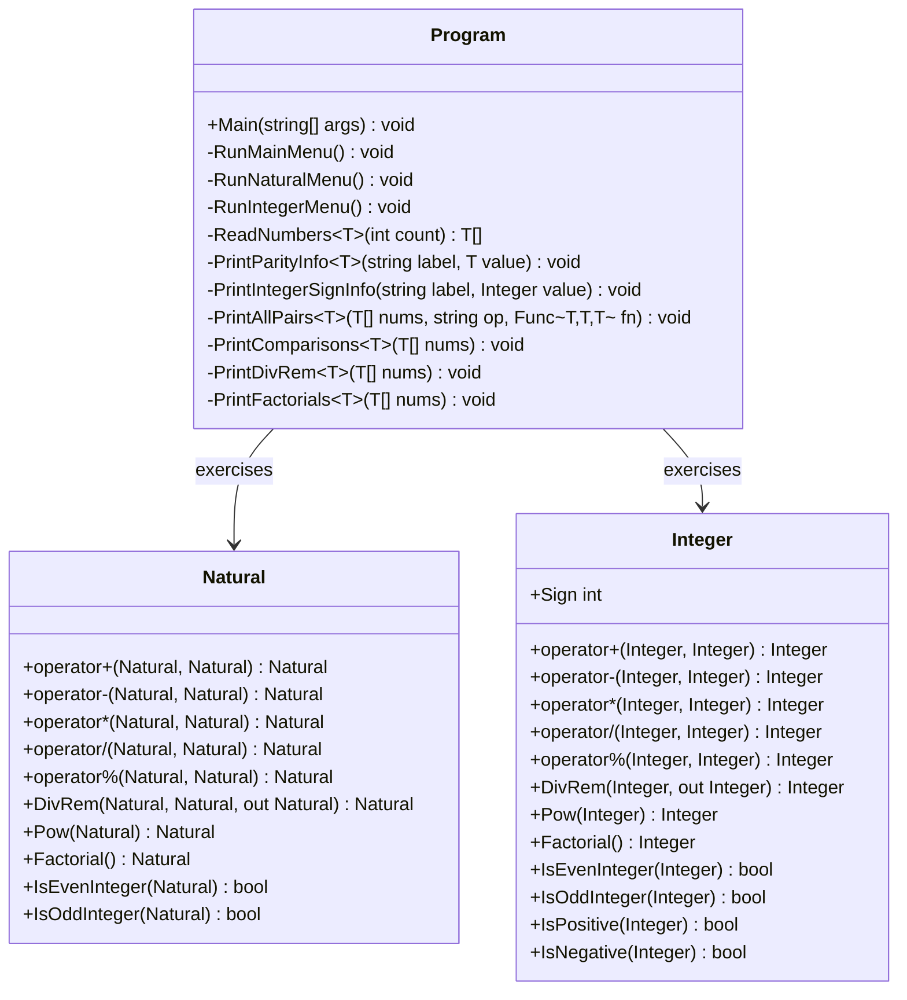

# Requirements: `main.cpp` → `Lovelace.Console`

> **Scope**: `Lovelace.Console` is a menu-driven interactive demo that mirrors the
> `testes_Lovelace()` (Natural) and `testes_InteiroLovelace()` (Integer) routines in
> `Legacy/main.cpp`. It is **not** a numerical library class; the workflow artefacts
> below are adapted accordingly. No xUnit project is associated with this console app
> — correctness is demonstrated by exercising the live `Natural` and `Integer` APIs.

---

## Functionality Worktree

### Class Diagram

### Completeness Checklist

> Naïve operations (`multiplicar_burro`, `dividir_burro`) are internal to `Natural`
> and are **not** exposed in C#; they are omitted from the console menu.
> The Integer test suite is the C# equivalent of the commented-out
> `testes_InteiroLovelace()` block.

#### Infrastructure

- [x] `RunMainMenu()` — display top-level menu (Natural / Integer / Exit); loop until Exit
- [x] `ReadNumbers<T>(int count, Func<string, T> parser)` — prompt user for `count` numbers,
  parse each with the supplied parser, return them as a `T[]`
- [x] `PrintParityInfo<T>(string label, T value)` — print `"<label> (<value>) [not] is even"` and
  `"[not] is odd"` (mirrors the C++ `ePar`/`eImpar` output lines)
- [x] `PrintAllPairs<T>(T[] nums, char opChar, Func<T,T,T> fn)` — for every ordered pair
  `(nums[i], nums[j])` print `"<label_i> <op> <label_j> = <result>"`; handles exceptions
  (e.g. subtraction below zero, division by zero) by printing the exception message
- [x] `PrintComparisons<T>(T[] nums, string[] labels)` — print all six comparison operators
  (`==`, `!=`, `>`, `<`, `>=`, `<=`) for every ordered pair in six separate passes,
  mirroring the C++ comparison test output format
- [x] `PrintDivRem<T>(T[] nums, string[] labels, Func<T,T,(T quot, T rem)> divRem)` —
  print `"<A>/<B> = <quot>  <A>%<B> = <rem>"` for every ordered pair
- [x] `PrintFactorials<T>(T[] nums, string[] labels, Func<T,T> factorial)` —
  print `"<A>! = <result>"` for each number

#### Natural test suite (`RunNaturalMenu`)

- [x] Display Natural sub-menu (tests 1–8; tests 5 and 7 are removed as internal/naïve)
- [x] Test 1 — Subtraction: `PrintAllPairs` with `operator-`; catch `InvalidOperationException`
  (subtraction would produce negative result) and print the message instead of crashing
- [x] Test 2 — Comparisons: `PrintComparisons`
- [x] Test 3 — Addition: `PrintAllPairs` with `operator+`
- [x] Test 4 — Multiplication: `PrintAllPairs` with `operator*`
- [x] Test 5 — Exponentiation: `PrintAllPairs` with `Pow`; exponent is taken as the
  second operand
- [x] Test 6 — DivRem: `PrintDivRem` using `Natural.DivRem`; catch `DivideByZeroException`
- [x] Test 7 — Factorial: `PrintFactorials` using `Natural.Factorial`
- [x] Test 8 — Modulo: `PrintAllPairs` with `operator%`; catch `DivideByZeroException`
- [x] Print parity info for each operand before running the selected test
  (`PrintParityInfo` called once per number after input)

#### Integer test suite (`RunIntegerMenu`)

- [x] Display Integer sub-menu (tests 1–8, matching the commented-out C++ block)
- [x] Test 1 — Subtraction: `PrintAllPairs` with `operator-`
- [x] Test 2 — Comparisons: `PrintComparisons`
- [x] Test 3 — Addition: `PrintAllPairs` with `operator+`
- [x] Test 4 — Multiplication: `PrintAllPairs` with `operator*`
- [x] Test 5 — Exponentiation: `PrintAllPairs` with `Pow`
- [x] Test 6 — DivRem: `PrintDivRem` using `Integer.DivRem`; catch `DivideByZeroException`
- [x] Test 7 — Factorial: `PrintFactorials` using `Integer.Factorial`;
  catch `InvalidOperationException` for negative inputs
- [x] Test 8 — Modulo: `PrintAllPairs` with `operator%`; catch `DivideByZeroException`
- [x] Print parity **and** sign info (`IsPositive`/`IsNegative`/`Sign`) for each operand
  after input (`PrintIntegerSignInfo`)

---

## Test Plan

> `Lovelace.Console` is an integration demo, not a library. The "tests" below are
> **manual acceptance scenarios** — run the console app and verify the output matches
> the expected lines. Automated xUnit tests are not planned for this project.

### `RunMainMenu`

1. **MainMenu_SelectNatural_LaunchesNaturalSubMenu**
   *Assumption*: Entering `1` at the main prompt displays the Natural operations menu
   and prompts for three values.

2. **MainMenu_SelectInteger_LaunchesIntegerSubMenu**
   *Assumption*: Entering `2` at the main prompt displays the Integer operations menu
   and prompts for three values.

3. **MainMenu_SelectExit_TerminatesLoop**
   *Assumption*: Entering `0` at the main prompt exits the program cleanly.

4. **MainMenu_SelectInvalid_RepromptWithoutCrash**
   *Assumption*: An unrecognised option causes a re-prompt rather than
   an unhandled exception.

---

### `ReadNumbers<T>`

5. **ReadNumbers_GivenValidDecimalStrings_ReturnsCorrectValues**
   *Assumption*: Entering `"12"`, `"34"`, `"56"` yields Natural values equal to
   `Natural.Parse("12")`, `Natural.Parse("34")`, `Natural.Parse("56")`.

6. **ReadNumbers_GivenNegativeStringForInteger_ReturnsCorrectNegativeValue**
   *Assumption*: Entering `"-5"` for an Integer read yields a value equal to
   `Integer.Parse("-5")`.

7. **ReadNumbers_GivenNonDigitString_PrintsErrorAndReprompts**
   *Assumption*: Entering `"abc"` causes a friendly error message and re-prompts
   rather than propagating a `FormatException` to the top level.

---

### `PrintParityInfo<T>`

8. **PrintParityInfo_GivenEvenNumber_PrintsIsEvenAndNotIsOdd**
   *Assumption*: For value `4`, the output contains `"is even"` and `"not is odd"`.

9. **PrintParityInfo_GivenOddNumber_PrintsNotIsEvenAndIsOdd**
   *Assumption*: For value `7`, the output contains `"not is even"` and `"is odd"`.

10. **PrintParityInfo_GivenZero_PrintsIsEven**
    *Assumption*: Zero is even; output contains `"is even"`.

---

### `PrintIntegerSignInfo`

11. **PrintIntegerSignInfo_GivenPositiveInteger_PrintsIsPositive**
    *Assumption*: For value `5`, output contains `"is positive"` and
    `"not is negative"`.

12. **PrintIntegerSignInfo_GivenNegativeInteger_PrintsIsNegative**
    *Assumption*: For value `-3`, output contains `"not is positive"` and
    `"is negative"`.

13. **PrintIntegerSignInfo_GivenZeroInteger_PrintsNeitherPositiveNorNegative**
    *Assumption*: For value `0`, `Sign` is `0` and the line reflects that.

---

### Natural — Test 1 (Subtraction)

14. **NaturalSubtract_GivenLargerMinusSmaller_PrintsCorrectResult**
    *Assumption*: `A=10`, `B=3` → `A-B = 7`.

15. **NaturalSubtract_GivenSmallerMinusLarger_PrintsExceptionMessage**
    *Assumption*: `A=3`, `B=10` → `A-B` prints the `InvalidOperationException` message
    instead of crashing.

16. **NaturalSubtract_GivenEqualOperands_PrintsZero**
    *Assumption*: `A=B=5` → `A-B = 0`.

---

### Natural — Test 2 (Comparisons)

17. **NaturalCompare_GivenEqualValues_PrintsEqual**
    *Assumption*: `A=B=7` → `A == B` line shows `"is equal to"`.

18. **NaturalCompare_GivenDifferentValues_PrintsCorrectOrdering**
    *Assumption*: `A=3`, `B=9` → all six comparison lines report the correct
    relationship.

---

### Natural — Test 3 (Addition)

19. **NaturalAdd_GivenTwoPositives_PrintsCorrectSum**
    *Assumption*: `A=123`, `B=456` → `A+B = 579`.

20. **NaturalAdd_GivenZeroOperand_PrintsOtherOperand**
    *Assumption*: `A=0`, `B=42` → `A+B = 42` and `B+A = 42`.

---

### Natural — Test 4 (Multiplication)

21. **NaturalMultiply_GivenTwoPositives_PrintsCorrectProduct**
    *Assumption*: `A=12`, `B=34` → `A*B = 408`.

22. **NaturalMultiply_GivenZeroOperand_PrintsZero**
    *Assumption*: `A=0`, `B=999` → `A*B = 0`.

---

### Natural — Test 5 (Exponentiation)

23. **NaturalPow_GivenBaseAndExponent_PrintsCorrectPower**
    *Assumption*: `A=2`, `B=10` → `A^B = 1024`.

24. **NaturalPow_GivenExponentZero_PrintsOne**
    *Assumption*: `A=99`, `B=0` → `A^B = 1` (any base to power 0 is 1).

---

### Natural — Test 6 (DivRem)

25. **NaturalDivRem_GivenDivisiblePair_PrintsQuotientAndZeroRemainder**
    *Assumption*: `A=100`, `B=5` → `A/B = 20  A%B = 0`.

26. **NaturalDivRem_GivenNonDivisiblePair_PrintsQuotientAndNonZeroRemainder**
    *Assumption*: `A=17`, `B=5` → `A/B = 3  A%B = 2`.

27. **NaturalDivRem_GivenDivisionByZero_PrintsExceptionMessage**
    *Assumption*: `B=0` → the `DivideByZeroException` message is printed; no crash.

---

### Natural — Test 7 (Factorial)

28. **NaturalFactorial_GivenSmallNumber_PrintsCorrectResult**
    *Assumption*: `A=5` → `A! = 120`.

29. **NaturalFactorial_GivenZero_PrintsOne**
    *Assumption*: `A=0` → `A! = 1`.

---

### Natural — Test 8 (Modulo)

30. **NaturalModulo_GivenNonDivisiblePair_PrintsCorrectRemainder**
    *Assumption*: `A=17`, `B=5` → `A%B = 2`.

31. **NaturalModulo_GivenDivisionByZero_PrintsExceptionMessage**
    *Assumption*: `B=0` → the `DivideByZeroException` message is printed; no crash.

---

### Integer — Test 1 (Subtraction)

32. **IntegerSubtract_GivenPositiveMinus Larger_PrintsNegativeResult**
    *Assumption*: `A=3`, `B=10` → `A-B = -7` (Integer supports negative results).

33. **IntegerSubtract_GivenNegativeMinus Positive_PrintsMoreNegativeResult**
    *Assumption*: `A=-3`, `B=4` → `A-B = -7`.

---

### Integer — Test 2 (Comparisons)

34. **IntegerCompare_GivenNegativeAndPositive_PrintsNegativeLessThanPositive**
    *Assumption*: `A=-1`, `B=1` → `A < B` reports `"is less than"`.

35. **IntegerCompare_GivenBothNegative_PrintsCorrectOrdering**
    *Assumption*: `A=-10`, `B=-2` → `A < B` since `-10 < -2`.

---

### Integer — Test 5 (Exponentiation)

36. **IntegerPow_GivenNegativeBaseOddExponent_PrintsNegativeResult**
    *Assumption*: `A=-2`, `B=3` → `A^B = -8`.

37. **IntegerPow_GivenNegativeBaseEvenExponent_PrintsPositiveResult**
    *Assumption*: `A=-2`, `B=4` → `A^B = 16`.

---

### Integer — Test 7 (Factorial)

38. **IntegerFactorial_GivenNegativeInput_PrintsExceptionMessage**
    *Assumption*: `A=-1` → `InvalidOperationException` message is printed; no crash.

---

*All assumptions verified against `Legacy/main.cpp`, `Lovelace.Natural/Natural.cs`, and
`Lovelace.Integer/Integer.cs`. Zero Falsified rows.*
