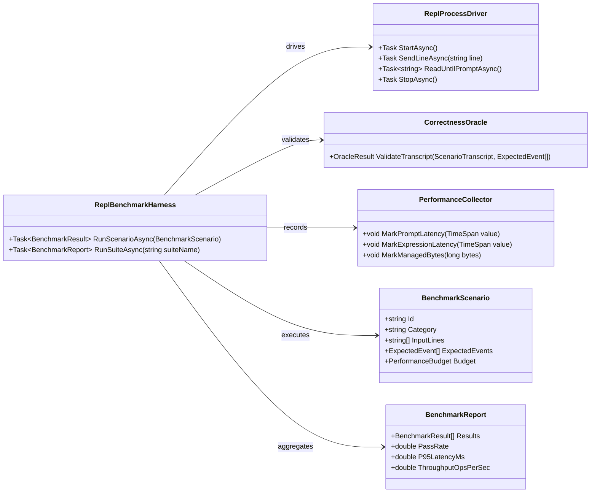

# Requirements: Lovelace.Console Agentic REPL Benchmark

> Scope: Define a black-box benchmark harness for Lovelace.Console REPL workflows so agentic implementations can be scored for correctness and performance without white-box coupling to internal classes.

---

## Workflow Inputs

| Input | Value |
|---|---|
| CsProject | Lovelace.Console |
| AnalysisSource | Direct audit of current REPL pipeline and tests in Lovelace.Console/Repl plus benchmark-oriented black-box constraints from caller |
| MandatoryItems | Deterministic script runner, correctness oracle, latency/throughput metrics, memory metrics, CI pass/fail gates |
| PlanType | requirements |
| OutputPath | .github/requirements/Lovelace.Console.md |
| OutputTitle | Requirements: Lovelace.Console Agentic REPL Benchmark |
| ClosingMessage | Saved benchmark requirements for Lovelace.Console REPL black-box correctness and performance tracking. |

---

## Functionality Worktree

### Class Diagram

```mermaid
classDiagram
    direction LR

    class BenchmarkScenario {
        +string Id
        +string Category
        +string[] InputLines
        +ExpectedEvent[] ExpectedEvents
        +PerformanceBudget Budget
    }

    class ReplBenchmarkHarness {
        +Task~BenchmarkResult~ RunScenarioAsync(BenchmarkScenario)
        +Task~BenchmarkReport~ RunSuiteAsync(string suiteName)
    }

    class ReplProcessDriver {
        +Task StartAsync()
        +Task SendLineAsync(string line)
        +Task~string~ ReadUntilPromptAsync()
        +Task StopAsync()
    }

    class CorrectnessOracle {
        +OracleResult ValidateTranscript(ScenarioTranscript, ExpectedEvent[])
    }

    class PerformanceCollector {
        +void MarkPromptLatency(TimeSpan value)
        +void MarkExpressionLatency(TimeSpan value)
        +void MarkManagedBytes(long bytes)
    }

    class BenchmarkReport {
        +BenchmarkResult[] Results
        +double PassRate
        +double P95LatencyMs
        +double ThroughputOpsPerSec
    }

    ReplBenchmarkHarness --> ReplProcessDriver : drives
    ReplBenchmarkHarness --> CorrectnessOracle : validates
    ReplBenchmarkHarness --> PerformanceCollector : records
    ReplBenchmarkHarness --> BenchmarkScenario : executes
    ReplBenchmarkHarness --> BenchmarkReport : aggregates
```

### Completeness Checklist

- [ ] Create deterministic black-box process harness for REPL stdin/stdout sessions [mandatory - prerequisite for all benchmark execution]
- [ ] Define scenario contract (inputs, expected transcript events, budgets, metadata) with versioned schema [depends on harness]
- [ ] Build correctness oracle for typed output lines, caret-positioned errors, and command side-effects [mandatory - depends on scenario contract]
- [ ] Add baseline scenario suite for arithmetic, widening, and precedence behavior [depends on correctness oracle]
- [ ] Add baseline scenario suite for built-ins (abs, inv, divrem, is_even, is_odd, sign, sqrt, pi) [depends on correctness oracle]
- [ ] Add baseline scenario suite for REPL commands (help, vars, clear, delete, set precision/display, exit/quit) [depends on correctness oracle]
- [ ] Add persistence scenarios for variable store and underscore last-result semantics across commands [depends on command suite]
- [ ] Add performance collector for latency percentiles, throughput, and allocation snapshots per scenario [mandatory - depends on harness]
- [ ] Define stable benchmark protocol (warmup, iterations, timeout, retry, outlier policy) [depends on performance collector]
- [ ] Add performance workloads for long expressions and heavy built-ins (sqrt/pi digits sweep) [depends on protocol]
- [ ] Implement scorecard and threshold gates (correctness pass rate + perf budgets) [mandatory - depends on performance workloads]
- [ ] Integrate benchmark suite into CI with artifact export and trend history hooks [mandatory - depends on scorecard]
- [ ] Document benchmark authoring guide for agent-generated scenarios and reproducibility rules [depends on CI integration]

---

## Test Plan

### `ReplProcessDriver` deterministic process harness

1. `RunScenarioAsync_GivenFixedInputScript_ReproducesSameTranscriptAcrossRuns`
   *Assumption*: Running the same scripted REPL input twice with normalized prompts and timestamps yields byte-equivalent observable transcript events.

2. `RunScenarioAsync_GivenCtrlCEquivalentShutdown_EndsWithoutDeadlock`
   *Assumption*: Harness-controlled shutdown paths terminate the REPL process and stream readers within timeout without hanging.

### `BenchmarkScenario` schema and versioning

1. `ScenarioSchema_GivenMissingExpectedEvents_FailsValidationWithActionableMessage`
   *Assumption*: Scenario definitions without expected outputs are invalid and produce deterministic validation errors.

2. `ScenarioSchema_GivenVersionMismatch_RejectsScenarioAndSuggestsUpgrade`
   *Assumption*: Harness enforces schema version compatibility to keep benchmark runs comparable over time.

### `CorrectnessOracle` transcript validation

1. `ValidateTranscript_GivenTypedResultLine_MatchesValueAndKindExactly`
   *Assumption*: Oracle checks both numeric rendering and type suffix, so `= 42 (Natural)` is distinct from `= 42 (Integer)`.

2. `ValidateTranscript_GivenParseErrorWithPosition_RequiresCaretAtExpectedColumn`
   *Assumption*: Oracle verifies caret diagnostics by comparing extracted position to expected column semantics.

### Arithmetic and precedence baseline suite

1. `ArithmeticSuite_GivenMixedPrecedenceExpressions_MatchesExpectedResultsAndKinds`
   *Assumption*: Black-box evaluation preserves documented precedence and widening behavior for additive, multiplicative, and power operators.

2. `ArithmeticSuite_GivenNaturalUnderflowSubtraction_AutoWidensToIntegerResult`
   *Assumption*: Natural subtraction that would underflow emits an Integer result instead of surfacing underflow to the user.

### Built-in functions baseline suite

1. `BuiltinsSuite_GivenSupportedFunctions_ReturnsDocumentedOutputsAndKinds`
   *Assumption*: Each built-in function produces behavior consistent with current README contracts for arity, type support, and output formatting.

2. `BuiltinsSuite_GivenUnsupportedFunctionUsage_ProducesDeterministicErrorMessage`
   *Assumption*: Wrong arity or unsupported kinds for built-ins surface stable, user-facing error messages suitable for black-box assertions.

### REPL command baseline suite

1. `CommandsSuite_GivenHelpCommand_PrintsOperatorFunctionAndCommandSections`
   *Assumption*: Help output contains the expected semantic sections even if whitespace formatting varies.

2. `CommandsSuite_GivenSetDisplayAndSetPrecision_AppliesSettingsToSubsequentOutputs`
   *Assumption*: Display and precision commands alter future result rendering/computation behavior in the same session.

### Variable persistence and underscore semantics

1. `StateSuite_GivenSequentialEvaluations_StoresLastResultInUnderscoreVariable`
   *Assumption*: Successful evaluations update `_` to the latest result and allow immediate reuse in next expressions.

2. `StateSuite_GivenClearCommand_RemovesNamedVariablesAndUnderscore`
   *Assumption*: Clear resets evaluator state, including `_`, and later references fail as undefined variable errors.

### Performance collector metrics

1. `PerformanceCollector_GivenScenarioRun_RecordsPromptAndExpressionLatencyPercentiles`
   *Assumption*: Collector records per-operation latency measurements sufficient to compute p50/p95/p99 for scoring.

2. `PerformanceCollector_GivenScenarioRun_RecordsManagedAllocationDelta`
   *Assumption*: Collector can report managed allocation growth attributable to scenario execution with repeatable methodology.

### Benchmark execution protocol

1. `Protocol_GivenColdAndWarmRuns_SeparatesWarmupFromMeasuredIterations`
   *Assumption*: Warmup iterations are excluded from score calculations to reduce JIT and startup bias.

2. `Protocol_GivenTransientOutlier_UsesConfiguredOutlierPolicyWithoutMaskingRegressions`
   *Assumption*: Outlier handling removes spurious spikes while still flagging sustained regressions.

### Heavy workload performance scenarios

1. `PerformanceWorkloads_GivenLongExpressionBatch_TracksThroughputAgainstBudget`
   *Assumption*: Throughput on batched arithmetic expressions is measurable and can be bounded by scenario budgets.

2. `PerformanceWorkloads_GivenPiAndSqrtDigitSweep_TracksLatencyScalingMonotonicity`
   *Assumption*: Increasing requested digit precision for heavy built-ins should show predictable latency growth and budget enforcement.

### Scorecard and threshold gates

1. `Scorecard_GivenAllScenariosWithinBudgets_ReturnsPassWithDetailedMetrics`
   *Assumption*: Benchmark pass requires both correctness checks and performance budget compliance.

2. `Scorecard_GivenAnyCriticalScenarioFailure_ReturnsFailAndIdentifiesBlockingScenario`
   *Assumption*: Any mandatory scenario failing correctness or hard performance thresholds fails the overall run.

### CI integration and artifacts

1. `CiIntegration_GivenBenchmarkRun_PublishesMachineReadableReportArtifacts`
   *Assumption*: CI pipeline exports benchmark outputs in stable formats for trend analysis and regression triage.

2. `CiIntegration_GivenPerformanceRegressionBeyondThreshold_FailsBuild`
   *Assumption*: CI gate enforces configured performance regression limits in addition to functional correctness.

### Benchmark authoring and reproducibility rules

1. `Documentation_GivenNewScenarioTemplate_ExplainsCorrectnessAndBudgetFieldsClearly`
   *Assumption*: Contributors can author new benchmark scenarios without inspecting internal harness implementation.

2. `Documentation_GivenReproducibilityChecklist_EnablesConsistentLocalAndCiResults`
   *Assumption*: Documented environment and run instructions reduce variance between local and CI benchmark outcomes.

---

*All assumptions verified by Falsify Claims. Zero Falsified rows.*