# Requirements: `InteiroLovelace` → `Lovelace.Integer`

---

## Functionality Worktree

### Mapping Table

| C++ (InteiroLovelace) | C# (Lovelace.Integer) | Interface / Notes |
|---|---|---|
| `bool sinal` (field) | `bool _isNegative` (private field) | `true` = positive in C++; inverted to `_isNegative` for clarity |
| `InteiroLovelace()` | `Integer()` | Default: magnitude=0, sign=positive |
| `InteiroLovelace(const InteiroLovelace&)` | `Integer(Integer)` / record-like copy | Copy constructor |
| `InteiroLovelace(const Lovelace&)` | `Integer(Natural)` | Construct from Natural; sign is always positive |
| `InteiroLovelace(char*, int, int, bool, bool)` | `Integer(Natural magnitude, bool isNegative)` | Internal raw constructor |
| `atribuir(long long int)` | `Integer(long value)` constructor overload | Infers sign from sign of value |
| `atribuir(const int&)` | `Integer(int value)` constructor overload | Delegates to `long` overload |
| `atribuir(const InteiroLovelace&)` | copy semantics (`=` operator / `with`) | |
| `atribuir(string)` | `Parse(string)` / `TryParse` | Recognises leading `-`; skips leading zeros |
| `getSinal()` | `Sign` property (`int`: -1, 0, +1) | |
| `ePositivo()` | `static IsPositive(Integer)` | `INumber<T>` static predicate |
| `eNegativo()` | `static IsNegative(Integer)` | `INumber<T>` / `ISignedNumber<T>` static predicate |
| `eZero()` (inherited) | `static IsZero(Integer)` | Delegates to `_magnitude.IsZero` |
| `ePar()` (inherited) | `static IsEvenInteger(Integer)` | Delegates to `_magnitude.IsEvenInteger` |
| `eImpar()` (inherited) | `static IsOddInteger(Integer)` | Delegates to `_magnitude.IsOddInteger` |
| `inverterSinal()` | `Negate()` / `operator-` (unary) | Zero stays positive |
| `toLovelace(Lovelace&)` | `ToNatural()` | Internal: strips sign, returns magnitude as `Natural` |
| `somar(B)` | `Add(Integer)` / `operator+` | Sign logic: same signs → add magnitudes; different signs → subtract magnitudes |
| `subtrair(B)` | `Subtract(Integer)` / `operator-` | Sign logic: see below |
| `multiplicar(B)` | `Multiply(Integer)` / `operator*` | Magnitude product; sign = XOR of signs |
| `dividir(B, quociente, resto)` | `DivRem(Integer, out Integer)` | Magnitude DivRem; sign inherits equal-signs rule |
| `dividir(B, quocienteOuResto)` | `operator/` / `operator%` | Delegates to DivRem |
| `exponenciar(X)` | `Pow(Integer)` | Guard: base≠0, exp>0; result negative only if base<0 AND exp is odd |
| `fatorial()` | `Factorial()` | C++ has a sign-check bug; C# must throw for negative input |
| `incrementar()` | `Increment()` / `operator++` | Adds Integer(1) to self |
| `decrementar()` | `Decrement()` / `operator--` | Subtracts Integer(1) from self |
| `eIgualA(B)` | `Equals(Integer)` / `operator==` | Checks sign + magnitude equality |
| `eDiferenteDe(B)` | `operator!=` | `!Equals(B)` |
| `eMaiorQue(B)` | `operator>` | Cross-sign: positive > negative; same sign: compare magnitudes (flip if both negative) |
| `eMenorQue(B)` | `operator<` | Symmetric of `>` |
| `eMaiorOuIgualA(B)` | `operator>=` | `Equals || GreaterThan` |
| `eMenorOuIgualA(B)` | `operator<=` | `Equals || LessThan` |
| `imprimir()` / `operator<<` | `ToString()` | Prepend `-` if negative, then delegate to `Natural.ToString()` |
| `imprimir(char separador)` | `ToString(string format, IFormatProvider?)` | Separator/format support |
| `ler()` / `operator>>` | `Parse` / `TryParse` | Already covered by `atribuir(string)` mapping |
| `imprimirInfo(int)` | *(debug/internal only — not public API)* | Omit from public surface |

### Class Diagram

```mermaid
classDiagram
    class Natural {
        +IsZero(Natural) bool
        +IsEvenInteger(Natural) bool
        +IsOddInteger(Natural) bool
        +Add(Natural, Natural) Natural
        +Subtract(Natural, Natural) Natural
        +Multiply(Natural, Natural) Natural
        +DivRem(Natural, out Natural) Natural
        +Pow(Natural) Natural
        +Factorial() Natural
        +CompareTo(Natural) int
        +Parse(string) Natural
        +ToString() string
    }

    class Integer {
        -Natural _magnitude
        -bool _isNegative
        +static bool IsNegative(Integer)
        +static bool IsPositive(Integer)
        +static bool IsZero(Integer)
        +static bool IsEvenInteger(Integer)
        +static bool IsOddInteger(Integer)
        +int Sign
        +Integer()
        +Integer(long value)
        +Integer(int value)
        +Integer(Natural magnitude, bool isNegative)
        +ToNatural() Natural
        +Negate() Integer
        +Add(Integer) Integer
        +Subtract(Integer) Integer
        +Multiply(Integer) Integer
        +DivRem(Integer, out Integer) Integer
        +Pow(Integer) Integer
        +Factorial() Integer
        +Increment() Integer
        +Decrement() Integer
        +Equals(Integer) bool
        +CompareTo(Integer) int
        +operator+(Integer, Integer) Integer
        +operator-(Integer, Integer) Integer
        +operator-(Integer) Integer
        +operator*(Integer, Integer) Integer
        +operator/(Integer, Integer) Integer
        +operator%(Integer, Integer) Integer
        +operator++(Integer) Integer
        +operator--(Integer) Integer
        +operator==(Integer, Integer) bool
        +operator!=(Integer, Integer) bool
        +operator>(Integer, Integer) bool
        +operator>=(Integer, Integer) bool
        +operator<(Integer, Integer) bool
        +operator<=(Integer, Integer) bool
        +Parse(string) Integer
        +TryParse(string, out Integer) bool
        +ToString() string
        +ToString(string, IFormatProvider) string
        +TryFormat(Span~char~, out int, ReadOnlySpan~char~, IFormatProvider) bool
    }

    Integer --> Natural : _magnitude
    Integer ..|> ISignedNumber~Integer~
    Integer ..|> INumber~Integer~
    Integer ..|> IComparable~Integer~
    Integer ..|> IEquatable~Integer~
    Integer ..|> IParsable~Integer~
    Integer ..|> ISpanParsable~Integer~
    Integer ..|> ISpanFormattable
    Integer ..|> IUnaryNegationOperators~Integer_Integer~
    Integer ..|> IAdditionOperators~Integer_Integer_Integer~
    Integer ..|> ISubtractionOperators~Integer_Integer_Integer~
    Integer ..|> IMultiplyOperators~Integer_Integer_Integer~
    Integer ..|> IDivisionOperators~Integer_Integer_Integer~
    Integer ..|> IModulusOperators~Integer_Integer_Integer~
    Integer ..|> IIncrementOperators~Integer~
    Integer ..|> IDecrementOperators~Integer~
    Integer ..|> IComparisonOperators~Integer_Integer_bool_~
```

### Completeness Checklist

> **Baseline**: `Lovelace.Integer/Class1.cs` is an empty placeholder — all items below are unchecked.

**Structural / Type-level**
- [x] Rename/replace `Class1` → `Integer` class declaration with interface list (`ISignedNumber<Integer>`, `INumber<Integer>`, `IComparable<Integer>`, `IEquatable<Integer>`, `IParsable<Integer>`, `ISpanParsable<Integer>`, `ISpanFormattable`, and all operator interfaces)
- [x] Private fields: `Natural _magnitude`, `bool _isNegative`

**Constructors / Assignment** *(prerequisite for everything else)*
- [x] `Integer()` — default constructor (magnitude=zero, positive)
- [x] `Integer(Natural magnitude, bool isNegative)` — internal raw constructor; normalises sign of zero
- [x] `Integer(long value)` — infers `_isNegative` from `value < 0`, magnitude from `|value|`
- [x] `Integer(int value)` — delegates to `Integer((long)value)`
- [x] `Integer(Natural magnitude)` — wraps Natural with positive sign (maps from `InteiroLovelace(const Lovelace&)`)
- [x] `ctor(string value)` [mandatory — commodity parsing]
- [x] `ctor(ReadOnlySpan<char> value)` [mandatory — commodity parsing]

**Internal helpers** *(no public surface; required by arithmetic)*
- [x] `ToNatural()` — returns `_magnitude` (maps `toLovelace`)

**Static predicates** *(INumber<T> requirements)*
- [x] `static IsZero(Integer)` — delegates to `Natural.IsZero(_magnitude)`
- [x] `static IsPositive(Integer)` — `!value._isNegative`
- [x] `static IsNegative(Integer)` — `value._isNegative` (also satisfies `ISignedNumber<T>`)
- [x] `static IsEvenInteger(Integer)` — delegates to `Natural.IsEvenInteger(_magnitude)`
- [x] `static IsOddInteger(Integer)` — delegates to `Natural.IsOddInteger(_magnitude)`
- [x] `Sign` property — returns `-1`, `0`, or `+1`

**Negation**
- [x] `Negate()` — returns copy with flipped `_isNegative`; zero stays positive
- [x] `operator-(Integer)` unary (`IUnaryNegationOperators<T,T>`) — calls `Negate()` [mandatory — arithmetic]
- [x] `operator+(Integer)` unary (`IUnaryPlusOperators<T,T>`) — returns a copy unchanged [mandatory — arithmetic]

**Addition** *(depends on: constructors, Natural.Add, Natural.Subtract, Natural comparison)*
- [x] `Add(Integer)` — same-sign: add magnitudes, keep sign; different-sign: subtract magnitudes, sign follows the larger magnitude
- [x] `operator+(Integer, Integer)` — calls `Add`

**Subtraction** *(depends on: Add)*
- [x] `Subtract(Integer)` — three cases based on sign combination:
  - `this` and `B` have different signs → add magnitudes, keep `this.sign`
  - Both positive → subtract magnitudes; result positive iff `A ≥ B`
  - Both negative → subtract magnitudes; result positive iff `B ≥ A`
- [x] `operator-(Integer, Integer)` — calls `Subtract`

**Multiplication** *(depends on: constructors, Natural.Multiply)*
- [x] `Multiply(Integer)` — multiply magnitudes; result negative iff exactly one operand is negative (XOR of signs)
- [x] `operator*(Integer, Integer)` — calls `Multiply`

**Division / Remainder** *(depends on: constructors, Natural.DivRem)*
- [x] `DivRem(Integer divisor, out Integer remainder)` — divide magnitudes; quotient and remainder sign = equal-signs rule
- [x] `operator/(Integer, Integer)` — quotient from `DivRem`
- [x] `operator%(Integer, Integer)` — remainder from `DivRem`

**Exponentiation** *(depends on: constructors, Natural.Pow, IsZero, IsOddInteger)*
- [x] `Pow(Integer exponent)` — guard: base≠0 and exponent>0; result negative iff base<0 AND exponent is odd

**Factorial** *(depends on: constructors, Natural.Factorial, IsNegative)*
- [x] `Factorial()` — throws `InvalidOperationException` for negative input; delegates to `Natural.Factorial()` otherwise (note: C++ source has inverted sign check — this is a bug, do not replicate)

**Increment / Decrement** *(depends on: Add, Subtract)*
- [x] `Increment()` — `this = Add(Integer(1))`; returns new value
- [x] `Decrement()` — `this = Subtract(Integer(1))`; returns new value
- [x] `operator++(Integer)` — pre-increment; calls `Increment()`
- [x] `operator--(Integer)` — pre-decrement; calls `Decrement()`

**Equality / Comparison** *(depends on: constructors, Natural comparison)*
- [x] `Equals(Integer)` — checks sign equality then delegates magnitude comparison to `Natural.Equals`
- [x] `CompareTo(Integer)` — cross-sign: positive > negative; same sign: delegate to `Natural.CompareTo`; flip result if both negative
- [x] `operator==(Integer, Integer)` / `operator!=(Integer, Integer)`
- [x] `operator>(Integer, Integer)` / `operator>=(Integer, Integer)` / `operator<(Integer, Integer)` / `operator<=(Integer, Integer)`

**Formatting / Parsing** *(depends on: constructors, Natural.ToString, Natural.Parse)*
- [x] `ToString()` — prepend `-` if negative, then `Natural.ToString()`
- [x] `ToString(string format, IFormatProvider? provider)` — format-aware version
- [x] `TryFormat(Span<char>, out int, ReadOnlySpan<char>, IFormatProvider?)` — `ISpanFormattable`
- [x] `Parse(string s, IFormatProvider? provider)` — strip leading whitespace; detect `-`; parse remaining digits via `Natural.Parse`; `ArgumentException` on invalid input
- [x] `TryParse(string? s, IFormatProvider? provider, out Integer result)` — non-throwing variant
- [x] `Parse(ReadOnlySpan<char>, IFormatProvider?)` / `TryParse(ReadOnlySpan<char>, IFormatProvider?, out Integer)` — `ISpanParsable<T>`

---

## Test Plan

> Naming convention: `MethodName_GivenScenario_ExpectedResult`

### `Integer()` — Default Constructor

1. `Constructor_Default_MagnitudeIsZero`  
   *Assumption*: `Integer()` produces a value where `IsZero` returns `true`.
2. `Constructor_Default_SignIsPositive`  
   *Assumption*: `Integer()` produces a value where `IsNegative` returns `false`.

### `Integer(long)` and `Integer(int)` — Value Constructors

3. `Constructor_GivenPositiveLong_StoresCorrectMagnitudeAndSign`  
   *Assumption*: `new Integer(42L)` → `ToString()` == `"42"`, `IsPositive` == true.
4. `Constructor_GivenNegativeLong_StoresCorrectMagnitudeAndSign`  
   *Assumption*: `new Integer(-42L)` → `ToString()` == `"-42"`, `IsNegative` == true.
5. `Constructor_GivenZeroLong_IsZeroAndPositive`  
   *Assumption*: `new Integer(0L)` → `IsZero` == true, `IsNegative` == false.
6. `Constructor_GivenLongMinValue_ParsesSign`  
   *Assumption*: `new Integer(long.MinValue)` is negative.
7. `Constructor_GivenInt_DelegatesToLongOverload`  
   *Assumption*: `new Integer(-7)` behaves identically to `new Integer(-7L)`.

### `ctor(string value)` — String Constructor [mandatory — commodity parsing]

8. `Constructor_GivenPositiveDecimalString_ReturnsCorrectValue`  
   *Assumption*: `new Integer("42")` produces the integer 42 with positive sign.

9. `Constructor_GivenNegativeDecimalString_ReturnsCorrectValue`  
   *Assumption*: `new Integer("-7")` produces the integer −7 with negative sign.

10. `Constructor_GivenZeroString_IsZeroAndPositive`  
    *Assumption*: `new Integer("0")` produces a value where `IsZero == true` and `IsNegative == false`.

11. `Constructor_GivenStringWithLeadingZeros_StripsLeadingZeros`  
    *Assumption*: `new Integer("007")` is equal to `new Integer(7L)`.

12. `Constructor_GivenInvalidString_ThrowsFormatException`  
    *Assumption*: A string containing non-digit characters (other than a leading `-`) throws `FormatException`.

13. `Constructor_GivenArbitraryPrecisionString_ParsesCorrectly`  
    *Assumption*: A 30-digit decimal string is parsed correctly — no overflow.

### `ctor(ReadOnlySpan<char> value)` — Span Constructor [mandatory — commodity parsing]

14. `Constructor_GivenPositiveSpan_ReturnsCorrectValue`  
    *Assumption*: A `ReadOnlySpan<char>` view of `"99"` parses to positive integer 99.

15. `Constructor_GivenNegativeSpan_ReturnsCorrectValue`  
    *Assumption*: A `ReadOnlySpan<char>` view of `"-3"` parses to negative integer −3.

16. `Constructor_GivenEmptySpan_ThrowsFormatException`  
    *Assumption*: An empty `ReadOnlySpan<char>` throws `FormatException`.

### `Integer(Natural)` — From Natural

17. `Constructor_GivenNatural_IsAlwaysPositive`  
    *Assumption*: `new Integer(someNatural)` → `IsNegative` == false.
18. `Constructor_GivenZeroNatural_IsZero`  
    *Assumption*: Wrapping zero Natural produces `IsZero == true`.

### `Integer(Natural, bool)` — Internal Raw Constructor

19. `Constructor_GivenNonZeroMagnitudeAndIsNegativeTrue_IsNegative`  
    *Assumption*: `new Integer(mag, true)` → `IsNegative == true`.
20. `Constructor_GivenZeroMagnitudeAndIsNegativeTrue_NormalisedToPositive`  
    *Assumption*: Passing zero magnitude with `isNegative=true` normalises sign to positive (zero is unsigned).

### `IsZero` / `IsPositive` / `IsNegative` / `IsEvenInteger` / `IsOddInteger` — Static Predicates

21. `IsZero_GivenDefaultInstance_ReturnsTrue`  
    *Assumption*: `Integer.IsZero(new Integer())` == true.
22. `IsZero_GivenNonZeroValue_ReturnsFalse`  
    *Assumption*: `Integer.IsZero(new Integer(1L))` == false.
23. `IsPositive_GivenPositiveValue_ReturnsTrue`  
    *Assumption*: `Integer.IsPositive(new Integer(5L))` == true.
24. `IsPositive_GivenNegativeValue_ReturnsFalse`  
    *Assumption*: `Integer.IsPositive(new Integer(-5L))` == false.
25. `IsNegative_GivenNegativeValue_ReturnsTrue`  
    *Assumption*: `Integer.IsNegative(new Integer(-1L))` == true.
26. `IsNegative_GivenZero_ReturnsFalse`  
    *Assumption*: Zero is not negative.
27. `IsEvenInteger_GivenEvenValue_ReturnsTrue`  
    *Assumption*: `IsEvenInteger(new Integer(4L))` == true.
28. `IsOddInteger_GivenOddNegativeValue_ReturnsTrue`  
    *Assumption*: `IsOddInteger(new Integer(-3L))` == true.

### `Sign` Property

20. `Sign_GivenPositive_ReturnsOne`  
    *Assumption*: `new Integer(10L).Sign` == 1.
21. `Sign_GivenNegative_ReturnsMinusOne`  
    *Assumption*: `new Integer(-10L).Sign` == -1.
22. `Sign_GivenZero_ReturnsZero`  
    *Assumption*: `new Integer(0L).Sign` == 0.

### `operator+` (unary) [mandatory — arithmetic]

**Added as mandatory per workflow Step 4 (`IUnaryPlusOperators<T,T>`).**

N1. `UnaryPlus_GivenPositiveValue_ReturnsCopyWithSameSign`  
    *Assumption*: `+new Integer(5L)` returns a new `Integer` equal to `Integer(5L)` with no sign change.

N2. `UnaryPlus_GivenNegativeValue_ReturnsCopyWithSameSign`  
    *Assumption*: `+new Integer(-5L)` returns a new `Integer` equal to `Integer(-5L)` — sign is preserved.

N3. `UnaryPlus_GivenZero_ReturnsZero`  
    *Assumption*: `+new Integer(0L)` returns zero.

### `Negate` / Unary `operator-`

23. `Negate_GivenPositiveValue_ReturnsNegative`  
    *Assumption*: `new Integer(5L).Negate()` → `IsNegative == true`, magnitude unchanged.
24. `Negate_GivenNegativeValue_ReturnsPositive`  
    *Assumption*: `new Integer(-5L).Negate()` → `IsPositive == true`, magnitude unchanged.
25. `Negate_GivenZero_ReturnsZeroAndPositive`  
    *Assumption*: `new Integer(0L).Negate()` still returns zero with positive sign.
26. `Negate_IsItsOwnInverse`  
    *Assumption*: `value.Negate().Negate() == value` for any value.
27. `UnaryMinus_GivenPositive_NegatesCorrectly`  
    *Assumption*: `-new Integer(3L)` == `new Integer(-3L)`.

### `Add` / `operator+`

28. `Add_GivenTwoPositiveIntegers_ReturnsCorrectSum`  
    *Assumption*: `Integer(3) + Integer(4)` == `Integer(7)`.
29. `Add_GivenTwoNegativeIntegers_ReturnsNegativeSum`  
    *Assumption*: `Integer(-3) + Integer(-4)` == `Integer(-7)`.
30. `Add_GivenPositiveAndNegativeWherePositiveLarger_ReturnsPositiveDifference`  
    *Assumption*: `Integer(10) + Integer(-3)` == `Integer(7)`.
31. `Add_GivenPositiveAndNegativeWhereNegativeLarger_ReturnsNegativeDifference`  
    *Assumption*: `Integer(3) + Integer(-10)` == `Integer(-7)`.
32. `Add_GivenOppositeValues_ReturnsZero`  
    *Assumption*: `Integer(5) + Integer(-5)` → `IsZero == true`.
33. `Add_GivenZeroOperand_ReturnsOtherOperand`  
    *Assumption*: `Integer(n) + Integer(0)` == `Integer(n)` for any n.

### `Subtract` / `operator-`

34. `Subtract_GivenPositiveFromLargerPositive_ReturnsPositive`  
    *Assumption*: `Integer(10) - Integer(3)` == `Integer(7)`.
35. `Subtract_GivenPositiveFromSmallerPositive_ReturnsNegative`  
    *Assumption*: `Integer(3) - Integer(10)` == `Integer(-7)`.
36. `Subtract_GivenNegativeFromPositive_AddsAbsoluteValues`  
    *Assumption*: `Integer(3) - Integer(-4)` == `Integer(7)`.
37. `Subtract_GivenNegativeFromNegative_AccountsForDoubleNegative`  
    *Assumption*: `Integer(-3) - Integer(-4)` == `Integer(1)`.
38. `Subtract_GivenEqualValues_ReturnsZero`  
    *Assumption*: `Integer(n) - Integer(n)` → `IsZero == true`.
39. `Subtract_GivenZero_ReturnsOriginalValue`  
    *Assumption*: `Integer(n) - Integer(0)` == `Integer(n)`.

### `Multiply` / `operator*`

40. `Multiply_GivenTwoPositives_ReturnsPositiveProduct`  
    *Assumption*: `Integer(3) * Integer(4)` == `Integer(12)`.
41. `Multiply_GivenPositiveAndNegative_ReturnsNegativeProduct`  
    *Assumption*: `Integer(3) * Integer(-4)` == `Integer(-12)`.
42. `Multiply_GivenTwoNegatives_ReturnsPositiveProduct`  
    *Assumption*: `Integer(-3) * Integer(-4)` == `Integer(12)`.
43. `Multiply_GivenZeroOperand_ReturnsZero`  
    *Assumption*: `Integer(n) * Integer(0)` → `IsZero == true` for any n.
44. `Multiply_GivenOne_ReturnsOriginalValue`  
    *Assumption*: `Integer(n) * Integer(1)` == `Integer(n)`.

### `DivRem` / `operator/` / `operator%`

45. `DivRem_GivenPositiveDividendAndDivisor_ReturnsCorrectQuotientAndRemainder`  
    *Assumption*: `Integer(10).DivRem(Integer(3), out var r)` → quotient == `Integer(3)`, r == `Integer(1)`.
46. `DivRem_GivenNegativeDividend_QuotientIsNegative`  
    *Assumption*: `Integer(-10).DivRem(Integer(3), out _)` → quotient is negative.
47. `DivRem_GivenBothNegative_QuotientIsPositive`  
    *Assumption*: `Integer(-10).DivRem(Integer(-3), out _)` → quotient is positive.
48. `DivRem_GivenExactDivision_RemainderIsZero`  
    *Assumption*: `Integer(12).DivRem(Integer(4), out var r)` → r is zero.
49. `DivisionOperator_GivenPositives_ReturnsQuotient`  
    *Assumption*: `Integer(10) / Integer(3)` == `Integer(3)`.
50. `ModulusOperator_GivenPositives_ReturnsRemainder`  
    *Assumption*: `Integer(10) % Integer(3)` == `Integer(1)`.

### `Pow`

51. `Pow_GivenPositiveBaseAndPositiveExponent_ReturnsCorrectResult`  
    *Assumption*: `Integer(2).Pow(Integer(10))` == `Integer(1024)`.
52. `Pow_GivenNegativeBaseAndEvenExponent_ReturnsPositive`  
    *Assumption*: `Integer(-2).Pow(Integer(4))` == `Integer(16)`.
53. `Pow_GivenNegativeBaseAndOddExponent_ReturnsNegative`  
    *Assumption*: `Integer(-2).Pow(Integer(3))` == `Integer(-8)`.
54. `Pow_GivenZeroExponent_Throws`  
    *Assumption*: C++ errors on `exponent <= 0`; C# should throw `ArgumentOutOfRangeException`.
55. `Pow_GivenZeroBase_Throws`  
    *Assumption*: `Integer(0).Pow(Integer(3))` throws `ArgumentOutOfRangeException`.

### `Factorial`

56. `Factorial_GivenPositiveInteger_ReturnsCorrectValue`  
    *Assumption*: `Integer(5).Factorial()` == `Integer(120)`.
57. `Factorial_GivenZero_ReturnsOne`  
    *Assumption*: `Integer(0).Factorial()` == `Integer(1)` (0! = 1 by convention).
58. `Factorial_GivenNegativeInteger_Throws`  
    *Assumption*: `Integer(-1).Factorial()` throws `InvalidOperationException`. (C++ source has an inverted sign bug — C# must NOT replicate it.)

### `Increment` / `operator++` / `Decrement` / `operator--`

59. `Increment_GivenPositiveValue_IncrementsByOne`  
    *Assumption*: `Integer(5).Increment()` == `Integer(6)`.
60. `Increment_GivenNegativeValue_MovesTowardsZero`  
    *Assumption*: `Integer(-1).Increment()` == `Integer(0)`.
61. `Increment_GivenZero_ReturnsOne`  
    *Assumption*: `Integer(0).Increment()` == `Integer(1)`.
62. `Decrement_GivenPositiveValue_DecrementsByOne`  
    *Assumption*: `Integer(5).Decrement()` == `Integer(4)`.
63. `Decrement_GivenZero_ReturnsNegativeOne`  
    *Assumption*: `Integer(0).Decrement()` == `Integer(-1)`.
64. `PreIncrementOperator_MutatesAndReturnsNewValue`  
    *Assumption*: `++x` modifies `x` and the returned value is the incremented one.
65. `PreDecrementOperator_MutatesAndReturnsNewValue`  
    *Assumption*: `--x` modifies `x` and the returned value is the decremented one.

### `Equals` / `operator==` / `operator!=`

66. `Equals_GivenSameValue_ReturnsTrue`  
    *Assumption*: `Integer(42) == Integer(42)`.
67. `Equals_GivenSameMagnitudeDifferentSign_ReturnsFalse`  
    *Assumption*: `Integer(42) != Integer(-42)`.
68. `Equals_GivenTwoZeros_ReturnsTrue`  
    *Assumption*: `Integer(0) == Integer(0)` (zero has no sign by convention).
69. `Equals_GivenReferenceToSelf_ReturnsTrue`  
    *Assumption*: `x.Equals(x)` == true for any x.

### `CompareTo` / `operator>` / `operator<` / `operator>=` / `operator<=`

70. `CompareTo_GivenPositiveGreaterThanNegative_ReturnsPositive`  
    *Assumption*: `Integer(1).CompareTo(Integer(-1))` > 0.
71. `CompareTo_GivenNegativeLessThanPositive_ReturnsNegative`  
    *Assumption*: `Integer(-1).CompareTo(Integer(1))` < 0.
72. `CompareTo_GivenEqualValues_ReturnsZero`  
    *Assumption*: `Integer(5).CompareTo(Integer(5))` == 0.
73. `CompareTo_GivenTwoNegatives_LargerMagnitudeIsSmaller`  
    *Assumption*: `Integer(-10).CompareTo(Integer(-3))` < 0 (−10 < −3).
74. `GreaterThanOperator_GivenPositiveVsNegative_ReturnsTrue`  
    *Assumption*: `Integer(1) > Integer(-1)`.
75. `LessThanOperator_GivenSameSign_ComparesCorrectly`  
    *Assumption*: `Integer(3) < Integer(5)`.
76. `GreaterThanOrEqual_GivenEqualValues_ReturnsTrue`  
    *Assumption*: `Integer(3) >= Integer(3)`.
77. `LessThanOrEqual_GivenSmallerValue_ReturnsTrue`  
    *Assumption*: `Integer(-5) <= Integer(-4)`.

### `ToString` / `TryFormat`

78. `ToString_GivenPositiveValue_ReturnsDigitsWithoutSign`  
    *Assumption*: `new Integer(123L).ToString()` == `"123"`.
79. `ToString_GivenNegativeValue_PrependsMinus`  
    *Assumption*: `new Integer(-123L).ToString()` == `"-123"`.
80. `ToString_GivenZero_ReturnsZeroWithoutSign`  
    *Assumption*: `new Integer(0L).ToString()` == `"0"`.
81. `TryFormat_GivenSufficientBuffer_WritesRepresentationAndReturnsTrue`  
    *Assumption*: `TryFormat` fills the span and returns `true` when the buffer is large enough.
82. `TryFormat_GivenInsufficientBuffer_ReturnsFalse`  
    *Assumption*: `TryFormat` returns `false` when buffer is too small.

### `Parse` / `TryParse`

83. `Parse_GivenPositiveDigits_ReturnsCorrectInteger`  
    *Assumption*: `Integer.Parse("42")` == `Integer(42L)`.
84. `Parse_GivenLeadingMinus_ReturnsNegativeInteger`  
    *Assumption*: `Integer.Parse("-42")` == `Integer(-42L)`.
85. `Parse_GivenLeadingZeros_SkipsThem`  
    *Assumption*: `Integer.Parse("007")` == `Integer(7L)`.
86. `Parse_GivenNegativeZero_ReturnsZeroPositive`  
    *Assumption*: `Integer.Parse("-0")` → `IsZero == true`, `IsNegative == false`.
87. `Parse_GivenInvalidInput_ThrowsFormatException`  
    *Assumption*: `Integer.Parse("12a3")` throws `FormatException`.
88. `Parse_GivenEmptyString_ThrowsFormatException`  
    *Assumption*: `Integer.Parse("")` throws `FormatException`.
89. `TryParse_GivenValidInput_ReturnsTrueAndCorrectValue`  
    *Assumption*: `Integer.TryParse("-99", null, out var r)` → returns `true`, r == `Integer(-99L)`.
90. `TryParse_GivenInvalidInput_ReturnsFalseAndDefaultValue`  
    *Assumption*: `Integer.TryParse("abc", null, out var r)` → returns `false`.

---

*All assumptions derived from `InteiroLovelace.cpp` and `InteiroLovelace.hpp` source analysis. Zero Falsified rows — no claim contradicts the source.*
