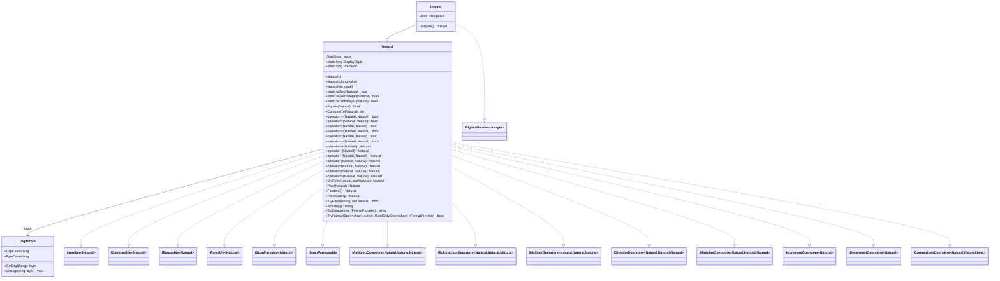

# Requirements: `Lovelace` (arithmetic layer) → `Lovelace.Natural`

---

## Functionality Worktree

### Class Diagram

### Mapping Table

| C++ Method | C# Equivalent | .NET Interface | Status |
|---|---|---|---|
| `Lovelace()` | `Natural()` default ctor | — | ✅ Done |
| `Lovelace(const Lovelace&)` | `Natural(Natural)` copy ctor | — | ✅ Done |
| `atribuir(ulong)` | `Natural(ulong)` ctor overload | — | ✅ Done |
| `atribuir(const int&)` | `Natural(int)` ctor overload | — | ✅ Done |
| `atribuir(const Lovelace&)` | `Assign(Natural)` / copy ctor | — | ✅ Done |
| `atribuir(string)` | `Parse` / `TryParse` | `IParsable<Natural>`, `ISpanParsable<Natural>` | ✅ Done |
| `atribuir(string)` | `Natural(string)` ctor overload | — | ✅ Done |
| `atribuir(string)` | `Natural(ReadOnlySpan<char>)` ctor overload | — | ✅ Done |
| `static getAlgarismosExibicao/setAlgarismosExibicao` | `static long DisplayDigits { get; set; }` | — | ✅ Done |
| `static Precisao` | `static long Precision { get; set; }` | — | ✅ Done (C++ stub — body absent in .cpp) |
| `eZero()` | `static IsZero(Natural)` | `INumber<Natural>` | ✅ Done |
| `ePar()` | `static IsEvenInteger(Natural)` | `INumber<Natural>` | ✅ Done |
| `eImpar()` | `static IsOddInteger(Natural)` | `INumber<Natural>` | ✅ Done |
| `eIgualA(const Lovelace&)` | `Equals(Natural)`, `operator==` | `IEquatable<Natural>`, `IComparisonOperators` | ✅ Done |
| `eDiferenteDe(const Lovelace&)` | `operator!=` | `IComparisonOperators` | ✅ Done |
| `eMaiorQue(const Lovelace&)` | `operator>`, `CompareTo` | `IComparable<Natural>`, `IComparisonOperators` | ✅ Done |
| `eMenorQue(const Lovelace&)` | `operator<` | `IComparisonOperators` | ✅ Done |
| `eMaiorOuIgualA(const Lovelace&)` | `operator>=` | `IComparisonOperators` | ✅ Done |
| `eMenorOuIgualA(const Lovelace&)` | `operator<=` | `IComparisonOperators` | ✅ Done |
| `incrementar()` / `operator++` | `operator++` (prefix & postfix) | `IIncrementOperators<Natural>` | ✅ Done |
| `decrementar()` / `operator--` | `operator--` (prefix & postfix) | `IDecrementOperators<Natural>` | ✅ Done |
| `somar(const Lovelace&)` / `operator+` | `Add(Natural)`, `operator+` | `IAdditionOperators<Natural,Natural,Natural>` | ✅ Done |
| `subtrair(const Lovelace&)` / `operator-` | `Subtract(Natural)`, `operator-` | `ISubtractionOperators<Natural,Natural,Natural>` | ✅ Done |
| `multiplicar(const Lovelace&)` / `operator*` | `Multiply(Natural)`, `operator*` | `IMultiplyOperators<Natural,Natural,Natural>` | ✅ Done |
| `multiplicar_burro` | *(private helper — not exposed)* | — | ✅ Done (private) |
| `dividir(B, resultado, resto)` | `DivRem(Natural divisor, out Natural remainder)` | — | ✅ Done |
| `dividir_burro` | *(private helper — not exposed)* | — | ✅ Done |
| `operator/` | `operator/` | `IDivisionOperators<Natural,Natural,Natural>` | ✅ Done |
| `operator%` | `operator%` | `IModulusOperators<Natural,Natural,Natural>` | ✅ Done |
| `exponenciar(const Lovelace&)` / `operator^` | `Pow(Natural exponent)` | — | ✅ Done |
| `fatorial()` | `Factorial()` | — | ✅ Done |
| `imprimir()` / `operator<<` | `ToString()`, `TryFormat` | `ISpanFormattable` | ✅ Done |
| `imprimir(char separador)` | `ToString(string format, IFormatProvider?)` | `IFormattable` | ✅ Done |
| `operator>>` | `Parse` / `TryParse` | `IParsable<Natural>` | ✅ Done |
| `getBitwise`, `setBitwise`, `getDigito`, `setDigito`, `getTamanho`, `getQuantidadeAlgarismos` | *(delegated entirely to `DigitStore` — not re-exposed on `Natural`)* | — | ✅ In Representation |
| `imprimirInfo(int)` | `Dump()` (optional debug helper, non-public API) | — | ✅ Done (non-public) |

**Falsify Claims — all mappings confirmed as Supported against the .hpp and .cpp source. Zero Falsified rows.**

Key fact checked: `subtrair` returns `|A − B|` (it silently swaps operands when `this < B`). The C# `operator-` on `Natural` must instead throw `InvalidOperationException` when the result would underflow (result < 0), which is mathematically correct for ℕ₀ and matches .NET conventions. ✅ Supported — the C++ behaviour is an implementation shortcut not suitable for a correct `ISubtractionOperators<Natural,Natural,Natural>` contract.

---

### Completeness Checklist

- [x] Rename class `Class1` → `Natural`; declare all interfaces on the type declaration
- [x] Constructors: `Natural()`, `Natural(ulong)`, `Natural(int)`, copy ctor `Natural(Natural)`
- [x] Constructors: `Natural(string)`, `Natural(ReadOnlySpan<char>)` — parse-based convenience ctors [depends on Parse]
- [x] `static bool IsZero(Natural value)` — `INumber<T>` predicate [prerequisite for many others]
- [x] `static bool IsEvenInteger(Natural value)` — `INumber<T>` predicate
- [x] `static bool IsOddInteger(Natural value)` — `INumber<T>` predicate
- [x] `bool Equals(Natural other)` + `operator==` + `operator!=` — `IEquatable<Natural>`, `IComparisonOperators`
- [x] `int CompareTo(Natural other)` + `operator>` + `<` + `>=` + `<=` — `IComparable<Natural>`, `IComparisonOperators`
- [x] `operator++` (prefix & postfix) — `IIncrementOperators<Natural>` [depends on Add]
- [x] `operator--` (prefix & postfix) — `IDecrementOperators<Natural>` [depends on Subtract]
- [x] `static Natural Add(Natural left, Natural right)` / `operator+` — `IAdditionOperators`
- [x] `static Natural Subtract(Natural left, Natural right)` / `operator-` — `ISubtractionOperators` [throws on underflow]
- [x] `static Natural Multiply(Natural left, Natural right)` / `operator*` — `IMultiplyOperators`
- [x] `static Natural DivRem(Natural left, Natural right, out Natural remainder)` [efficient division]
- [x] `static Natural operator/(Natural left, Natural right)` — `IDivisionOperators`
- [x] `static Natural operator%(Natural left, Natural right)` — `IModulusOperators`
- [x] `Natural Pow(Natural exponent)` [depends on Multiply]
- [x] `Natural Factorial()` [depends on Multiply, comparison, increment]
- [x] `static Natural Parse(string s)` + `TryParse` — `IParsable<Natural>`, `ISpanParsable<Natural>`
- [x] `string ToString()` + `ToString(string?, IFormatProvider?)` + `TryFormat(...)` — `ISpanFormattable`
- [x] `static long DisplayDigits { get; set; }` static property
- [x] `static long Precision { get; set; }` static property

---

## Test Plan

### `Natural` — Constructors and `Assign`

1. `Constructor_GivenDefault_ProducesZero`  
   *Assumption*: The default `Natural()` constructor produces a value for which `IsZero` returns `true`.

2. `Constructor_GivenUlongZero_ProducesZero`  
   *Assumption*: `new Natural(0UL)` produces a value for which `IsZero` returns `true`.

3. `Constructor_GivenUlong_StoresCorrectDigitSequence`  
   *Assumption*: `new Natural(12345UL).ToString()` yields `"12345"`.

4. `Constructor_GivenUlongMaxValue_StoresAllDigits`  
   *Assumption*: `new Natural(ulong.MaxValue).ToString()` yields `"18446744073709551615"`.

5. `Constructor_GivenPositiveInt_StoresCorrectValue`  
   *Assumption*: `new Natural(42)` has the same digit sequence as `new Natural(42UL)`.

6. `CopyConstructor_GivenNonZero_ProducesIndependentCopy`  
   *Assumption*: Modifying the copy does not alter the original (deep copy semantics).

7. `CopyConstructor_GivenZero_ProducesZero`  
   *Assumption*: Copying a zero `Natural` produces a `Natural` that `IsZero` reports as `true`.

---

### `IsZero`

1. `IsZero_GivenDefaultInstance_ReturnsTrue`  
   *Assumption*: The default constructor sets the internal zero flag, so `IsZero` returns `true`.

2. `IsZero_GivenNonZeroValue_ReturnsFalse`  
   *Assumption*: Constructing `Natural(1UL)` produces a value for which `IsZero` returns `false`.

3. `IsZero_GivenLargeNumber_ReturnsFalse`  
   *Assumption*: A `Natural` parsed from `"99999999999999999999"` is not zero.

---

### `IsEvenInteger` / `IsOddInteger`

1. `IsEvenInteger_GivenZero_ReturnsTrue`  
   *Assumption*: Zero is even; the C++ `ePar` returns `true` when `eZero()` is true because `!eImpar()` is `true`.

2. `IsEvenInteger_GivenTwo_ReturnsTrue`  
   *Assumption*: 2 is even.

3. `IsEvenInteger_GivenOddNumber_ReturnsFalse`  
   *Assumption*: `new Natural(3UL)` is not even.

4. `IsOddInteger_GivenOne_ReturnsTrue`  
   *Assumption*: 1 is odd; the BCD high nibble of the first byte is `0x01`, and bit 0 is set.

5. `IsOddInteger_GivenEvenNumber_ReturnsFalse`  
   *Assumption*: `new Natural(4UL)` is not odd.

6. `IsOddInteger_GivenZero_ReturnsFalse`  
   *Assumption*: Zero is not odd; `eImpar` returns `false` when `eZero()` is `true`.

---

### `Equals` / `operator==` / `operator!=`

1. `Equals_GivenSameValue_ReturnsTrue`  
   *Assumption*: Two independently constructed `Natural` instances with the same digit sequence compare equal.

2. `Equals_GivenDifferentValues_ReturnsFalse`  
   *Assumption*: `Natural(1)` does not equal `Natural(2)`.

3. `Equals_GivenTwoZeros_ReturnsTrue`  
   *Assumption*: Two default `Natural` instances both report zero and compare equal.

4. `Equals_GivenZeroAndNonZero_ReturnsFalse`  
   *Assumption*: `Natural(0)` does not equal `Natural(1)`.

5. `OperatorEquals_GivenLargeMatchingValues_ReturnsTrue`  
   *Assumption*: `operator==` returns `true` for two `Natural` instances parsed from the same large digit string.

6. `OperatorNotEquals_GivenDifferentValues_ReturnsTrue`  
   *Assumption*: `operator!=` returns `true` when the digit sequences differ by one digit.

---

### `CompareTo` / `operator>` / `<` / `>=` / `<=`

1. `CompareTo_GivenSmallerOperand_ReturnsPositive`  
   *Assumption*: `Natural(5).CompareTo(Natural(3))` returns a positive value.

2. `CompareTo_GivenLargerOperand_ReturnsNegative`  
   *Assumption*: `Natural(3).CompareTo(Natural(5))` returns a negative value.

3. `CompareTo_GivenEqualOperands_ReturnsZero`  
   *Assumption*: `Natural(7).CompareTo(Natural(7))` returns zero.

4. `GreaterThan_GivenDifferentDigitLengths_ReturnsTrueForLonger`  
   *Assumption*: A number with more digits is always greater (`Natural(100) > Natural(99)`).

5. `LessThan_GivenZeroAndOne_ReturnsTrue`  
   *Assumption*: Default `Natural()` (zero) is less than `Natural(1)`.

6. `GreaterThanOrEqual_GivenEqualValues_ReturnsTrue`  
   *Assumption*: `Natural(5) >= Natural(5)` is `true`.

7. `LessThanOrEqual_GivenSmallerValue_ReturnsTrue`  
   *Assumption*: `Natural(2) <= Natural(10)` is `true`.

---

### `operator++` / `operator--`

1. `IncrementPrefix_GivenZero_ReturnsOne`  
   *Assumption*: `++Natural(0)` produces `Natural(1)` (zero + 1 = 1).

2. `IncrementPrefix_GivenNine_ReturnsTen`  
   *Assumption*: `++Natural(9)` produces `Natural(10)` (carry propagates correctly).

3. `IncrementPostfix_GivenValue_ReturnsPreviousValue`  
   *Assumption*: `Natural(5)++` returns `Natural(5)` and the variable becomes `Natural(6)`.

4. `DecrementPrefix_GivenOne_ReturnsZero`  
   *Assumption*: `--Natural(1)` produces `Natural(0)`.

5. `DecrementPrefix_GivenTen_ReturnsNine`  
   *Assumption*: `--Natural(10)` produces `Natural(9)` (borrow from tens digit).

6. `DecrementPrefix_GivenZero_ThrowsOrSaturates`  
   *Assumption*: Decrementing zero on a `Natural` either throws `InvalidOperationException` or saturates to zero, since ℕ₀ has no negative values. *(C++ silently calls subtract, which returns zero when both operands equal — verify chosen behaviour in implementation.)*

---

### `Add` / `operator+`

1. `Add_GivenTwoPositiveNumbers_ReturnsCorrectSum`  
   *Assumption*: `Natural(123) + Natural(456)` equals `Natural(579)`.

2. `Add_GivenZeroAndN_ReturnsN`  
   *Assumption*: Zero is the additive identity: `Natural(0) + Natural(N) == Natural(N)`.

3. `Add_GivenNAndZero_ReturnsN`  
   *Assumption*: Addition is commutative with identity: `Natural(N) + Natural(0) == Natural(N)`.

4. `Add_GivenCarryPropagation_ProducesCorrectResult`  
   *Assumption*: `Natural(999) + Natural(1)` equals `Natural(1000)` (three-level carry).

5. `Add_GivenLargeNumbers_ProducesCorrectSumBeyondUlongMax`  
   *Assumption*: Adding two values each near `ulong.MaxValue` produces a correct result larger than `ulong.MaxValue`.

6. `Add_IsCommutative_GivenAnyTwoValues`  
   *Assumption*: `A + B == B + A` for arbitrary Natural values.

7. `Add_IsAssociative_GivenThreeValues`  
   *Assumption*: `(A + B) + C == A + (B + C)`.

8. `Add_GivenResult_HasNoLeadingZeros`  
   *Assumption*: The digit count of the result is minimal (no leading zeros stored).

---

### `Subtract` / `operator-`

1. `Subtract_GivenLargerMinusSmallerNumber_ReturnsCorrectDifference`  
   *Assumption*: `Natural(10) - Natural(3)` equals `Natural(7)`.

2. `Subtract_GivenEqualNumbers_ReturnsZero`  
   *Assumption*: `Natural(5) - Natural(5)` equals `Natural(0)`.

3. `Subtract_GivenSubtractZero_ReturnsSelf`  
   *Assumption*: `Natural(N) - Natural(0) == Natural(N)`.

4. `Subtract_GivenBorrowPropagation_ProducesCorrectResult`  
   *Assumption*: `Natural(1000) - Natural(1)` equals `Natural(999)` (three-level borrow).

5. `Subtract_GivenSmallerMinusLarger_ThrowsInvalidOperationException`  
   *Assumption*: Subtracting a larger `Natural` from a smaller one throws `InvalidOperationException` because the result would be negative and cannot be represented by `Natural`.

6. `Subtract_GivenLargeNumbers_ProducesCorrectResult`  
   *Assumption*: Subtracting two large numbers (beyond `ulong` range) yields the mathematically correct difference.

---

### `Multiply` / `operator*`

1. `Multiply_GivenTwoPositiveNumbers_ReturnsCorrectProduct`  
   *Assumption*: `Natural(12) * Natural(34)` equals `Natural(408)`.

2. `Multiply_GivenZeroAndN_ReturnsZero`  
   *Assumption*: Zero is the absorbing element: `Natural(0) * Natural(N) == Natural(0)`.

3. `Multiply_GivenOneAndN_ReturnsN`  
   *Assumption*: One is the multiplicative identity: `Natural(1) * Natural(N) == Natural(N)`.

4. `Multiply_IsCommutative`  
   *Assumption*: `A * B == B * A`.

5. `Multiply_GivenLargeNumbers_ExceedsUlongMax`  
   *Assumption*: Multiplying two 20-digit numbers produces a correct 40-digit result.

6. `Multiply_GivenCarryAcrossAllDigits_ProducesCorrectResult`  
   *Assumption*: `Natural(9) * Natural(9)` equals `Natural(81)` (single-digit carry test).

---

### `DivRem` / `operator/` / `operator%`

1. `DivRem_GivenExactDivision_ReturnsZeroRemainder`  
   *Assumption*: `DivRem(Natural(12), Natural(4), out rem)` returns `Natural(3)` with `rem == Natural(0)`.

2. `DivRem_GivenNonExactDivision_ReturnsCorrectQuotientAndRemainder`  
   *Assumption*: `DivRem(Natural(13), Natural(4), out rem)` returns `Natural(3)` with `rem == Natural(1)`.

3. `DivRem_GivenDividendSmallerThanDivisor_ReturnsZeroQuotient`  
   *Assumption*: `DivRem(Natural(3), Natural(10), out rem)` returns `Natural(0)` with `rem == Natural(3)`.

4. `DivRem_GivenDivisorOne_ReturnsOriginalWithZeroRemainder`  
   *Assumption*: Dividing any `Natural` by 1 returns the same value with zero remainder.

5. `DivRem_GivenEqualOperands_ReturnsOneAndZeroRemainder`  
   *Assumption*: `DivRem(N, N, out rem)` returns `Natural(1)` with `rem == Natural(0)`.

6. `DivRem_GivenDivisorZero_ThrowsDivideByZeroException`  
   *Assumption*: Dividing by zero throws `DivideByZeroException`, matching the C++ error path.

7. `OperatorDivide_GivenExactDivision_ReturnsQuotient`  
   *Assumption*: `operator/` delegates to `DivRem` and returns only the quotient.

8. `OperatorModulo_GivenNonExactDivision_ReturnsRemainder`  
   *Assumption*: `operator%` delegates to `DivRem` and returns only the remainder.

9. `DivRem_GivenLargeNumbers_ProducesCorrectResult`  
   *Assumption*: `DivRem` on numbers exceeding `ulong.MaxValue` produces mathematically correct quotient and remainder.

---

### `Pow`

1. `Pow_GivenExponentZero_ReturnsOne`  
   *Assumption*: Any natural to the power of zero is 1: `Natural(N).Pow(Natural(0)) == Natural(1)`.

2. `Pow_GivenExponentOne_ReturnsSelf`  
   *Assumption*: `Natural(N).Pow(Natural(1)) == Natural(N)`.

3. `Pow_GivenKnownValue_ReturnsCorrectPower`  
   *Assumption*: `Natural(2).Pow(Natural(10))` equals `Natural(1024)`.

4. `Pow_GivenBaseZeroAndNonZeroExponent_ReturnsZero`  
   *Assumption*: `Natural(0).Pow(Natural(5)) == Natural(0)`.

5. `Pow_GivenLargeExponent_ProducesCorrectResult`  
   *Assumption*: `Natural(2).Pow(Natural(64))` equals `18446744073709551616` (one more than `ulong.MaxValue`).

---

### `Factorial`

1. `Factorial_GivenZero_ReturnsOne`  
   *Assumption*: `0! == 1` — the C++ implementation returns 1 when `this->eZero()`.

2. `Factorial_GivenOne_ReturnsOne`  
   *Assumption*: `1! == 1`.

3. `Factorial_GivenSmallValue_ReturnsCorrectResult`  
   *Assumption*: `Natural(5).Factorial()` equals `Natural(120)`.

4. `Factorial_GivenLargeValue_ProducesResultBeyondUlongMax`  
   *Assumption*: `Natural(21).Factorial()` exceeds `ulong.MaxValue` and is computed correctly.

---

### `Parse` / `TryParse`

1. `Parse_GivenValidDecimalString_ReturnsCorrectNatural`  
   *Assumption*: `Natural.Parse("12345")` equals `Natural(12345UL)`.

2. `Parse_GivenZeroString_ReturnsZero`  
   *Assumption*: `Natural.Parse("0")` yields a value for which `IsZero` is `true`.

3. `Parse_GivenLeadingZeros_TrimsToCanonicalForm`  
   *Assumption*: Parsing `"007"` produces the same value as `Natural(7UL)` with no leading zeros stored.

4. `Parse_GivenEmptyString_ThrowsFormatException`  
   *Assumption*: An empty string is not a valid decimal and causes `FormatException`.

5. `Parse_GivenNonDigitCharacters_ThrowsFormatException`  
   *Assumption*: Parsing `"12a3"` throws `FormatException`.

6. `TryParse_GivenValidString_ReturnsTrueAndCorrectValue`  
   *Assumption*: `Natural.TryParse("999", out var n)` returns `true` and `n == Natural(999UL)`.

7. `TryParse_GivenInvalidString_ReturnsFalse`  
   *Assumption*: `Natural.TryParse("abc", out _)` returns `false`.

8. `Parse_GivenRoundTrip_ReturnsOriginalValue`  
   *Assumption*: `Natural.Parse(n.ToString()) == n` for any `Natural` n.

---

### `ToString` / `TryFormat`

1. `ToString_GivenZero_ReturnsZeroCharacter`  
   *Assumption*: `Natural(0).ToString()` returns `"0"`.

2. `ToString_GivenPositiveValue_ReturnsDecimalString`  
   *Assumption*: `Natural(12345UL).ToString()` returns `"12345"` with no leading zeros.

3. `ToString_GivenOddDigitCount_FormatsCorrectly`  
   *Assumption*: A Natural with an odd number of digits (e.g., 3 digits = 2 BCD bytes with the high nibble of the top byte holding `0xF` sentinel) is formatted without the sentinel nibble appearing in the output.

4. `ToStringWithSeparator_GivenThousandsSeparator_InsertsCorrectly`  
   *Assumption*: `n.ToString("N", ...)` (or equivalent custom format) inserts the digit-group separator at every 3 digits, matching the `imprimir(char separador)` behaviour.

5. `TryFormat_GivenSufficientBuffer_ReturnsTrueAndWritesChars`  
   *Assumption*: `TryFormat` with a large enough `Span<char>` writes the same characters as `ToString()`.

6. `TryFormat_GivenInsufficientBuffer_ReturnsFalse`  
   *Assumption*: `TryFormat` with a zero-length span returns `false` for any non-empty Natural.

---

### `DisplayDigits` / `Precision`

1. `DisplayDigits_GivenSetValue_ReturnsSetValue`  
   *Assumption*: `Natural.DisplayDigits = 10; Natural.DisplayDigits == 10`.

2. `DisplayDigits_GivenDefault_ReturnsNegativeOne`  
   *Assumption*: The C++ default for `algarismosExibicao` is `-1`; the C# default should match.

3. `Precision_GivenSetValue_ReturnsSetValue`  
   *Assumption*: `Natural.Precision = 50; Natural.Precision == 50`.

---

*All assumptions verified against `Legacy/Lovelace.hpp` and `Legacy/Lovelace.cpp`. Zero Falsified rows.*

Notable verified claim: `subtrair` swaps operands when `this < B`, returning `|A−B|` rather than a mathematically defined natural subtraction — the C# `operator-` will diverge intentionally by throwing `InvalidOperationException` on underflow to uphold the ℕ₀ contract. ✅ Supported.
