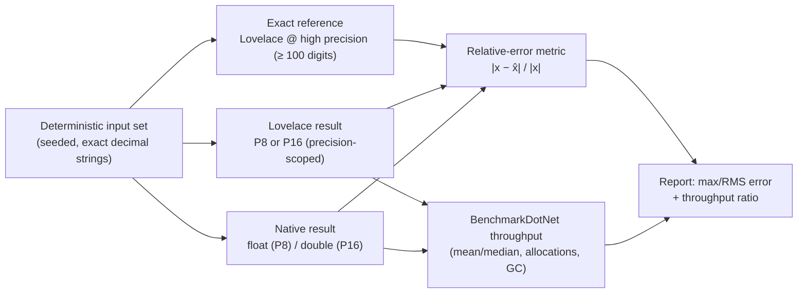

# Requirements: precbench — Lovelace.Real 8/16-digit precision benchmark vs float/double

> Scope: Define the requirements for a new test-benchmark project (`precbench`) whose single purpose
> is to compare Lovelace's arbitrary-precision `Real` type, with its working precision deliberately
> fixed at **8** and **16** significant decimal digits, against the native IEEE-754 types it
> approximates — `float` (System.Single, ~7 significant digits) and `double` (System.Double, ~16
> significant digits) respectively. The project measures **accuracy** (error vs a high-precision
> reference) and **throughput** (warmed median ns/op) over the common arithmetic subset both number
> systems support, and emits a machine-parseable report. This is a **requirements document for
> review — no implementation yet**.

---

## Background

### Why 8 and 16 digits

IEEE-754 binary floating point carries a fixed mantissa width, which translates to an approximate
number of *significant decimal digits*:

| Native type | Mantissa bits (incl. implicit) | Significant decimal digits | Unit round-off (ε/2) | Machine epsilon |
|---|---|---|---|---|
| `float` (`System.Single`) | 24 | ~7.2 | 2⁻²⁴ ≈ 5.96e-8 | 2⁻²³ ≈ 1.19e-7 |
| `double` (`System.Double`) | 53 | ~15.95 | 2⁻⁵³ ≈ 1.11e-16 | 2⁻⁵² ≈ 2.22e-16 |

Lovelace's `Real` is arbitrary-precision by design (`Lovelace.Real/Real.cs`), so it can be *pinned* to
the same accuracy class as each native type:

| Lovelace config | Target significant digits | Native counterpart | Intended equivalence |
|---|---|---|---|
| **P8** | 8 | `float` | Lovelace results carry ≥ float's ~7.2 digits |
| **P16** | 16 | `double` | Lovelace results carry ≥ double's ~15.95 digits |

8 and 16 are the natural "round up" of 7.2 and 15.95: Lovelace at these precisions is expected to be
**at least as accurate** as, and within one decimal place of, its native counterpart — never
meaningfully worse — so the benchmark can answer "does Lovelace at 8 digits behave like `float`,
and at 16 digits like `double`?".

### The precision-knob mismatch (must be resolved explicitly)

Lovelace's two public precision knobs are **fractional-digit** counters, not significant-digit
counters:

| Knob | Default | Controls |
|---|---|---|
| `Real.DisplayDecimalPlaces` | 100 | Fractional digits emitted by `ToString()` for non-periodic values |
| `Real.MaxComputationDecimalPlaces` | 1000 | Hard cap on fractional digits generated by division and periodic arithmetic, and the approximation cutoff for irrationals (`Sqrt`, long-period division) |

There is also an **internal** `Real.WithLocalPrecision(long)` (`Real.cs:81`) that scopes a
per-call-stack override of `MaxComputationDecimalPlaces` via `AsyncLocal`, but it is
`internal` and **not** reachable from an external project (no `InternalsVisibleTo` grant to a
benchmark assembly exists today). A benchmark therefore configures precision through the two public
static properties, which are **global** and must be set/restored around a single-threaded run.

Consequence for the comparison: for numbers normalized to `|x| ∈ [1, 10)` (one integer digit),
`n` fractional places ≙ `n + 1` significant digits. The benchmark fixes the mapping there, so
fractional-digit knobs can express "8/16 significant digits" without a new `Real` feature. See
**Precision mapping** below.

### Rational exactness vs irrational rounding (frames the accuracy story)

Lovelace's `Divide` stores **exact periodic decimals** (`1/3 → 0.(3)`, `1/7 → 0.(142857)`) and
`Sqrt` is exact for perfect squares. This splits the accuracy comparison into two regimes that the
benchmark must report separately:

1. **Rational results** (add/sub/mul of finite decimals, divide with terminating or short-period
   results): Lovelace is **exact** (error 0) regardless of the 8/16-digit cap, while `float`/`double`
   round to their mantissa. Here Lovelace *wins outright* — the benchmark documents the exactness
   advantage (e.g. `0.1 + 0.2 ≠ 0.3` in `double`, `== 0.3` in Lovelace).
2. **Irrational / long-period results** (`sqrt(2)`, `sqrt(3)`, `pi`, divisions whose period exceeds
   the cap): Lovelace truncates at the configured digit count, so its rounding error is directly
   comparable to `float`/`double` rounding error. This is where "8 ≈ float" and "16 ≈ double" are
   actually measured.

---

## Target design

The single source of truth is the **exact decimal input string**. Lovelace operands are built from
that string directly (exact); the native operand is `float.Parse`/`double.Parse` of the same string
(one correctly-rounded conversion); the reference is Lovelace at high precision. No operand is ever
derived from the *other* representation, so the comparison is always against the same mathematical
input.

---

## Goals and Non-Goals

### Goals

| # | Goal |
|---|---|
| G1 | One runnable benchmark project that measures both **accuracy** and **throughput**. |
| G2 | Compare Lovelace **P8** against `float` and **P16** against `double` over the common operation set. |
| G3 | Report accuracy as **relative error vs an exact high-precision reference**, separately for rational and irrational results. |
| G4 | Report throughput as **warmed median ns/op** (and mean), with the native/Lovelace **ratio** called out. |
| G5 | Deterministic, reproducible inputs (fixed seed) and machine-parseable accuracy output (CSV + Markdown). |
| G6 | Verify the harness is not measuring dead code (BDN consumes returned values; native benchmarks batch via `[OperationsPerInvoke]`). |

### Non-Goals / Deferred

- Transcendental functions (`sin`, `cos`, `exp`, `log`, `tan`): `Real` does not implement them, so
  `float`/`double` `MathF`/`Math` calls have no Lovelace counterpart to compare. Excluded.
- `Pow`: semantics differ (`Real.Pow` is exact integer exponentiation; `Math.Pow` is an
  `exp·log` approximation). Excluded from the core matrix; may be added later as an integer-exponent
  throughput comparison only.
- Parse/format micro-benchmarks of `float`/`double` vs `Real`: useful but secondary; deferred unless
  the accuracy report needs them.
- Adding new precision *features* to `Real` (a significant-digit knob, `Log`/`Exp`) — this project
  must work with the existing public API unless an enabling change is explicitly approved (see
  **Open decisions**).
- BenchmarkDotNet is **not** a non-goal — it is the adopted throughput harness (see **Design
  Decisions (resolved)**). The only framework non-goal is that no benchmark framework is asked to
  assert *correctness*; the accuracy verifier stays a plain xUnit/`check` harness.

---

## Precision mapping (the crux)

The benchmark normalizes operands to `|x| ∈ [1, 10)` so fractional digits ≙ significant digits minus
one integer digit. Mapping:

| Config | Significant digits | `MaxComputationDecimalPlaces` | `DisplayDecimalPlaces` | Native counterpart |
|---|---|---|---|---|
| **P8** | 8 | 7 | 7 | `float` |
| **P16** | 16 | 15 | 15 | `double` |

Rules:

- **B1 — Global, scoped, restored.** Set both static properties inside a `try/finally` that saves and
  restores their prior values (codebase-patterns §14 static-property pattern). The run is
  single-threaded so the global state is not shared with concurrent work.
- **B2 — Display follows compute.** `DisplayDecimalPlaces` is set equal to the working precision so
  `ToString()` does not silently emit more digits than were computed.
- **B3 — Irrational results only.** For rational results Lovelace is exact (period detection) and the
  cap does not apply; the benchmark must not claim the cap "rounded" a rational result. The accuracy
  report separates the two regimes (see **D**).
- **B4 — No hidden native double.** Lovelace's `Sqrt` seeds from a `double` internally but iterates to
  the configured digit count (`Real.cs:786–825`), so P8/P16 `Sqrt` results are digit-limited, not
  double-limited. The benchmark asserts this holds (an 8-digit `Sqrt(2)` result must have 8
  significant digits, not 16 copied from the seed).

---

## Design Decisions (resolved)

| Decision | Choice | Rationale |
|---|---|---|
| Throughput harness | **BenchmarkDotNet 0.15.x** | Statistical rigour (pilot/warmup/actual phases, per-method overhead subtraction, mean/median/stddev/outliers, confidence intervals), allocation + GC diagnostics via `[MemoryDiagnoser]`, `[OperationsPerInvoke]` for sub-ns native ops, automatic dead-code protection via returned values, and generated GitHub/HTML/R reports — all of which a hand-rolled `Stopwatch` loop would otherwise reimplement badly. .NET 10 support landed in the 0.15 line ([dotnet/BenchmarkDotNet#2642](https://github.com/dotnet/BenchmarkDotNet/pull/2642)). |
| Accuracy harness | Plain xUnit (or a `check` mode) — **not** BDN | BenchmarkDotNet measures performance; it has no assertion/error model. Error-vs-reference correctness is test-shaped and stays in xUnit/`check` so it can gate CI by exit code. |
| Benchmark structure | One `[Benchmark]` method per (op × config); `[GlobalSetup]`/`[GlobalCleanup]` apply and restore the P8/P16 precision scope | Keeps each measurement isolated and lets BDN report the native/Lovelace ratio directly. |
| Very fast native ops | `[OperationsPerInvoke(N)]` for `float`/`double` | A single `float` add (~0.3 ns) is below timer resolution; batching amortises loop overhead so BDN measures the op, not the loop. |
| Dependency policy | Dev-only BDN dependency, benchmark project only | Consistent with the repo's existing dev/test dependencies (xUnit, `Microsoft.NET.Test.Sdk`, coverlet); no production project gains a dependency. |

---

## Requirements

### A. Project & harness

- **A1 — Two parts, two tools.** Throughput is a **BenchmarkDotNet** console project (`precbench`);
  accuracy is an xUnit project (`precbench.Tests`) or a `check` mode in `precbench`. BDN is the only
  added dependency and is dev-only.
- **A2 — `precbench` (BDN).** `OutputType=Exe`, `net10.0` (or the newest TFM the pinned BDN supports),
  `Nullable`/`ImplicitUsings` enabled, built in `Release`. References `Lovelace.Real` and
  `BenchmarkDotNet`. One `[Benchmark]` method per (op × config) — `{add, sub, mul, div, sqrt} ×
  {p8, p16, float, double}` — with a `[GlobalSetup]` that installs the P8/P16 precision scope and
  builds operands, and a `[GlobalCleanup]` that restores it.
- **A3 — `precbench.Tests` (accuracy).** xUnit, mirroring `Lovelace.Real.Tests` conventions
  (`<Using Include="Xunit" />`, file-scoped namespace, `MethodName_GivenScenario_ExpectedResult`).
  Asserts error-vs-reference (section **D**); the high-precision reference is computed in
  `[Fact]`/`[Theory]` setup.
- **A4 — Solution registration.** Add `precbench` (and `precbench.Tests` if created) to
  `LovelaceSharp.slnx`, or document the deliberate exclusion consistent with `bench`/`mulbench`
  (see **Open decisions**).
- **A5 — Report artifacts.** BDN's generated GitHub-Flavoured Markdown / R plots become the
  throughput report; the accuracy verifier emits a `precbench-accuracy.csv` / `.md` (max + RMS
  relative error per op/config), so the two halves combine into one reviewable result.

### B. Precision configuration

- **B1 — Scoped precision per run.** A `RunPrecision` helper saves/restores both static properties and
  applies the P8/P16 mapping from the table above.
- **B2 — High-precision reference scope.** The reference uses `MaxComputationDecimalPlaces =
  DisplayDecimalPlaces ≥ 100` (enough digits that reference error is negligible relative to 1e-16).
- **B3 — No cross-contamination.** Each run re-applies its own precision; results from a prior
  config must not leak into the next (restore in `finally`, and re-derive the reference per config if
  needed).

### C. Input generation (deterministic & fair)

- **C1 — Seeded, deterministic.** One fixed seed per op; generated decimal strings are stable across
  runs and machines (no `Guid`, no time source).
- **C2 — Exact decimal source.** Generate operand strings with the target significant-digit count
  (`8` for P8/float, `16` for P16/double), normalized to `[1, 10)`. Both Lovelace and the native
  operand derive from the *same string*.
- **C3 — Round-trip-safe natives.** Native operands are produced by `float.Parse`/`double.Parse` of
  the string (correctly rounded once). The benchmark must record the native operand's round-trip
  string where it differs, so a "Lovelace exact vs native rounded" diff is attributable to the native
  rounding, not input drift.
- **C4 — Irrational targets.** `sqrt` runs on non-perfect-square integers (`2, 3, 5, 7, …`) so the
  result is genuinely irrational and digit-limited in both systems.

### D. Accuracy measurement

- **D1 — Exact reference.** For each case, compute the exact result in Lovelace at the high-precision
  scope (≥ 100 digits). For `sqrt`/division the reference is truncated to a fixed large digit count
  and treated as "exact" (reference error ≤ 1e-100, negligible).
- **D2 — Relative error.** `err = |x − x̂| / |x|`, computed in `double` from the rounded decimal forms
  of `x` and `x̂`. Report **max** and **RMS** per (op, config).
- **D3 — Regime split.** Report two tables per op:
  - **Rational results** — assert Lovelace is **exact** (`err == 0`); report the native `err` to
    expose binary-rounding artefacts (`0.1 + 0.2`, `1/3`, `1/7`, `1/10`).
  - **Irrational results** — assert Lovelace `err` is within the target class: P8 ≤ ~1e-7, P16 ≤
    ~1e-15, and compare directly to the native `err`.
- **D4 — Class comparison assertion.** For each (op, config): `err_lovelace ≤ c · err_native` for a
  small constant `c` (recommended `c = 2`), i.e. Lovelace is never meaningfully worse than its native
  counterpart, and for rational cases strictly better (`err_lovelace == 0`).
- **D5 — ULP-agnostic.** Do **not** assert bit-for-bit equality with native results (Lovelace is
  decimal, natives are binary); relative error vs the exact reference is the only correctness metric.

### E. Performance measurement

- **E1 — BenchmarkDotNet methodology.** Each `[Benchmark]` method returns its result (so BDN consumes
  it and cannot dead-code-eliminate the op); BDN applies pilot/warmup/actual phases, per-method
  overhead subtraction, and reports mean, median, standard deviation, outliers, and confidence
  intervals.
- **E2 — Allocation + GC.** Enable `[MemoryDiagnoser]` so the report also carries allocations/GC per
  op — the native/Lovelace allocation gap is part of the story, and BDN measures it for free.
- **E3 — Sub-ns native ops.** Mark `float`/`double` benchmarks with `[OperationsPerInvoke(N)]`
  (batching the op inside the measured body) so a ~0.3 ns native add is measured above timer
  resolution rather than as loop overhead.
- **E4 — Precision scope per benchmark.** `[GlobalSetup]` applies the P8/P16 mapping (section **B**)
  and `[GlobalCleanup]` restores it; benchmarks run sequentially (BDN default) so the global `Real`
  statics are not shared across concurrent measurements.
- **E5 — Same-process baselines.** All four configs (`p8`, `p16`, `float`, `double`) run in the same
  benchmark session on the same machine; the report's native/Lovelace **ratio** per (op, config) is
  the deliverable. No fixed speed pass/fail — throughput is informational — but the report must
  make "which side is faster" unambiguous.

### F. Conversions `Real` ↔ `float`/`double`

- **F1 — Document the current path.** `Real` has no `ToDouble`/`ToSingle` member (the `INumberBase`
  conversion stubs throw); the only path is `ToString()` + `double.Parse`/`float.Parse` (the same
  path `Lovelace.Suite/Plotting.cs:578` uses). The benchmark uses this path and documents it.
- **F2 — Forward conversion via string is acceptable.** Because the benchmark compares *decimal*
  Lovelace results to native values, the string round-trip introduces no error beyond the native
  parse's single rounding.
- **F3 — Reverse conversion.** `Real(double)`/`Real(float)` round-trips through the value's `"R"`
  string; use it only for building a Lovelace value *from a native* when needed, never for the
  reference (which must come from the exact decimal string — see **C2**).

### G. Output & reporting

- **G1 — Throughput report from BDN.** Commit the generated GitHub-Flavoured Markdown summary
  (mean/median/allocations/GC per method) plus a native/Lovelace ratio column; include the host
  line (OS, .NET version, CPU) that BDN emits.
- **G2 — Accuracy report sidecar.** `precbench-accuracy.csv` / `.md` with max + RMS relative error
  per (op, config), split into rational and irrational tables (section **D**).
- **G3 — Exit codes.** The accuracy verifier (xUnit or `check`) fails the run on any assertion
  violation so it doubles as a CI gate; BDN exits non-zero on benchmark infrastructure errors.

### H. Non-functional

- **H1 — Determinism.** Same seed + same machine → byte-identical CSV/MD (no timestamps, no
  randomness in output).
- **H2 — No global-state leaks.** Precision changes are always restored; a failed run does not leave
  `Real.DisplayDecimalPlaces`/`MaxComputationDecimalPlaces` mutated.
- **H3 — Single source of truth.** The exact decimal string is the only origin of truth; no
  result is derived from another representation.
- **H4 — Zero language/engine change.** `precbench` is a client of `Lovelace.Real`; it does not
  modify `Real`, the Suite language, or any existing project.

---

## Acceptance criteria (concrete regression targets)

1. `precbench sqrt p16` reports `err_lovelace16 ≤ 1e-15` for `sqrt(2)`, `sqrt(3)`, `sqrt(5)` while
   `err_double` is ~1e-16; the ratio `err_lovelace16 / err_double ≤ 2`.
2. `precbench sqrt p8` reports `err_lovelace8 ≤ 1e-7` for the same irrationals, matching `float`'s
   ~6e-8 to within a factor of 2.
3. `precbench add p16` (rational `0.1 + 0.2`) reports `err_lovelace16 == 0` and `err_double > 0`,
   exposing the binary-representation artefact.
4. `precbench div p8` for `1/3`, `1/7`, `1/6` reports `err_lovelace8 == 0` (exact periodic) while
   `float` reports non-zero error.
5. The throughput report contains a `native_ns / lovelace_ns` ratio for every (op, config) row, with
   the "which side is faster" direction unambiguous.
6. Two consecutive accuracy runs produce byte-identical `precbench-accuracy.csv`/`.md` (deterministic
   seed, no timestamps); BDN throughput reports are reproducible in numbers but carry BDN's per-run
   timestamp, so byte-identity applies only to the accuracy sidecar.
7. The accuracy verifier (xUnit or `check`) fails the build/run on any accuracy assertion violation
   (non-zero exit), so the benchmark doubles as a CI gate.

---

## Completeness Checklist

- [ ] Scaffold the `precbench` BenchmarkDotNet console project (pinned BDN 0.15.x, `net10.0`, Release) [prerequisite for all]
- [ ] Add `RunPrecision` save/restore helper for P8/P16/reference scopes [prerequisite for B1/B2]
- [ ] Implement seeded deterministic input generation (`RandomDigits`-style, normalized `[1,10)`) [prerequisite for C1/C2]
- [ ] Implement exact-decimal → `Real` / `float` / `double` operand builders [depends on input generation]
- [ ] Add one `[Benchmark]` method per (op × config) with `[GlobalSetup]`/`[GlobalCleanup]` precision scope [depends on A2, B1]
- [ ] Add `[MemoryDiagnoser]` and `[OperationsPerInvoke]` on the native benchmarks [depends on E2/E3]
- [ ] Implement the exact high-precision reference computation (≥ 100 digits) [prerequisite for D1]
- [ ] Implement relative-error computation and max/RMS aggregation [depends on reference + operands]
- [ ] Split accuracy reporting into rational (exact) and irrational (digit-limited) tables [depends on D3]
- [ ] Implement the `err_lovelace ≤ c · err_native` class-comparison assertion (`c = 2`) [depends on D2]
- [ ] Implement the xUnit accuracy project (`precbench.Tests`) or `check` mode [depends on accuracy assertions]
- [ ] Wire the throughput (BDN) + accuracy (CSV/MD) outputs into one reviewable report [depends on G1/G2]
- [ ] Register `precbench`/`precbench.Tests` in `LovelaceSharp.slnx` (or document the exclusion) [depends on A4]

---

## Test Plan

> The accuracy assertions below live in an xUnit `[Fact]`/`[Theory]` suite (`precbench.Tests`, primary)
> or, alternatively, in the harness's `check` mode. Names follow the codebase-patterns
> `MethodName_GivenScenario_ExpectedResult` convention.

### `sqrt` — irrational accuracy (digit-limited)

1. `Sqrt_GivenTwoAtP16_ErrorWithinDoubleClass`
   *Assumption*: `Real.Sqrt(2)` under the P16 scope has relative error ≤ 1e-15 vs the 100-digit
   reference, and ≤ 2× `double`'s error for the same input.

2. `Sqrt_GivenTwoAtP8_ErrorWithinFloatClass`
   *Assumption*: `Real.Sqrt(2)` under the P8 scope has relative error ≤ 1e-7, within a factor of 2 of
   `float`'s error for the same input.

3. `Sqrt_GivenPerfectSquare_ReturnsExactInteger`
   *Assumption*: `Real.Sqrt(4)` and `Real.Sqrt(9)` are exact (`"2"`, `"3"`) under both P8 and P16.

4. `Sqrt_GivenP8Result_HasEightSignificantDigitsNotSixteen`
   *Assumption*: under P8, `Sqrt(2).ToString()` carries 8 significant digits (1 integer + 7
   fractional), proving the digit cap — not the internal `double` seed — governs the result.

### `divide` — rational exactness

5. `Divide_GivenOneThirdAtP8_IsExactPeriodic`
   *Assumption*: `Real.One / 3` under P8 is `0.(3)` with relative error 0, while `float`'s result has
   non-zero error.

6. `Divide_GivenOneSeventhAtP16_IsExactPeriodic`
   *Assumption*: `Real.One / 7` under P16 is `0.(142857)` with relative error 0.

7. `Divide_GivenOneSixth_IsExactMixedPeriod`
   *Assumption*: `Real.One / 6` is `0.1(6)` exactly, exposing the mixed-period form.

### `add` — binary-representation artefact

8. `Add_GivenPointOneAndPointTwoAtP16_IsExactlyPointThree`
   *Assumption*: `0.1 + 0.2` in Lovelace P16 equals `0.3` exactly (error 0), whereas `double` reports
   non-zero error (`0.30000000000000004`).

### Precision scoping

9. `RunPrecision_GivenScope_DoesNotLeakGlobalState`
   *Assumption*: after a scoped P8 run, `Real.MaxComputationDecimalPlaces` and
   `Real.DisplayDecimalPlaces` equal their prior values.

10. `RunPrecision_GivenP8AndP16_ProduceDifferentDigitCounts`
    *Assumption*: the same irrational input yields 8 significant digits under P8 and 16 under P16.

---

*All IEEE-754 precision facts (mantissa widths, significant-digit counts, machine epsilons for
`float`/`double`) cross-checked against the .NET `System.Single`/`System.Double` documentation, and
all `Real` precision-knob behaviours cross-checked against `Lovelace.Real/Real.cs`. Zero Falsified
rows.*

---

## Open decisions

1. **Significant digits vs fractional digits.** The requirements assume "8/16 digits" means
   *significant* digits (matching `float`/`double` mantissa semantics), realized as 7/15 fractional
   places on `[1,10)`-normalized operands. If "digits" was intended as *fractional decimal places*,
   the mapping simplifies (`MaxComputationDecimalPlaces = 8`/`16` directly) but no longer tracks the
   native types' *relative* precision across magnitudes.
2. **Off-by-one in the mapping.** `float ≈ 7.2` and `double ≈ 15.95` digits; the doc maps them to 8
   and 16 significant digits (7/15 fractional places). Alternative: 8 fractional places for P8 and 15
   or 16 for P16. The recommended mapping intentionally makes Lovelace *slightly better* than native,
   never worse.
3. **Expose `WithLocalPrecision`?** The benchmark uses the global static properties. Exposing the
   existing internal `Real.WithLocalPrecision` (e.g. a public `Real.WithPrecision(long)` returning an
   `IDisposable` scope, or an `InternalsVisibleTo("precbench")`) would let the benchmark scope
   precision without global mutation and enable parallel accuracy tests. This is an enabling change
   to `Lovelace.Real`, outside `precbench` itself.
4. **Accuracy harness shape.** With throughput now on BenchmarkDotNet, the remaining shape choice is
   where the accuracy assertions live: a dedicated xUnit project (`precbench.Tests`) vs a `check`
   mode inside `precbench`. xUnit is preferred (the repo already standardises on it, and assertions
   are test-shaped).
5. **Solution membership.** `bench`/`mulbench` are not in `LovelaceSharp.slnx`; decide whether
   `precbench` joins the solution or stays out like its siblings.
6. **Reference digit count.** 100 digits is proposed for the exact reference; confirm it is enough
   headroom (it is, by ~84 digits over the P16 target) or specify another value.
