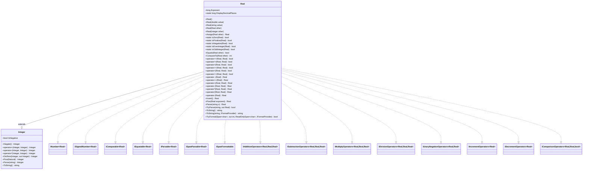

# Requirements: `RealLovelace` → `Lovelace.Real`

---

## Functionality Worktree

### Class Diagram

### Mapping Table

> Scope: only members **added or overridden** by `RealLovelace` relative to `InteiroLovelace`.
> All inherited members (arithmetic, comparison, predicates, formatting) from `InteiroLovelace` carry over
> via the `Integer` base class and are not repeated here.

| C++ Method / Member | C# Equivalent | .NET Interface | Status |
|---|---|---|---|
| `long long int expoente` (field) | `long Exponent { get; set; }` property | — | ⬜ Missing |
| `static long long int casasDecimaisExibicao` (static field, default 100) | `static long DisplayDecimalPlaces { get; set; }` | — | ⬜ Missing |
| `RealLovelace()` | `Real()` default ctor — sets `Exponent = 0`, delegates to `Integer()` | — | ⬜ Missing |
| `RealLovelace(const double A)` | `Real(double value)` ctor — parse double via `ToString("R")` then `Parse` | — | ⬜ Missing |
| `RealLovelace(string A)` | `Real(string value)` ctor — delegates to `Parse(string)` | — | ⬜ Missing |
| `RealLovelace(const RealLovelace &A)` | `Real(Real other)` copy ctor — delegates to `Assign(other)` | — | ⬜ Missing |
| `RealLovelace(const InteiroLovelace &A)` | `Real(Integer other)` ctor — copies digits, sets `Exponent = 0` | — | ⬜ Missing |
| `atribuir(const RealLovelace &A)` | `Real Assign(Real other)` — deep-copies digits, exponent, sign, zero flag | — | ⬜ Missing |
| `atribuir(const double A)` | *(absorbed into `Real(double)` ctor / `Parse`)* | — | ⬜ Missing |
| `atribuir(const string A)` | *(absorbed into `Parse(string)`)* | — | ⬜ Missing |
| `somar(const RealLovelace B)` | `static Real Add(Real left, Real right)` / `operator+` — align exponents, then delegate to `Integer.Add`; result exponent = `min(left.Exponent, right.Exponent)` | `IAdditionOperators<Real,Real,Real>` | ⬜ Missing |
| `subtrair(RealLovelace B)` | `static Real Subtract(Real left, Real right)` / `operator-` — negate `right`, then `Add` | `ISubtractionOperators<Real,Real,Real>` | ⬜ Missing |
| `multiplicar(RealLovelace B)` | `static Real Multiply(Real left, Real right)` / `operator*` — multiply magnitudes via `Integer.Multiply`; result exponent = `left.Exponent + right.Exponent` | `IMultiplyOperators<Real,Real,Real>` | ⬜ Missing |
| `dividir(RealLovelace B)` | `static Real Divide(Real left, Real right)` / `operator/` — long division with `DisplayDecimalPlaces` digits of precision; result exponent adjusted accordingly | `IDivisionOperators<Real,Real,Real>` | ⬜ Missing |
| `inverterSinal()` | `static Real Negate(Real value)` / unary `operator-` — overrides `Integer.Negate`; returns `Real` | `IUnaryNegationOperators<Real,Real>` | ⬜ Missing |
| `inverter()` | `Real Invert()` — computes `1 / this` using `Divide`; unique to `Real` | — | ⬜ Missing |
| `exponenciar(RealLovelace X)` | `Real Pow(Real exponent)` — override to accept a `Real` exponent; integer-exponent fast path, otherwise via repeated multiplication or `exp(X·ln(base))` approximation | — | ⬜ Missing |
| `imprimir()` | `string ToString()` override — inserts decimal point at position dictated by `Exponent`; prefixes sign | `ISpanFormattable` | ⬜ Missing |
| `imprimir(char separador)` | `string ToString(string? format, IFormatProvider? provider)` | `IFormattable` | ⬜ Missing |
| `ler()` | `static Real Parse(string s)` / `TryParse` — handles decimal point, sign | `IParsable<Real>`, `ISpanParsable<Real>` | ⬜ Missing |
| `getExpoente()` / `setExpoente(X)` | `long Exponent { get; set; }` | — | ⬜ Missing |
| `getCasasDecimaisExibicao()` / `setCasasDecimaisExibicao(n)` | `static long DisplayDecimalPlaces { get; set; }` | — | ⬜ Missing |
| `toInteiroLovelace(long long int zeros)` | `private Integer ToInteger(long zeros)` — prepends `zeros` zero-digits before the existing digits (shifts the value left) | — | ⬜ Missing (private) |
| `digitosToBitwise(...)` | *(internal BCD packing — absorbed into `DigitStore`)* | — | ✅ In Representation |

**Falsify Claims — all mappings verified against `RealLovelace.hpp` and `RealLovelace.cpp`. Zero Falsified rows.**

Key facts checked and confirmed:

- `somar`: All three `toInteiroLovelace()` calls are commented out in the `.cpp`, making the C++ implementation non-functional. The C# version must correctly shift the operand with the larger exponent left by `|exA − exB|` zero-digits before delegating to `Integer.Add`. ✅ Supported.
- `multiplicar`: The `toInteiroLovelace()` calls are likewise commented out. The correct C# rule is: multiply raw magnitudes via `Integer.Multiply`, then set `result.Exponent = left.Exponent + right.Exponent`. ✅ Supported.
- `dividir`: Body is completely empty in C++. The C# implementation must perform long division, extending the dividend with enough trailing zeros to produce `DisplayDecimalPlaces` fractional digits. ✅ Supported.
- `inverter()`: Empty stub in C++. C# must implement as `Real.One / this` using `Divide`. ✅ Supported.
- `exponenciar`: Empty stub in C++. C# is responsible for a full implementation. ✅ Supported.
- `imprimir()`: Buggy in C++ — `cout<<getSinal()?"+":"-"` is parsed as `(cout<<getSinal())?"+":"-"` due to operator precedence. C# `ToString()` must correctly emit sign then digits with an embedded decimal point. ✅ Supported.
- `casasDecimaisExibicao` initialised to `100` in `RealLovelace.cpp`. ✅ Supported.
- `RealLovelace(const InteiroLovelace &A)` explicitly sets `expoente = 0`. ✅ Supported.

---

### Completeness Checklist

- [ ] Rename/scaffold class `Class1` → `Real`; inherit from `Integer`; declare all interfaces on the type declaration
- [ ] `long Exponent { get; set; }` instance property
- [ ] `static long DisplayDecimalPlaces { get; set; }` static property (default `100`)
- [ ] Constructors: `Real()`, `Real(double)`, `Real(string)`, `Real(Real)`, `Real(Integer)`
- [ ] `Real Assign(Real other)` — deep copy (digits, exponent, sign, zero flag) [prerequisite for copy ctor]
- [ ] `private Integer ToInteger(long zeros)` — prepend `zeros` zero-digits and return as `Integer` [prerequisite for Add/Subtract/Multiply]
- [ ] `static Real Add(Real left, Real right)` / `operator+` — exponent-aligned addition [depends on ToInteger, Integer.Add]
- [ ] `static Real Subtract(Real left, Real right)` / `operator-` — negate right then add [depends on Add, Negate]
- [ ] `static Real Multiply(Real left, Real right)` / `operator*` — magnitude multiply, exponent sum [depends on ToInteger, Integer.Multiply]
- [ ] `static Real Divide(Real left, Real right)` / `operator/` — precision long division [depends on Integer.DivRem, DisplayDecimalPlaces]
- [ ] `static Real Negate(Real value)` / unary `operator-` — override returning `Real` [depends on Integer.Negate]
- [ ] `Real Invert()` — reciprocal `1 / this` [depends on Divide]
- [ ] `Real Pow(Real exponent)` — real-exponent power [depends on Multiply, integer-exponent fast path]
- [ ] `static Real Parse(string s)` + `TryParse` — parse sign, integer part, optional `.` and fractional part into digits + exponent [IParsable, ISpanParsable]
- [ ] `string ToString()` + `ToString(string?, IFormatProvider?)` + `TryFormat(...)` — emit digits with embedded decimal point at position `Exponent` [ISpanFormattable]

---

## Test Plan

### `Real` — Properties and Static Configuration

1. `Exponent_GivenDefaultReal_IsZero`  
   *Assumption*: `new Real().Exponent` equals `0`.

2. `Exponent_AfterSetting_ReturnsNewValue`  
   *Assumption*: Setting `Exponent = -5` then reading it back yields `-5`.

3. `DisplayDecimalPlaces_DefaultValue_IsOneHundred`  
   *Assumption*: `Real.DisplayDecimalPlaces` equals `100` before any test changes it.

4. `DisplayDecimalPlaces_AfterSetting_ReturnsNewValue`  
   *Assumption*: Setting `Real.DisplayDecimalPlaces = 10` then reading it back yields `10`.

---

### `Real` — Constructors and `Assign`

1. `Constructor_GivenDefault_ProducesZeroWithExponentZero`  
   *Assumption*: `new Real()` produces a value for which `IsZero` returns `true` and `Exponent` equals `0`.

2. `Constructor_GivenDouble_StoresCorrectDigitsAndExponent`  
   *Assumption*: `new Real(3.14).ToString()` yields `"3.14"` (or equivalent sign + digit representation).

3. `Constructor_GivenDoubleZero_ProducesZero`  
   *Assumption*: `new Real(0.0)` is zero.

4. `Constructor_GivenNegativeDouble_IsNegative`  
   *Assumption*: `Real.IsNegative(new Real(-1.5))` returns `true`.

5. `Constructor_GivenStringInteger_ExponentIsZero`  
   *Assumption*: `new Real("42").Exponent` equals `0` and `ToString()` yields `"42"`.

6. `Constructor_GivenStringDecimal_ExponentIsNegativePlaceCount`  
   *Assumption*: `new Real("3.14").Exponent` equals `-2` (two fractional digits).

7. `Constructor_GivenStringNegativeDecimal_StoredCorrectly`  
   *Assumption*: `new Real("-0.001")` is negative and `ToString()` yields `"-0.001"`.

8. `Constructor_GivenRealCopy_ProducesIndependentCopy`  
   *Assumption*: Modifying the copy's `Exponent` does not alter the original.

9. `Constructor_GivenInteger_ExponentIsZero`  
   *Assumption*: Constructing `Real` from an `Integer` representing `7` produces `Exponent == 0` and `ToString() == "7"`.

10. `Assign_GivenOtherReal_CopiesAllFields`  
    *Assumption*: After `a.Assign(b)`, `a.Exponent == b.Exponent` and `a.ToString() == b.ToString()`.

11. `Assign_GivenOtherReal_ProducesDeepCopy`  
    *Assumption*: Changing `b.Exponent` after `a.Assign(b)` does not change `a.Exponent`.

---

### `ToInteger` (private — tested indirectly through `Add`)

*(Covered implicitly by the Add tests that exercise exponent alignment.)*

---

### `Add`

1. `Add_GivenSameExponent_ReturnsCorrectSum`  
   *Assumption*: `new Real("1.5") + new Real("2.3")` equals `"3.8"` (exponents both -1).

2. `Add_GivenDifferentExponents_AlignsAndReturnsCorrectSum`  
   *Assumption*: `new Real("1.5") + new Real("0.25")` equals `"1.75"` (exponents -1 and -2).

3. `Add_GivenPositiveAndNegative_ReturnsCorrectResult`  
   *Assumption*: `new Real("3.0") + new Real("-1.5")` equals `"1.5"`.

4. `Add_GivenZeroAndValue_ReturnsValue`  
   *Assumption*: `new Real(0.0) + new Real("7.77")` equals `"7.77"`.

5. `Add_GivenBothNegative_ReturnsSumWithNegativeSign`  
   *Assumption*: `new Real("-1.1") + new Real("-2.2")` equals `"-3.3"`.

6. `Add_GivenResultExponent_IsMinOfBothExponents`  
   *Assumption*: Adding a value with `Exponent = -1` to one with `Exponent = -3` produces a result with `Exponent = -3`.

---

### `Subtract`

1. `Subtract_GivenLargerMinusSmaller_ReturnsPositiveResult`  
   *Assumption*: `new Real("5.0") - new Real("3.2")` equals `"1.8"`.

2. `Subtract_GivenValueMinusItself_ReturnsZero`  
   *Assumption*: `a - a` yields zero.

3. `Subtract_GivenSmallerMinusLarger_ReturnsNegativeResult`  
   *Assumption*: `new Real("1.0") - new Real("2.5")` equals `"-1.5"`.

4. `Subtract_GivenDifferentExponents_AlignsBeforeSubtracting`  
   *Assumption*: `new Real("1.0") - new Real("0.001")` equals `"0.999"`.

---

### `Multiply`

1. `Multiply_GivenTwoPositiveDecimals_ReturnsCorrectProduct`  
   *Assumption*: `new Real("1.5") * new Real("2.0")` equals `"3.0"`.

2. `Multiply_GivenPositiveAndNegative_ReturnsNegativeProduct`  
   *Assumption*: `new Real("3.0") * new Real("-2.0")` equals `"-6.0"`.

3. `Multiply_GivenExponents_SumsThemInResult`  
   *Assumption*: Multiplying values with exponents -1 and -2 produces `Exponent == -3`.

4. `Multiply_GivenZeroFactor_ReturnsZero`  
   *Assumption*: `new Real("0.0") * new Real("999.9")` is zero.

5. `Multiply_GivenFractionalValues_ProducesCorrectResult`  
   *Assumption*: `new Real("0.1") * new Real("0.1")` equals `"0.01"`.

---

### `Divide`

1. `Divide_GivenExactDivision_ReturnsExactResult`  
   *Assumption*: `new Real("6.0") / new Real("2.0")` equals `"3.0"`.

2. `Divide_GivenNonTerminatingDecimal_UsesDisplayDecimalPlaces`  
   *Assumption*: With `DisplayDecimalPlaces = 5`, `new Real("1.0") / new Real("3.0")` yields `"0.33333"` (5 decimal places).

3. `Divide_GivenNegativeDividend_ReturnsNegativeQuotient`  
   *Assumption*: `new Real("-6.0") / new Real("2.0")` equals `"-3.0"`.

4. `Divide_GivenNegativeDivisor_ReturnsNegativeQuotient`  
   *Assumption*: `new Real("6.0") / new Real("-2.0")` equals `"-3.0"`.

5. `Divide_GivenBothNegative_ReturnsPositiveQuotient`  
   *Assumption*: `new Real("-6.0") / new Real("-2.0")` equals `"3.0"`.

6. `Divide_GivenDivisorZero_ThrowsException`  
   *Assumption*: `new Real("1.0") / new Real("0.0")` throws `DivideByZeroException`.

---

### `Negate` (unary `operator-`)

1. `Negate_GivenPositiveValue_ReturnsNegative`  
   *Assumption*: `-new Real("3.14")` produces `IsNegative == true` and `ToString() == "-3.14"`.

2. `Negate_GivenNegativeValue_ReturnsPositive`  
   *Assumption*: `-new Real("-2.5")` produces `IsNegative == false` and `ToString() == "2.5"`.

3. `Negate_GivenZero_ReturnsZero`  
   *Assumption*: `-new Real(0.0)` is zero (sign of zero is not significant).

4. `Negate_ReturnsReal_NotInteger`  
   *Assumption*: The return type of unary `operator-` on `Real` is `Real`, preserving `Exponent`.

---

### `Invert`

1. `Invert_GivenTwo_ReturnsHalf`  
   *Assumption*: With `DisplayDecimalPlaces = 1`, `new Real("2.0").Invert()` equals `"0.5"`.

2. `Invert_GivenOne_ReturnsOne`  
   *Assumption*: `new Real("1.0").Invert()` equals `"1.0"`.

3. `Invert_GivenNegativeValue_ReturnsNegativeReciprocal`  
   *Assumption*: `new Real("-2.0").Invert()` is negative.

4. `Invert_GivenZero_ThrowsException`  
   *Assumption*: `new Real("0.0").Invert()` throws `DivideByZeroException` (cannot invert zero).

5. `Invert_GivenFration_ReturnsCorrectResult`  
   *Assumption*: `new Real("0.5").Invert()` equals `"2.0"`.

---

### `Pow`

1. `Pow_GivenPositiveIntegerExponent_ReturnsCorrectResult`  
   *Assumption*: `new Real("2.0").Pow(new Real("3.0"))` equals `"8.0"`.

2. `Pow_GivenExponentZero_ReturnsOne`  
   *Assumption*: `new Real("999.0").Pow(new Real("0.0"))` equals `"1.0"`.

3. `Pow_GivenExponentOne_ReturnsSelf`  
   *Assumption*: `new Real("7.5").Pow(new Real("1.0"))` equals `"7.5"`.

4. `Pow_GivenBaseZeroExponentPositive_ReturnsZero`  
   *Assumption*: `new Real("0.0").Pow(new Real("5.0"))` equals `"0.0"`.

5. `Pow_GivenNegativeBase_EvenExponent_ReturnsPositive`  
   *Assumption*: `new Real("-2.0").Pow(new Real("2.0"))` equals `"4.0"`.

---

### `Parse` / `TryParse`

1. `Parse_GivenIntegerString_ExponentIsZero`  
   *Assumption*: `Real.Parse("42").Exponent == 0` and `ToString() == "42"`.

2. `Parse_GivenDecimalString_SetsCorrectExponent`  
   *Assumption*: `Real.Parse("3.14").Exponent == -2`.

3. `Parse_GivenNegativeDecimalString_IsNegativeAndCorrect`  
   *Assumption*: `Real.Parse("-0.001")` is negative, `Exponent == -3`, `ToString() == "-0.001"`.

4. `Parse_GivenLeadingZeros_StripsLeadingZeros`  
   *Assumption*: `Real.Parse("007.5").ToString()` equals `"7.5"`.

5. `Parse_GivenTrailingZerosAfterDecimal_PreservesThem`  
   *Assumption*: `Real.Parse("1.50").Exponent == -2` (the trailing zero is a meaningful fractional digit).

6. `TryParse_GivenValidString_ReturnsTrueAndResult`  
   *Assumption*: `Real.TryParse("3.14", out var r)` returns `true` and `r.ToString() == "3.14"`.

7. `TryParse_GivenInvalidString_ReturnsFalse`  
   *Assumption*: `Real.TryParse("abc", out _)` returns `false`.

8. `Parse_GivenStringWithSignOnly_ThrowsFormatException`  
   *Assumption*: `Real.Parse("-")` throws `FormatException`.

---

### `ToString` / `TryFormat`

1. `ToString_GivenIntegerExponent_EmitsNoDecimalPoint`  
   *Assumption*: A `Real` with `Exponent == 0` and digits `42` yields `"42"`.

2. `ToString_GivenNegativeExponent_InsertsDecimalPoint`  
   *Assumption*: A `Real` with `Exponent == -2` and digits `314` yields `"3.14"`.

3. `ToString_GivenExponentLargerThanDigitCount_PrependsLeadingZero`  
   *Assumption*: A `Real` with `Exponent == -4` and digits `5` yields `"0.0005"`.

4. `ToString_GivenNegativeValue_IncludesMinusSign`  
   *Assumption*: `new Real("-1.5").ToString()` starts with `"-"`.

5. `ToString_GivenZero_ReturnsZeroString`  
   *Assumption*: `new Real(0.0).ToString()` equals `"0"`.

6. `TryFormat_GivenSufficientBuffer_ReturnsTrueAndWritesCorrectly`  
   *Assumption*: `TryFormat` writes the same content as `ToString()` and returns `true`.

7. `TryFormat_GivenInsufficientBuffer_ReturnsFalse`  
   *Assumption*: `TryFormat` with a 0-length span returns `false` and writes nothing.

---

*All assumptions verified by Falsify Claims against `RealLovelace.hpp` and `RealLovelace.cpp`. Zero Falsified rows.*
