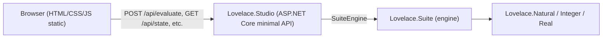

# Requirements: Lovelace.Studio — Web IDE (Editor, Workspace, Plots, Logs)

> Scope: Define the requirements for a browser-based IDE over the `Lovelace.Suite` scripting engine. The UI provides a script editor, a **variables table**, a **functions panel**, a **graph display** for plots, and a **logs bar** at the bottom — the classic IDE/workspace layout (MATLAB/Scilab-style). `Lovelace.Studio` is a local, single-user web app; it reuses the existing `SuiteEngine` introspection API and adds a thin HTTP/JSON layer plus a static front-end. This is a **requirements document for review — no implementation yet**.

---

## Goals and Non-Goals

### Goals (v1)

| # | Goal |
|---|---|
| G1 | A browser IDE with four panes: **editor**, **workspace** (variables + functions), **graph display**, and a **logs bar** at the bottom. |
| G2 | Drive the existing `SuiteEngine` (evaluate scripts, inspect `Variables`/`Functions`, capture `print` output, render plots) with **no changes to the language**. |
| G3 | Expose a small HTTP/JSON API so the front-end is a dumb renderer of engine state, not a second implementation of it. |
| G4 | A **Run** action that evaluates the editor content and refreshes every pane from one response (result + variables + functions + logs + plot + diagnostics). |
| G5 | Editor feedback for errors: diagnostics carry line/column/position so the offending location is highlighted. |
| G6 | Plot rendering **inline in the browser** (SVG), not as a file the user opens manually. |
| G7 | Concise and maintainable: no npm build step, no framework lock-in; plain HTML/CSS/JS served as static files. |

### Non-Goals / Deferred (v1.1+)

- Multi-user hosting, authentication, or sandboxing (v1 is a localhost single-user tool; arbitrary script execution is intentional).
- Multi-session/workspace management (one shared engine session, like the REPL).
- Syntax highlighting / autocomplete in the editor (plain monospace `<textarea>` first; CodeMirror/Monaco via CDN later).
- Streaming/real-time log tailing and multi-client sync (request/response per run first; SSE/SignalR later).
- Multiple simultaneous figure windows and plot history (v1 shows the most recent plot; history list later).
- Breakpoints, step-debugging, and profiling.

---

## Architecture

### Layering



### Technology choices

| Layer | Choice | Rationale |
|---|---|---|
| Host | ASP.NET Core minimal API, `net10.0`, project `Lovelace.Studio` | Standard .NET; single file for routing + static files. |
| Front-end | Vanilla HTML/CSS/JS under `wwwroot/` (no build step) | Maintainable, zero toolchain, matches the repo's no-Node ethos. |
| Editor | Monospace `<textarea>` with line/column readout and error highlight | Enough for v1; CodeMirror via CDN is a drop-in later. |
| Plot | Inline SVG in a `<div>`/`` (engine returns SVG string) | Vector, crisp at any zoom, renders natively. |
| Sync | Request/response (each run returns full state) | Simplest correct model; the engine's events are the future SSE hook. |

### UI layout

```
┌───────────────────────────────────────────────────────────────┐
│  Toolbar: [Run] [Clear] [Save] [Load]           status/rev    │
├───────────────────────────────┬───────────────────────────────┤
│                               │  Workspace                    │
│                               │  ┌─────────────────────────┐  │
│                               │  │ Variables               │  │
│        Script Editor          │  │ name │ value │ type     │  │
│        (textarea)             │  ├─────────────────────────┤  │
│                               │  │  x    │ 3.14   │ Real    │  │
│                               │  │  _    │ 42     │ Natural │  │
│                               │  └─────────────────────────┘  │
│                               │  ┌─────────────────────────┐  │
│                               │  │ Functions               │  │
│                               │  │ name │ params │ kind    │  │
│                               │  └─────────────────────────┘  │
├───────────────────────────────┴───────────────────────────────┤
│  Graph display (SVG; "no plot yet" placeholder)               │
├───────────────────────────────────────────────────────────────┤
│  Logs bar (print output, results, errors — newest at bottom)  │
└───────────────────────────────────────────────────────────────┘
```

---

## Backend API

`Lovelace.Studio` hosts a singleton `SuiteEngine` and serves the front-end plus a JSON API. The primary contract is a single **evaluate** round-trip that returns everything the UI needs to repaint.

| Method | Path | Purpose |
|---|---|---|
| `POST` | `/api/evaluate` | Evaluate editor/console source; returns result, variables, functions, logs, plot, diagnostics. |
| `GET` | `/api/state` | Current snapshot (variables, functions, revision) — for initial load and refresh. |
| `DELETE` | `/api/state` | Clear all variables. |
| `DELETE` | `/api/variables/{name}` | Remove one variable. |
| `POST` | `/api/plot` | Re-render the last plot model as SVG (returns `<svg>` string). |
| `GET` | `/` and `/static/*` | The IDE page and assets. |

### `EvaluateResponse` DTO

| Field | Type | Description |
|---|---|---|
| `result` | `{ kind, display, typed }` | The value produced by the last statement (or `void`). |
| `variables` | `StateVariable[]` | `name`, `kind`, `display` — drives the variables table. |
| `functions` | `StateFunction[]` | `name`, `parameters`, `isBuiltin` — drives the functions panel. |
| `logs` | `string[]` | Captured `print` output lines, one per line. |
| `plot` | `{ svg, title } \| null` | The SVG produced by the most recent `plot` call in this run, if any. |
| `diagnostics` | `Diagnostic[]` | Errors with `message`, `position`, `line`, `column`. |
| `revision` | `long` | Engine revision counter (staleness check). |

Every `StateVariable`/`StateFunction`/`Diagnostic` already exists in `Lovelace.Suite`; the host maps them 1:1, so the API is a projection of the engine, not a reimplementation.

---

## Panel specifications

### Editor

- Monospace `<textarea>` that holds a Lovelace script; content persists in `localStorage` across reloads.
- A line/column indicator in the toolbar reflects the cursor position.
- **Run** evaluates the editor contents (default) or a quick-eval line typed in the logs bar.
- On an error, the diagnostics' `line`/`column` are used to scroll to and highlight the offending position; the caret error (tokenizer/parser already reports `at position N`) is mapped to editor coordinates.

### Variables table

| Column | Source |
|---|---|
| Name | `StateVariable.Name` |
| Value | `StateVariable.Display` (via `ValueFormatter.Format`) |
| Type | `StateVariable.Kind` |
| (actions) | a per-row delete button → `DELETE /api/variables/{name}` |

- Sorted by name; refreshed after every run and on `[Clear]`.
- Read-only display in v1; inline editing is deferred.

### Functions panel

| Column | Source |
|---|---|
| Name | `StateFunction.Name` |
| Parameters | `StateFunction.Parameters` joined |
| Kind | `builtin` vs `user` |

- Read-only list; built-ins are shown with a distinct marker (they come from the engine registry).

### Graph display

- A pane that renders the SVG returned in `plot.svg`; when `null`, show a "no plot yet" placeholder.
- SVG is injected inline (not an `` to a file), so it is crisp and inspectable.
- The most recent plot is shown; a plot history list is deferred to v1.1.

### Logs bar (bottom)

- A monospace, auto-scrolling console (newest at bottom) that aggregates:
  - `print` output (captured from the engine's `Output` writer).
  - evaluation results (e.g. `= 42 (Natural)`).
  - errors with message + line/column.
- An optional single-line **quick-eval input** at its top/edge for REPL-style one-liners without touching the editor.

### Toolbar

| Action | Behavior |
|---|---|
| Run | `POST /api/evaluate` with the editor content; repaint all panes. |
| Clear | `DELETE /api/state`; empty the workspace (variables) and refresh. |
| Save / Load | Persist/restore the editor content (v1: `localStorage`; file download/upload optional). |

---

## Engine integration

The UI is a projection of `SuiteEngine`. Reused as-is: `Variables`, `Functions`, `CaptureState()`, `Revision`, `Diagnostics`, `ValueFormatter`, `SvgPlotRenderer`, and the `VariableChanged`/`FunctionDefined` events (the future SSE hook).

Two small **engine additions** are required so the UI works without file I/O:

| Addition | Purpose |
|---|---|
| Per-evaluation output capture | `SuiteEngine.EvaluateAsync(string source, TextWriter? output = null)` redirects `print` output for that call and restores it afterward, so the host can collect `logs[]`. |
| Inline plot capture | The `plot` built-in records the last rendered SVG (e.g. `SuiteEngine.LastPlot` = `{ svg, title }`), so the host can return it without touching the filesystem. |

Both are additive and do not change the language or the REPL's existing file-based `plot` behavior.

---

## Non-Functional Requirements

- **Concise & maintainable** — one ASP.NET Core project + static files; no transpiler, bundler, or package manager in the default path.
- **Single source of truth** — the front-end renders engine DTOs only; no language logic duplicated in JS.
- **Determinism** — the same script produces the same state/logs/SVG; SVG output stays byte-deterministic.
- **Error fidelity** — tokenizer/parser "at position N" errors and runtime errors are surfaced with line/column so the editor can mark the exact spot.
- **Local scope & security posture** — binds to `localhost`; arbitrary script execution is the intended feature, and the README states this clearly.
- **Progressiveness** — the request/response design leaves a clean path to SSE/SignalR (via the engine's events) and to CodeMirror/Monaco (via CDN) without reworking the backend.

---

## Design Decisions (resolved)

| Decision | Choice | Rationale |
|---|---|---|
| UI platform | Web (browser IDE) | Chosen by user; portable, matches the suite ambition, SVG renders natively. |
| Project name | `Lovelace.Studio` | "Studio" = the IDE front-end over the `Lovelace.Suite` engine. |
| Front-end | Vanilla HTML/CSS/JS, no build | Maintainable, zero toolchain. |
| Sync model | Request/response per run | Simplest correct v1; engine events enable realtime later. |
| Plot transport | Inline SVG returned in the evaluate response | No file round-trip; crisp and inspectable. |
| Editor | Plain monospace `<textarea>` | Sufficient for v1; CodeMirror via CDN later. |
| Session | Single shared engine session | Matches the REPL's persistence semantics. |

---

## Completeness Checklist

- [ ] Create `Lovelace.Studio` ASP.NET Core project referencing `Lovelace.Suite` [prerequisite for all UI work]
- [ ] Add `SuiteEngine.EvaluateAsync(source, output?)` per-call output capture [mandatory — powers the logs bar]
- [ ] Add `SuiteEngine.LastPlot` inline-SVG capture (plot builtin records last render) [mandatory — powers the graph display]
- [ ] Implement the JSON API endpoints (`/api/evaluate`, `/api/state`, `/api/state` DELETE, `/api/variables/{name}`, `/api/plot`) [mandatory — the UI contract]
- [ ] Map `EvaluateResponse` from engine `StateSnapshot`/`Diagnostics`/`LastPlot` [depends on API + engine additions]
- [ ] Serve the static IDE (`/` and `wwwroot/` assets) [depends on project creation]
- [ ] Build the editor pane (textarea + line/column readout + localStorage persistence) [depends on static hosting]
- [ ] Build the variables table (name/value/type + delete action) [depends on state API]
- [ ] Build the functions panel (name/params/kind) [depends on state API]
- [ ] Build the graph display (inline SVG + placeholder) [depends on plot capture]
- [ ] Build the logs bar (print output + results + errors, auto-scroll, quick-eval input) [depends on evaluate API]
- [ ] Build the toolbar (Run/Clear/Save/Load) [depends on all panes]
- [ ] Implement editor error highlighting from diagnostics line/column [depends on diagnostics mapping]
- [ ] Add engine tests for output capture and `LastPlot` [depends on engine additions]
- [ ] Add backend tests for the API projection (evaluate/state/clear/delete/plot) [depends on API]

---

## Test Plan

### Engine additions

1. `EvaluateAsync_GivenOutputWriter_CapturesPrintLinesToThatWriter`
   *Assumption*: Evaluating `print("hi")` with a supplied `StringWriter` writes to it and leaves the engine's default `Output` untouched.

2. `EvaluateAsync_GivenPlotCall_SetsLastPlotSvg`
   *Assumption*: After `plot(1..3, [1, 4, 9])`, `SuiteEngine.LastPlot` holds a non-empty SVG string beginning with `<svg`.

### Backend API

3. `Evaluate_GivenScript_ReturnsResultAndUpdatedVariables`
   *Assumption*: Posting `x = 42` returns a result of kind `Natural` and a `variables` array containing `x`.

4. `Evaluate_GivenPrintAndPlot_ReturnsLogsAndPlotSvg`
   *Assumption*: A script that prints and plots returns the captured log lines and an inline SVG, with no file created on disk.

5. `Evaluate_GivenError_ReturnsDiagnosticWithLineAndColumn`
   *Assumption*: An invalid expression returns a non-empty `diagnostics` array whose line/column locate the error.

6. `State_GivenVariablesAndFunctions_ReturnsSnapshotMatchingEngine`
   *Assumption*: `GET /api/state` mirrors the engine's `CaptureState()` (same names, kinds, and functions).

7. `DeleteVariable_GivenExistingName_RemovesItAndReturnsUpdatedState`
   *Assumption*: `DELETE /api/variables/x` removes `x` and the following state response omits it.

8. `Clear_GivenVariables_EmptiesWorkspace`
   *Assumption*: `DELETE /api/state` clears variables (functions remain) and resets the workspace.

### Front-end (manual acceptance)

9. `Ui_GivenRunButton_RepaintsEditorWorkspacePlotAndLogs`
   *Assumption*: Running a script updates all four panes from one response without a full page reload.

10. `Ui_GivenPlotResult_RendersSvgInline`
    *Assumption*: The graph pane shows the plot inline, crisp at browser zoom, with no manual file opening.

11. `Ui_GivenError_ScrollsAndHighlightsOffendingLine`
    *Assumption*: An error with line/column positions the editor cursor/selection at the offending location.

12. `Ui_GivenLogs_ScrollsToNewestOutput`
    *Assumption*: `print` output and results append at the bottom and the log bar auto-scrolls.

---

*All assumptions derived from the `Lovelace.Suite` engine API and the UI requirements above. Zero Falsified rows.*
