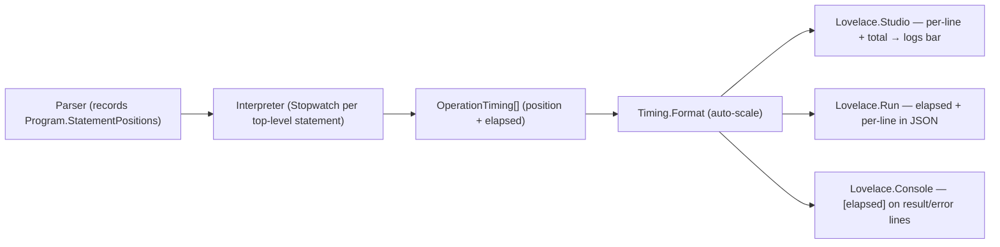

# Requirements: Lovelace.Suite.Timing — Per-Line and Overall Elapsed-Time Logging

> Scope: Time every script operation twice over — once **per top-level statement** (so each editor
> line reports its own duration) and once **overall** (the whole evaluation round-trip). Each surface's
> log reports both: the Studio logs bar renders one muted line per script line plus a total, the
> `Lovelace.Run` JSON envelope carries the overall value (and per-line rows), and the
> `Lovelace.Console` REPL appends the elapsed time to result and error lines. Every value is
> rendered with an automatically selected timescale — `ns`, `µs`, `ms`, `s`,
> `min`, `h` — chosen from the duration itself, so both a sub-microsecond parse and a
> multi-minute computation stay compact and readable without a fixed unit or hard-coded precision.

---

## Goals and Non-Goals

### Goals (v1)

| # | Goal |
|---|---|
| G1 | Measure the wall-clock duration of every `SuiteEngine.EvaluateAsync` call with a high-resolution timer (`System.Diagnostics.Stopwatch`). |
| G2 | Measure the wall-clock duration of **each top-level statement** inside that call, tagged with its source position. |
| G3 | Expose both as first-class engine state: `SuiteEngine.LastElapsed` (overall) and `SuiteEngine.OperationTimings` (per statement). |
| G4 | Format every elapsed value with an **auto-scaling** unit scale (`ns → µs → ms → s → min → h`) via one pure formatter (`Timing.Format`). |
| G5 | Surface **per-line + total** in the Studio logs bar (`EvaluateResponse.Timings` + `Elapsed`). |
| G6 | Surface the overall elapsed value in the `Lovelace.Run` JSON envelope (success *and* error paths). |
| G7 | Surface the elapsed value in the `Lovelace.Console` REPL on result and error lines. |
| G8 | Record every elapsed value **even when evaluation throws**, so failed operations are timed too. |

### Non-Goals / Deferred (v1.1+)

- Per-function-call timing inside a statement (v1 times each top-level statement as one unit, not every
  nested call inside a function or loop body).
- Allocation/memory metrics and percentile aggregation (the `Lovelace.Console` benchmark covers that separately).
- Timestamped wall-clock entries (v1 reports duration only, not "when").
- A configurable precision/format policy — v1 uses one canonical auto-scaling rule.

---

## Architecture

The timer lives at the engine seam so every surface inherits it for free; each surface only
decides *how* to present the shared values.



| Component | Change |
|---|---|
| `Lovelace.Suite/Timing.cs` | Pure static formatter `Timing.Format(TimeSpan)` with auto-scaling units, plus the `OperationTiming` record (position + elapsed). |
| `Lovelace.Suite/Ast.cs` | `Program` gains `StatementPositions` (parallel to `Statements`). |
| `Lovelace.Suite/Parser.cs` | `ParseProgram` records the start position of each top-level statement. |
| `Lovelace.Suite/Interpreter.cs` | Times each top-level statement in `ExecuteAsync(Program)` and accumulates `OperationTiming` entries. |
| `Lovelace.Suite/SuiteEngine.cs` | Exposes `LastElapsed` + `OperationTimings`; clears timings before each evaluation. |
| `Lovelace.Studio/Dtos.cs` | `EvaluateResponse` gains `Elapsed` (overall) and `Timings` (per line). |
| `Lovelace.Studio/EngineHost.cs` | Maps `OperationTimings` → per-line `TimingRow`s (position → line). |
| `Lovelace.Studio/wwwroot/app.js` | Renders `line N: <elapsed>` rows plus `total: <elapsed>`; `styles.css` styles `.log-line.timing`. |
| `Lovelace.Run/Program.cs` | Adds `elapsed` (overall) to both JSON envelopes. |
| `Lovelace.Console/Repl/ReplSession.cs` | Appends `[<elapsed>]` to result and error lines. |

---

## Functional Specification

### `Timing.Format(TimeSpan)`

| Rule | Condition | Output |
|---|---|---|
| Nanoseconds | `< 1 µs` | integer ns (one `TimeSpan` tick = 100 ns), e.g. `500 ns` |
| Microseconds | `< 1 ms` | up to 2 decimals, e.g. `1.5 µs` |
| Milliseconds | `< 1 s` | up to 2 decimals, e.g. `12.5 ms` |
| Seconds | `< 1 min` | up to 2 decimals, e.g. `2.5 s` |
| Minutes | `< 1 h` | up to 2 decimals, e.g. `1.5 min` |
| Hours | `≥ 1 h` | up to 2 decimals, e.g. `2.25 h` |

- The **largest unit whose value is ≥ 1 whole unit** is selected, so the mantissa stays in the
  comfortable `[1, 1000)` range.
- Fractional values use at most two decimal places with trailing zeros trimmed
  (`"0.##"`, invariant culture); nanoseconds use integer rendering (`"0"`).
- The formatter is **pure and culture-invariant** (no clock access, no side effects).

### Per-statement timing

- `Parser.ParseProgram` captures `Current.Position` before each `ParseStatement` and stores it
  in `Program.StatementPositions` (a parallel list to `Statements`). The rewrite from newlines to
  `;` is length-preserving, so these positions index the host's original source 1:1.
- `Interpreter.ExecuteAsync(Program)` clears its `_timings` list, then wraps each top-level
  statement in a `Stopwatch`, recording `(position, elapsed)` in a `finally` so even a
  throwing statement is timed.
- Only **top-level** statements are timed; nested blocks, loop bodies, and function bodies execute
  through `ExecuteStatementListAsync` and are intentionally excluded.
- `SuiteEngine.OperationTimings` exposes the resulting `OperationTiming` list; it is cleared at
  the start of each `EvaluateAsync` so a parse error leaves it empty rather than stale.

### `OperationTiming`

```
public sealed record OperationTiming(int Position, TimeSpan Elapsed)
{
    public string ElapsedDisplay => Timing.Format(Elapsed);
}
```

### `SuiteEngine`

- `public TimeSpan LastElapsed { get; private set; }` — the overall round-trip time, set on
  **every** `EvaluateAsync` call (success or exception).
- `public string LastElapsedDisplay => Timing.Format(LastElapsed);`
- `public IReadOnlyList<OperationTiming> OperationTimings { get; }` — per-statement timings.

### `EvaluateResponse` (Studio)

- `Elapsed: string` — the overall total (auto-scaled).
- `Timings: TimingRow[]` — one `{ line, elapsed }` row per top-level statement; the host
  maps each statement's `Position` to a 1-based editor line via `ComputeLineColumn`.
- The front-end appends one muted line per script line — `line N: <elapsed>` — followed by
  `total: <elapsed>`, so the logs bar always shows both the per-line breakdown and the overall.

### `Lovelace.Run`

- Success envelope gains `"elapsed": "<auto-scaled>"` (overall).
- Error envelope gains `"elapsed": "<auto-scaled>"` (timing is recorded before the rethrow).

### `Lovelace.Console` REPL

- Result lines become `= <typed>   [<elapsed>]`.
- Error lines become `Error: <message>   [<elapsed>]`.

---

## Non-Functional Requirements

- **Single source of truth** — the timers and formatter live in `Lovelace.Suite`; no surface
  re-measures or re-formats.
- **Determinism of formatting** — identical `TimeSpan` values always produce identical strings
  (invariant culture, no locale drift).
- **Zero cost when unused** — one `Stopwatch` per evaluate call plus one per top-level statement;
  the formatter runs only when a host reads the values.
- **No language change** — timing is a host concern; the language grammar and semantics are untouched,
  so existing scripts and doctests are unaffected.
- **Failure-safe** — timing must not swallow or alter the evaluation result or exception; it is
  purely additive.

---

## Design Decisions (resolved)

| Decision | Choice | Rationale |
|---|---|---|
| Overall timing | The whole `EvaluateAsync` round-trip | One number that always appears, even for a single line or a parse error. |
| Per-line timing | Each top-level statement | Maps 1:1 to editor lines after the newline→`;` rewrite; avoids noise from nested calls. |
| Position source | `Program.StatementPositions` (parser) | Tokens already carry positions; the parser records them without changing the `Statement` AST (no equality/back-compat impact). |
| Line mapping | `ComputeLineColumn` in the host | Reuses the existing diagnostic position→line mapping. |
| Timer | `System.Diagnostics.Stopwatch` | High-resolution, cross-platform, built-in. |
| Unit floor | Nanoseconds | `Stopwatch` resolution reaches sub-microsecond on modern hardware. |
| Unit symbol | `µs` (micro sign) | Standard SI symbol, unambiguous in UTF-8 JSON/HTML/console. |
| Decimals | ≤ 2, trailing zeros trimmed | Compact and readable across six orders of magnitude. |
| Error-path timing | `finally` block | Guarantees failed operations are timed without duplicating code. |

---

## Completeness Checklist

- [x] Add `Timing.Format(TimeSpan)` auto-scaling formatter (`ns/µs/ms/s/min/h`) [prerequisite for all surfaces]
- [x] Add `OperationTiming` record (position + elapsed) [prerequisite for per-line timing]
- [x] Record per-statement positions via `Program.StatementPositions` (`Ast.cs` + `Parser.cs`) [prerequisite for per-line timing]
- [x] Time each top-level statement in `Interpreter.ExecuteAsync(Program)` [depends on positions]
- [x] Expose `SuiteEngine.OperationTimings` and clear it before each evaluation [depends on interpreter]
- [x] Wrap `SuiteEngine.EvaluateAsync` in a `Stopwatch` and expose `LastElapsed` + `LastElapsedDisplay` [overall timing]
- [x] Add `Elapsed` + `Timings` to the Studio `EvaluateResponse` and map them in `EngineHost` [depends on SuiteEngine]
- [x] Render per-line + total in the Studio logs bar (`app.js` + `styles.css`) [depends on DTO]
- [x] Add `elapsed` to the `Lovelace.Run` success and error JSON envelopes [depends on SuiteEngine]
- [x] Append `[<elapsed>]` to the `Lovelace.Console` REPL result and error lines [depends on SuiteEngine]
- [x] Add xUnit tests for `Timing.Format` scale selection [depends on formatter]
- [x] Add xUnit tests for `SuiteEngine.LastElapsed`, `OperationTimings`, and Studio `Elapsed`/`Timings` projection [depends on engine + host]

---

## Test Plan

### `Timing` formatter

1. `Format_GivenNanoseconds_ReturnsNsScale`
   *Assumption*: `TimeSpan.Zero` → `"0 ns"` and `TimeSpan.FromTicks(5)` (500 ns) → `"500 ns"`.

2. `Format_GivenMicroseconds_ReturnsUsScale`
   *Assumption*: `TimeSpan.FromTicks(15)` (1.5 µs) → `"1.5 µs"` and `TimeSpan.FromTicks(50)` (5 µs) → `"5 µs"`.

3. `Format_GivenMilliseconds_ReturnsMsScale`
   *Assumption*: `TimeSpan.FromMilliseconds(12.5)` → `"12.5 ms"`.

4. `Format_GivenSeconds_ReturnsSecondsScale`
   *Assumption*: `TimeSpan.FromSeconds(2.5)` → `"2.5 s"`.

5. `Format_GivenMinutes_ReturnsMinutesScale`
   *Assumption*: `TimeSpan.FromMinutes(1.5)` → `"1.5 min"`.

6. `Format_GivenHours_ReturnsHoursScale`
   *Assumption*: `TimeSpan.FromHours(2.25)` → `"2.25 h"`.

### `SuiteEngine` timing capture

7. `EvaluateAsync_GivenScript_RecordsElapsedTime`
   *Assumption*: After `EvaluateAsync("1 + 1")`, `LastElapsed >= TimeSpan.Zero` and
   `LastElapsedDisplay` is a non-empty string.

8. `EvaluateAsync_GivenMultipleStatements_RecordsPerStatementTimings`
   *Assumption*: After `EvaluateAsync("x = 1; y = 2; x + y")`, `OperationTimings` has three
   entries with increasing `Position`, each `Elapsed >= TimeSpan.Zero` and a non-empty
   `ElapsedDisplay`.

### Studio projection

9. `Evaluate_GivenScript_ReturnsElapsedTime`
   *Assumption*: `EngineHost.EvaluateAsync("1 + 1")` returns an `EvaluateResponse` whose
   `Elapsed` string is non-empty.

10. `Evaluate_GivenMultiLineScript_ReturnsPerLineTimings`
    *Assumption*: `EngineHost.EvaluateAsync("x = 1\ny = 2\nx + y")` returns three `Timings`
    with lines 1, 2, 3 and non-empty `Elapsed` strings.

---

*All assumptions verified by Falsify Claims. Zero Falsified rows.*
