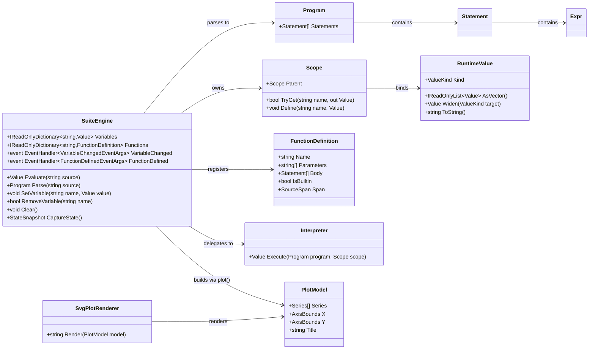

# Requirements: Lovelace.Suite — Scripting Engine, Introspection API, Vector Math, and Graph Visualization

> Scope: Define the requirements for lifting the `Lovelace.Console` REPL's tokenizer → parser → evaluator into a reusable scripting engine (`Lovelace.Suite`) that (1) compiles and executes a statement-based script language, (2) exposes a public introspection interface that exhibits variables with their values and types, and function definitions with their signatures and bodies, and (3) provides vector math and 2D graph visualization in this first version. `Lovelace.Suite` is the growth point for a MATLAB/Scilab-style math scripting suite; a graphical interface is a later phase that will consume the introspection API and vector rendering defined here. This is a **requirements document for review — no implementation yet**.

---

## Goals and Non-Goals

### Goals (v1)

| # | Goal |
|---|---|
| G1 | Extract the language front-end (tokenizer, parser, AST) and evaluation into a new library project `Lovelace.Suite`, with `Lovelace.Console` becoming a thin front-end. |
| G2 | Expose a public **introspection interface**: named variables + their values and types, named function definitions + their parameters and bodies, plus a serializable state snapshot and change notifications (the seam a future GUI reads). |
| G3 | Grow the grammar from a single-expression evaluator into a **statement language**: blocks, `if`/`else`, `while`, `for`, `return`, user-defined functions, and `print` with C#-style string interpolation. |
| G4 | Introduce a **`Vector` value type** (range literals + list literals) with indexing, length, and element-wise arithmetic — the foundation for the vector/matrix layer (`VetorLovelace` migration) and the input to plotting. |
| G5 | Provide **2D graph visualization**: a `plot` built-in that builds a plot model and renders it through a pluggable renderer, with an SVG renderer shipped first (resolution-independent for the future GUI). |
| G6 | Keep the **AST as a stable intermediate representation** so a future bytecode/AOT compiler can reuse the same front-end; the interpreter is the first backend, not the only one. |

### Non-Goals / Deferred (v1.1+)

- Bytecode emission and AOT/JIT compilation (designed for, not built in v1).
- Matrices / N-dimensional arrays and slicing; `sum`, inner product, and advanced vector algebra (defer to the `VetorLovelace` migration).
- The graphical interface (IDE/watch panels, interactive plots) — v1 only provides the introspection API and vector SVG output that a later GUI consumes.
- Complex numbers, symbolic algebra, and physical units.
- Function overloading, default/named arguments, and first-class closures (v1 has lexical scoping + recursion only).
- Interactive/zoomable plots, PNG export, and multi-series legend styling.

---

## Architecture

### Project layout

```
Lovelace.Console (REPL front-end: LineEditor, ReplSession, Program)
        │  depends on
        ▼
Lovelace.Suite (the engine)
        │
        ├── Ast/            Expression + statement nodes (the stable IR)
        ├── Token.cs, Tokenizer.cs, Parser.cs
        ├── Values.cs       RuntimeValue + ValueKind (incl. Vector)
        ├── Scope.cs        Lexical environment (global + function frames)
        ├── Functions.cs    FunctionDefinition + BuiltinFunction registry
        ├── Interpreter.cs  Tree-walking backend over the AST
        ├── SuiteEngine.cs  Public facade + introspection API
        └── Plotting/       PlotModel, IPlotRenderer, SvgPlotRenderer, Plot built-in
        │  depends on
        ▼
Lovelace.Natural / Lovelace.Integer / Lovelace.Real
```

`Lovelace.Console` keeps only I/O concerns (`LineEditor`, `ReplSession`, `Program`) and commands; all language logic moves into `Lovelace.Suite`.

### Class Diagram



---

## Language Specification (v1)

### Values

`ValueKind` is extended (additive, backward-compatible with the existing `Lovelace.Console.Repl.ValueKind`):

| Kind | Payload | Notes |
|---|---|---|
| `Natural` | `Lovelace.Natural.Natural` | existing |
| `Integer` | `Lovelace.Integer.Integer` | existing |
| `Real` | `Lovelace.Real.Real` | existing |
| `Boolean` | `bool` | existing |
| `Text` | `string` | existing |
| `Vector` | `IReadOnlyList<Value>` | new — numeric vector; seeds `VetorLovelace`; the plot input |
| `Function` | `FunctionDefinition` | new — first-class reference (passing functions deferred to v1.1) |
| `Void` | — | new — result of statements that produce no value |

Widening remains `Natural → Integer → Real`; `Vector` elements are numeric and widen element-wise at construction time.

### Statements

The parser now produces a `Program` (a list of statements) instead of a single `Expr`. Precedence and operators are unchanged and backward-compatible.

| Statement | Syntax | Notes |
|---|---|---|
| Expression statement | `<expr>` | REPL prints its value; a script returns the last one |
| Assignment | `name = <expr>` | right-associative, also usable as an expression |
| Block | `{ <stmt>; <stmt>; … }` | new lexical scope |
| Conditional | `if (<expr>) <stmt> [else <stmt>]` | `else if` chains allowed |
| Loop | `while (<expr>) <stmt>` | `break` / `continue` supported |
| Counted loop | `for name in <range> <stmt>` | loop variable is function-local |
| Return | `return <expr>?` | optional expression; bare `return` yields `Void` |
| Function definition | `func name(a, b) { <stmt>; … }` | C-style braces; `func name(a, b) = <expr>` is a shorthand for a single-expression body |

### Strings and `print`

- **Interpolated string literal** `$"… {expr} …"` — produces a `Text` value; each `{expr}` is evaluated and formatted using the value's display rendering (respecting current display precision). `{{` and `}}` escape literal braces, matching C#.
- **`print(expr)` built-in** — renders `expr` to standard output (a `Text` value prints as-is; any other value prints its display form). Returns `Void`. This is the script-side output primitive; the REPL's expression-statement echo remains separate so `print` does not double-print interactively.

### Vectors

| Construct | Syntax | Result |
|---|---|---|
| Range | `a .. b` | `Vector` of `Natural`/`Integer` from `a` to `b` inclusive, step 1 |
| Stepped range | `a .. step .. b` | `Vector` with explicit step |
| List literal | `[a, b, c]` | `Vector` of the given values |

Vector operations in v1:

| Operation | Syntax | Notes |
|---|---|---|
| Length | `len(v)` | returns `Natural` |
| Indexing | `v[i]` | **0-based**, first element at index 0; `i` is `Natural`/`Integer` |
| Element-wise `+ - * /` | `v op w`, `v op k`, `k op v` | vector∘vector requires equal lengths; vector∘scalar broadcasts |

Deferred to the vector/matrix layer: slicing, `sum`, inner product, and matrices.

### Functions

- User-defined functions and built-ins share one registry; `FunctionDefinition.IsBuiltin` distinguishes them.
- Parameters shadow globals; locals do not leak to the global scope; recursion is supported (the function's own name is visible inside its body).
- Block-bodied functions return their last expression value implicitly, or an explicit `return`.
- Arity is validated against `Parameters` at call time.

### Plot

- `plot(y)` — `y` is a `Vector`; x = `1..len(y)`.
- `plot(x, y)` — two `Vector`s of equal length.
- `plot(x, y, "title")` — optional title string.
- Returns a `Plot` value; writes a deterministic SVG file and the REPL prints the output path.

---

## Public API (the introspection interface)

### `SuiteEngine`

| Member | Signature | Description |
|---|---|---|
| `Evaluate` | `Value Evaluate(string source)` | Tokenize → parse → execute; returns the last value or `Void`. Async-aware where the numeric library requires it (`Sqrt`, `Pi`). |
| `Parse` | `Program Parse(string source)` | Exposes the front-end result (the IR) for tooling and the future compiler. |
| `Variables` | `IReadOnlyDictionary<string, Value> Variables` | Live view of all global variables (name → value + kind). |
| `Functions` | `IReadOnlyDictionary<string, FunctionDefinition> Functions` | Live view of all defined functions (name → signature + body + metadata). |
| `SetVariable` | `void SetVariable(string name, Value value)` | Programmatic injection (host/tooling/GUI). |
| `GetVariable` | `bool TryGetVariable(string name, out Value value)` | Typed lookup without exceptions. |
| `RemoveVariable` | `bool RemoveVariable(string name)` | Removes one variable. |
| `Clear` | `void Clear()` | Clears all variables (built-ins and functions remain). |
| `DefineFunction` | `void DefineFunction(FunctionDefinition def)` | Registers a user or built-in function. |
| `RegisterBuiltin` | `void RegisterBuiltin(string name, string[] parameters, Func<…> impl)` | Host-registered native function. |
| `CaptureState` | `StateSnapshot CaptureState()` | Immutable snapshot of variables + functions (for the GUI panels, debugging, and save/restore). |
| `VariableChanged` | `event … VariableChanged` | Raised when a variable is defined, reassigned, or removed. |
| `FunctionDefined` | `event … FunctionDefined` | Raised when a function is defined. |
| `Diagnostics` | `IReadOnlyList<Diagnostic> Diagnostics` | Errors/warnings with source position (line, column) and caret offset. |

### `FunctionDefinition`

| Member | Description |
|---|---|
| `Name` | Function name as written in source. |
| `Parameters` | Ordered parameter names. |
| `Body` | Statement list (the AST subtree). |
| `IsBuiltin` | `true` for native/built-in functions. |
| `Span` | Source location (start/end line + column) for tooling/GUI mapping. |
| `Documentation` | Optional doc-comment text (future help integration). |

### `StateSnapshot`

Serializable capture of `Variables` (name → rendered value + kind) and `Functions` (name → parameter list + `IsBuiltin` + source span), with an opaque `Revision` counter so hosts can detect staleness. This is the contract the REPL `vars`/`funcs` commands and the future GUI variables panel consume.

---

## REPL Integration

- `ReplSession` refactors to call `SuiteEngine` instead of owning `Tokenizer`/`Parser`/`Evaluator`; `PrintResult`/`PrintVars`/`PrintError` become presentation-only.
- `_` (last result) semantics are preserved by the engine (assignment after successful evaluation).
- Existing commands (`help`, `vars`, `clear`, `delete`, `set precision/display`, `exit`) are kept; `vars` now also reflects the richer `RuntimeValue` kinds.
- New commands: `funcs` (list function definitions), `run <file>` (execute a script file), and `plot` (render a graph and report the output path).
- The `LineEditor` gains **multi-line entry**: input accumulates until `{`/`}` braces balance and the line is not a complete statement, so block-bodied functions and loops can be entered interactively. Expression-bodied `func f(x) = x^2` still works on one line.

---

## Graph Visualization Requirements

1. **Plot model** (`PlotModel`) is renderer-agnostic: one or more series (x, y numeric pairs), explicit axis bounds, title, and axis labels. It must be independently constructible and testable without a renderer.
2. **SVG renderer** (`SvgPlotRenderer`) produces a self-contained, valid SVG file. Output is **deterministic** (no timestamps, no random ids, stable number formatting) so tests assert exact rendering. **SVG is the chosen primary format because vector graphics are resolution-independent** — crisp at any zoom, DPI, or window size, and directly renderable in a future GUI canvas without re-rasterizing.
3. **Axes** render with integer/real ticks chosen from the data range; empty or single-point vectors are rejected with a positioned error.
4. **Vector length mismatch** in `plot(x, y)` is a positioned diagnostic, not a silent truncation.
5. **Backend pluggability**: rendering goes through an `IPlotRenderer` interface so a PNG exporter or an in-GUI renderer can be added without touching the language or plot model.
6. **File output** default: `plot.svg` in the current directory (name configurable); the engine returns the absolute path as a `Text` value for the REPL to print.

---

## Non-Functional Requirements

- **Conciseness & maintainability** — one concern per file, mirroring the existing `Repl/` decomposition; the engine adds no dependencies beyond the numeric projects.
- **Determinism** — parse/evaluate/render are pure given the same state; tests assert byte-exact SVG and rendered values.
- **Async preserved** — `Sqrt`/`Pi` are async; the interpreter carries async evaluation through the walk without forcing it on pure arithmetic.
- **Backward compatibility** — every expression currently valid in the REPL evaluates identically after the refactor (guarded by the existing 133 tests, which are ported to target `Lovelace.Suite`).
- **Error model** — diagnostics carry line/column and caret offset; no exceptions with bare `"at position N"` strings.
- **Immutable snapshots** — `CaptureState()` returns a snapshot, not a live reference, so hosts can display state without races.
- **GUI-ready seam** — the introspection API (variables/functions/snapshot/events) and vector SVG output are the stable contract a future interface builds on.

---

## Design Decisions (resolved)

| Decision | Choice | Rationale |
|---|---|---|
| Project / product name | `Lovelace.Suite` | Reflects the MATLAB/Scilab-style suite ambition (language, vectors, plotting, future GUI). |
| Function syntax | `func name(a, b) { … }` (C-style braces); `= expr` shorthand | Concise, brace-terminated (no `end` keyword), familiar block scoping. |
| Range operator | `..` (`a..b`, `a..step..b`) | Unambiguous; `:` is reserved for future slicing/indexing. |
| Plot output | SVG (vector), renderer-pluggable | Resolution-independent for the future GUI; PNG can be added later. |
| Vectors in v1 | First-class `Vector` with `len`, 0-based indexing, element-wise arithmetic | Needed beyond plotting; 0-based for C-family familiarity. |
| Scope model | Global + function-local lexical scoping, no closures | Sufficient and simplest for v1. |
| Output | `print(expr)` built-in + `$"… {expr} …"` interpolation | C#-style modern interpolation; `{{`/`}}` escape braces. |

---

## Completeness Checklist

- [x] Create `Lovelace.Suite` project referencing `Lovelace.Natural`/`Integer`/`Real` [prerequisite for all engine work]
- [x] Move `Token`/`Tokenizer` from `Lovelace.Console.Repl` into `Lovelace.Suite`; add `DotDot`/`LBrace`/`RBrace`/`LBracket`/`RBracket`/`InterpolatedString` and keyword tokens [depends on project creation]
- [x] Extend the AST with statement nodes (`Block`, `If`, `While`, `For`, `Return`, `FunctionDefinition`, `Program`) and `IndexExpr` [depends on tokenizer]
- [x] Extend `ValueKind`/`RuntimeValue` with `Vector`, `Function`, `Void` [depends on project creation]
- [x] Implement lexical `Scope` (global + function frames) with recursion support [depends on RuntimeValue]
- [x] Implement the statement-level `Parser` (backward-compatible precedence) [depends on AST]
- [x] Implement `Interpreter` tree-walking backend over statements [depends on Parser + Scope]
- [x] Implement `FunctionDefinition` + builtin registry with `IsBuiltin` metadata [depends on Interpreter]
- [x] Implement `SuiteEngine` facade with `Evaluate`, `Parse`, `Variables`, `Functions`, `SetVariable`, `RemoveVariable`, `Clear`, `DefineFunction`, `RegisterBuiltin`, `CaptureState`, events, diagnostics [mandatory — the introspection interface]
- [x] Implement vector/range/list literals and vector operations (`len`, 1-based indexing, element-wise arithmetic) [depends on Interpreter]
- [x] Implement `$"… {expr} …"` interpolated strings and the `print` built-in [depends on Interpreter]
- [x] Implement `PlotModel` + `IPlotRenderer` + `SvgPlotRenderer` [depends on Vector]
- [x] Implement `plot` built-in with `plot(y)`, `plot(x, y)`, optional title [depends on PlotModel + Vector]
- [x] Refactor `Lovelace.Console` to consume `SuiteEngine`; keep `vars`/`clear`/`delete`/`set`/`help`/`exit` and `_` semantics [depends on SuiteEngine]
- [x] Add `funcs`, `run <file>`, and multi-line block entry to `LineEditor`/`ReplSession` [depends on SuiteEngine]
- [x] Port the existing 133 REPL tests to target `Lovelace.Suite` and keep them green [mandatory — backward compatibility]

---

## Test Plan

### SuiteEngine introspection surface

1. `Evaluate_GivenAssignmentExpression_ExposesVariableInVariablesDictionary`
   *Assumption*: After evaluating `x = 42`, `Variables` contains `x` mapped to a `Value` with `Kind == Natural` and value `42`.

2. `Evaluate_GivenFunctionDefinition_ExposesSignatureAndBodyInFunctionsDictionary`
   *Assumption*: After defining `func f(a, b) { a + b }`, `Functions["f"]` reports parameters `["a", "b"]`, `IsBuiltin == false`, and a non-empty body.

3. `CaptureState_GivenVariablesAndFunctions_ReturnsImmutableSnapshotMatchingLiveState`
   *Assumption*: The snapshot mirrors names, values, and function metadata and does not change when the live engine is subsequently mutated.

4. `VariableChanged_GivenAssignmentAndRemoval_RaisesEventWithNameAndValue`
   *Assumption*: Assigning and removing a variable each raise a notification carrying the variable name and affected value.

### Statement language

5. `Evaluate_GivenBlockStatement_ReturnsLastExpressionValue`
   *Assumption*: A block `{ 1; 2; 3 }` evaluates to the value `3`.

6. `Evaluate_GivenIfElseWithComparison_SelectsCorrectBranch`
   *Assumption*: `if (2 > 1) 10 else 20` yields `10`, and the false branch is not evaluated (no side effect).

7. `Evaluate_GivenWhileLoopWithCounter_ProducesExpectedAccumulatedValue`
   *Assumption*: A loop accumulating a counter over `while (i < 5)` terminates with the correct final value and increments the loop variable locally.

8. `Evaluate_GivenForRange_IteratesInclusiveBoundsInOrder`
   *Assumption*: `for i in 1..3` visits `1, 2, 3` in order.

### Functions

9. `Evaluate_GivenUserFunctionCall_BindsParametersAndReturnsResult`
   *Assumption*: Calling `func f(x) = x^2` with `f(5)` returns `25 (Natural)`.

10. `Evaluate_GivenRecursiveFunction_ComputesFactorialCorrectly`
    *Assumption*: A recursively defined function computes its result with correct base-case termination and no global-variable leakage.

11. `Evaluate_GivenWrongArity_ReportsPositionedDiagnostic`
    *Assumption*: Calling a 1-parameter function with 2 arguments produces a diagnostic naming the function and expected vs actual arity.

### Vectors and ranges

12. `Evaluate_GivenRangeLiteral_ProducesInclusiveVectorOfExpectedLength`
    *Assumption*: `1..5` produces a `Vector` of five `Natural` values `1,2,3,4,5`.

13. `Evaluate_GivenSteppedRange_ProducesExpectedArithmeticProgression`
    *Assumption*: `1..2..7` produces `1,3,5,7`.

14. `Evaluate_GivenListLiteral_ProducesVectorOfGivenValues`
    *Assumption*: `[1, 2, 3]` produces a `Vector` equal to the range `1..3`.

15. `Evaluate_GivenVectorIndex_UsesZeroBasedIndexing`
    *Assumption*: `[10, 20, 30][0]` returns `10`, and index `3` produces a positioned out-of-range diagnostic.

16. `Evaluate_GivenVectorArithmetic_AppliesElementWiseWithBroadcast`
    *Assumption*: `[1, 2] + [10, 20]` returns `[11, 22]`, and `[1, 2] * 10` returns `[10, 20]`; mismatched lengths are a positioned error.

### Strings and print

17. `Evaluate_GivenInterpolatedString_FormatsEmbeddedExpressions`
    *Assumption*: `$"x = {3 + 4}"` produces the `Text` value `"x = 7"` using the value's display rendering.

18. `Print_GivenValue_WritesRenderedFormAndReturnsVoid`
    *Assumption*: `print("hi {1..3}")` writes the interpolated text once and yields `Void`, without the REPL echoing a second line.

### Plot and rendering

19. `Plot_GivenSingleVector_UsesOneToLengthAsXAxis`
    *Assumption*: `plot([4, 9, 16])` builds a `PlotModel` whose x values are `1,2,3` and y values `4,9,16`.

20. `Plot_GivenMismatchedVectorLengths_ReportsPositionedError`
    *Assumption*: `plot(1..3, [1, 2])` fails with a diagnostic identifying the length mismatch, without truncating.

21. `SvgPlotRenderer_GivenFixedModel_ProducesDeterministicSvg`
    *Assumption*: Rendering the same `PlotModel` twice produces byte-identical SVG (no timestamps or random identifiers).

22. `Plot_GivenEmptyVector_RejectsWithPositionedError`
    *Assumption*: `plot([])` produces a diagnostic instead of an empty or malformed file.

### REPL compatibility

23. `ReplSession_GivenExistingExpressionSuite_ProducesIdenticalResultsAfterRefactor`
    *Assumption*: The ported REPL test suite passes unchanged, confirming no behavioral regression in arithmetic, widening, precedence, and built-ins.

24. `ReplSession_GivenMultiLineFunctionDefinition_AccumulatesUntilBracesBalance`
    *Assumption*: The line editor accepts a block-bodied function split across lines and only submits once braces are balanced.

---

*All assumptions derived from the current `Lovelace.Console` implementation and the resolved decisions above. Zero Falsified rows.*
