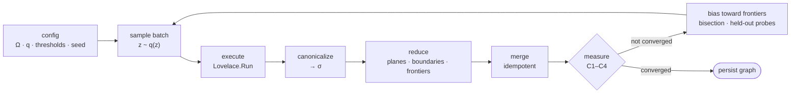
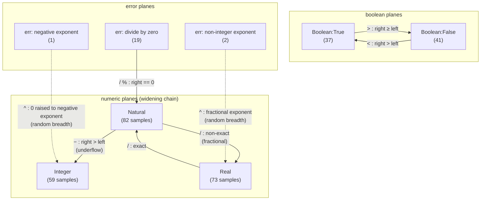
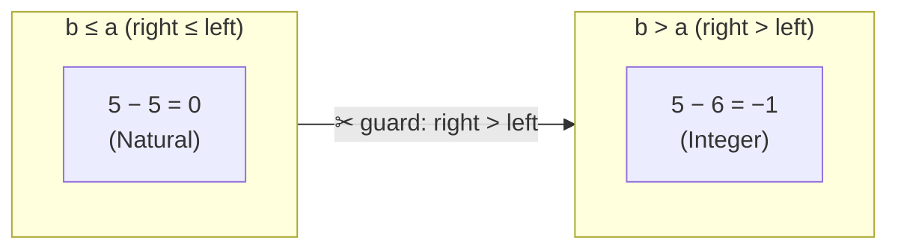
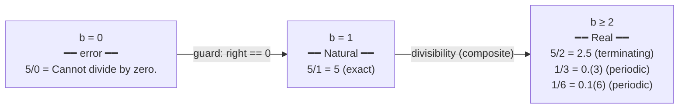
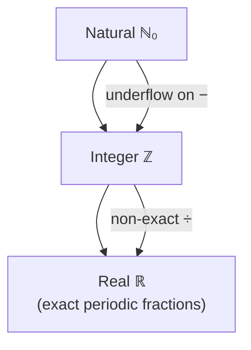
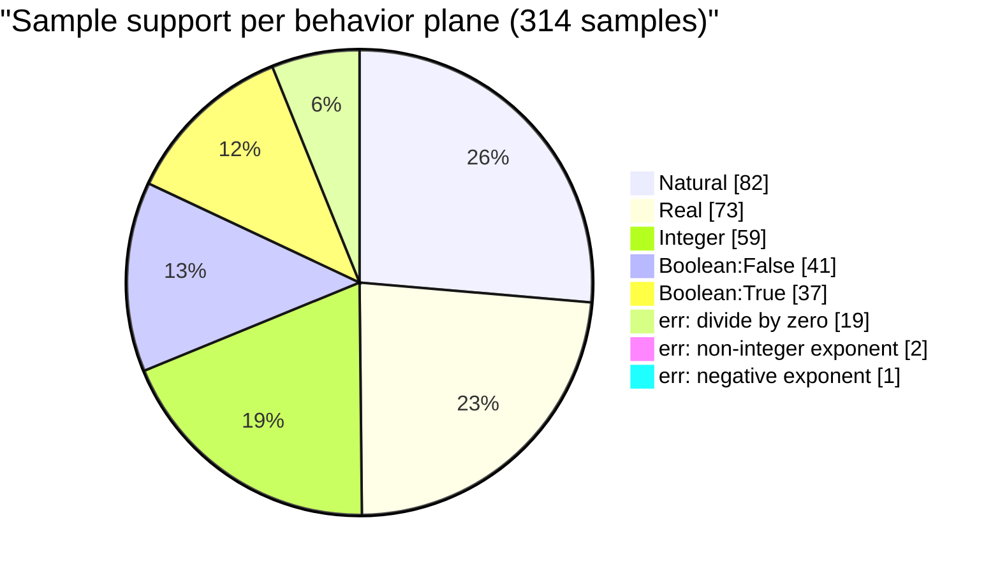

# The learned behavior graph — visual companion

Mermaid diagrams for the graph discovered by Lovelace.Knowledge.Run against the real Lovelace.Run
engine (seed 20240617, 314 samples, converged C1-C4). See CONVERGENCE-RESULTS.md for the numeric
evidence.

> **PDF:** a compiled copy lives at [BEHAVIOR-GRAPH.pdf](./BEHAVIOR-GRAPH.pdf). Regenerate it with
> `make graph-pdf`, or directly:
> `node Lovelace.Knowledge/tools/render-graph-pdf.mjs Lovelace.Knowledge/BEHAVIOR-GRAPH.md Lovelace.Knowledge/BEHAVIOR-GRAPH.pdf`
> (the script documents the verified headless-Chrome + mermaid recipe in its header).

## 1. The discovery pipeline

## 2. The behavior planes and their boundaries

Eight planes were found purely from observations, grouped into three families. Edges are the
localized boundaries (each carries a fitted guard and counterexamples on both sides).

The dashed edges mark planes observed through random sampling that have no localized guard —
honest open-world findings, not forced connections.

## 3. Natural-subtraction underflow (a localized threshold boundary)

Sweeping the right operand b over naturals with a fixed left a, the result stays Natural while
b ≤ a and flips to Integer the moment b > a. The reducer bisects the changed interval down to the
exact integer and fits the guard "right > left".

The same boundary re-appears at every anchor — 0−0/0−1, 1−1/1−2, 2−2/2−3, 5−5/5−6, 10−10/10−11 —
so the guard "right > left" is learned five times and is stable across two step sizes (h=2, h=3),
which is exactly the C2 check.

## 4. Division: one operation, three adjacent planes

Division over naturals exposes a three-way split along the divisor b:

The Natural → Real edge is not a clean interval (it flips whenever the divisor stops dividing the
dividend), so the reducer marks it composite and reports the bounding samples instead of inventing
a predicate — the open-world rule.

## 5. The widening lattice the numeric planes reveal

The numeric planes are ordered by the engine's widening rule; this lattice is inferred from the
observed result kinds, not read from source:

## 6. Where the 314 samples went

