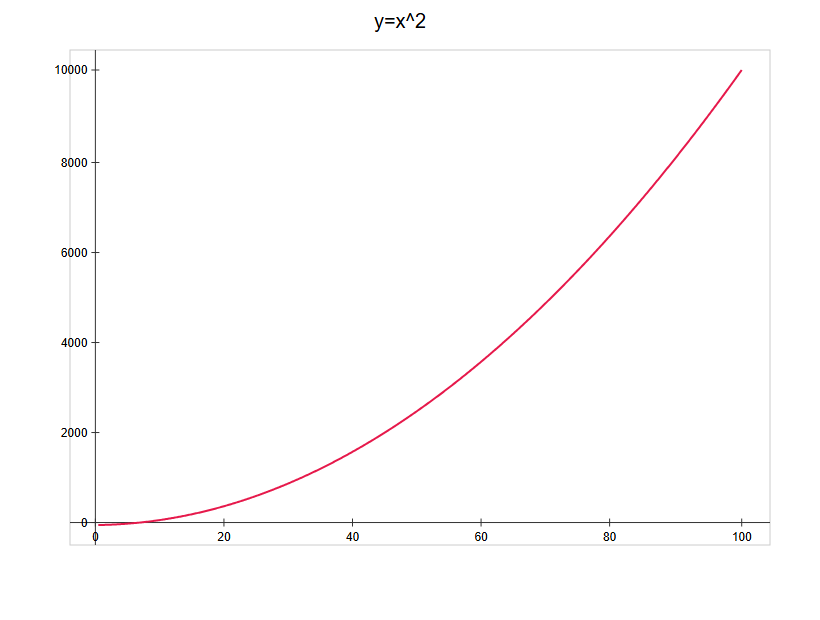
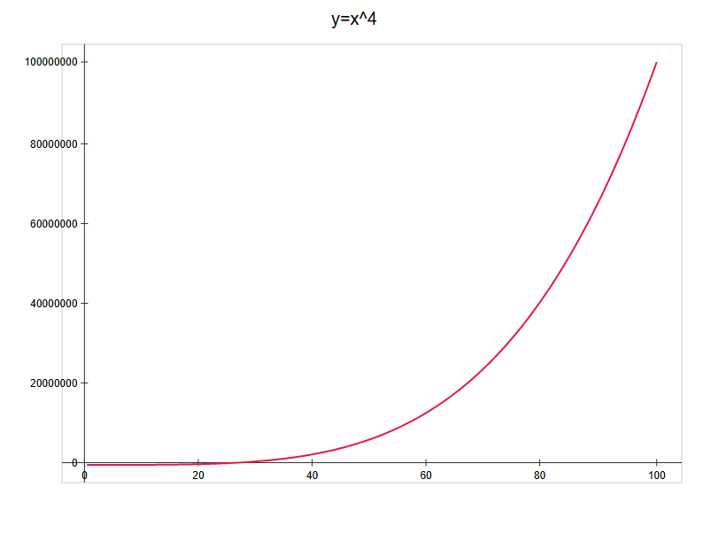
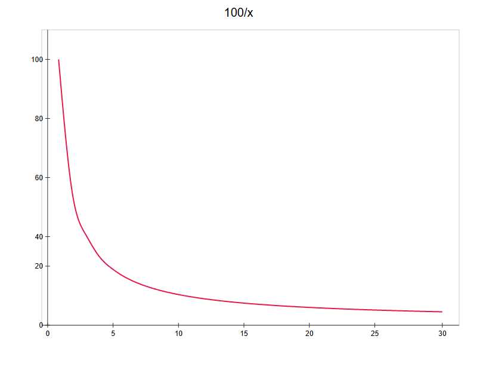
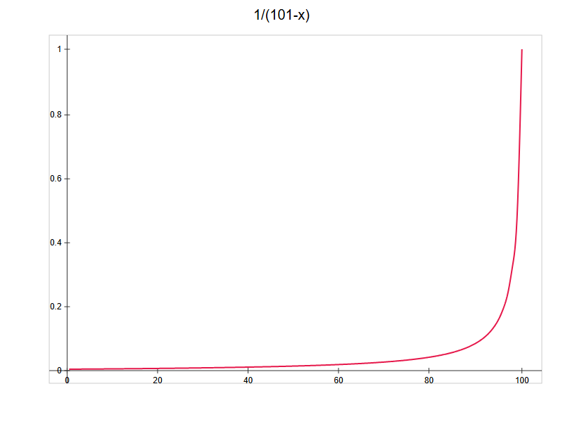
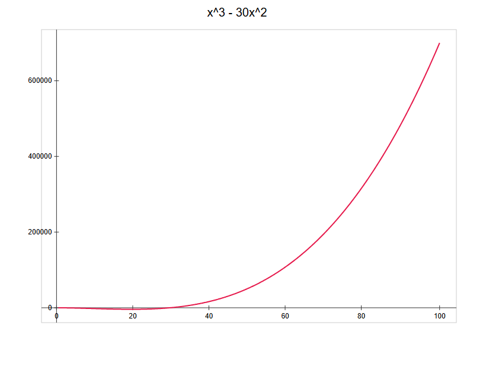
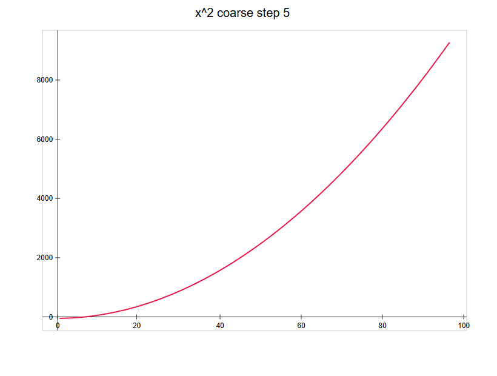
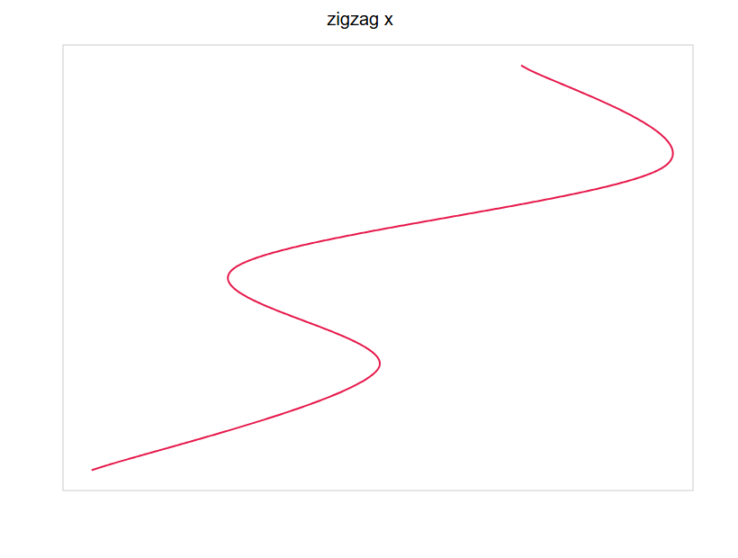

# Plot Interpolation Verification

Generated from the live renderer after the plot-interpolation fix
(`feat(Suite): smooth plot interpolation (natural cubic spline in data space)`).

Each curve below shows the exact Lovelace script and the SVG the engine produced
(rendered to PNG for viewing; the raw `.svg` is next to each `.png` in `graphs/`).

## What "smooth" means here

The renderer now fits a **natural cubic spline `y(x)` in data space** and samples it
densely into a `<polyline>`. Two numbers quantify smoothness:

- **Curvature sign-flips** — how many times the curve's curvature (2nd derivative) reverses
  direction. A kink *or* a wiggle shows up as sign-flips. A clean single-concavity curve
  (parabola, quartic, reciprocal) should have **0**.
- **max |Δslope|** — the largest change in slope between adjacent ~1px samples; a sharp
  corner is a big localized spike here.

The previous pixel-space Catmull-Rom renderer produced ~50 sign-flips and |Δslope| spikes
around 2.0 on `y = x²` (the visible "bends"). The new renderer removes them.

## Summary

| Curve | Points | Curvature sign-flips | max |Δslope| | Read |
|---|---|---|---|---|
| y = x² | 646 | **0** | 0.0027 | exact parabola |
| y = x⁴ | 646 | 3 | 0.0157 | sub-pixel ripples (invisible) |
| 100/x | 646 | 4 | 0.4385 | sub-pixel ripples (invisible) |
| 1/(101−x) | 646 | 3 | 5.0073 | real steepness near the pole |
| x³ − 30x² | 646 | 1 | 0.0100 | 1 = the cubic's true inflection |
| x² (coarse, 20 pts) | 646 | **0** | 0.0027 | exact parabola |
| zigzag x | 612 | 10 | 46.57 | parametric fallback (expected) |

---

## 1. y = x² (the reported case)

```lovelace
x = 1..100
y = x^2
plot(x, y, "y=x^2")
```



**Check:** one smooth curve, no corners or bends — 0 curvature sign-flips.

---

## 2. y = x⁴ (steeper)

```lovelace
x = 1..100
y = x^4
plot(x, y, "y=x^4")
```



**Check:** smooth, monotonically steepening. The 3 sign-flips are sub-pixel curvature
ripples (max |Δslope| 0.0157 px — invisible), not corners.

---

## 3. y = 100/x (steep near the left edge)

```lovelace
x = 1..30
y = 100 / x
plot(x, y, "100/x")
```



**Check:** smooth, steep near x = 1 and flattening to the right.

---

## 4. y = 1/(101 − x) (steep near the right edge)

```lovelace
x = 1..100
y = 1 / (101 - x)
plot(x, y, "1/(101-x)")
```



**Check:** smooth and steepens sharply toward x = 100 (a genuine pole, not a rendering
artifact — the large max |Δslope| is the true near-vertical climb).

---

## 5. y = x³ − 30x² (non-monotone, local minimum)

```lovelace
x = 1..100
y = x^3 - 30 * x^2
plot(x, y, "x^3 - 30x^2")
```



**Check:** dips smoothly through its minimum and back up. The single curvature sign-flip is
the cubic's real inflection point (expected, not a defect).

---

## 6. y = x² with 20 points (coarse sampling)

```lovelace
x = 1..5..100
y = x^2
plot(x, y, "x^2 coarse step 5")
```



**Check:** a smooth parabola through only 20 sample points — 0 curvature sign-flips (the
natural spline reproduces a quadratic exactly).

---

## 7. Non-monotone x (parametric fallback)

```lovelace
plot([1, 3, 2, 5, 4], [1, 2, 3, 4, 5], "zigzag x")
```



**Check:** a smooth-ish path through the 5 points. This is the parametric Catmull-Rom
fallback (used when x is not a single-valued function), so some wiggle is expected — no
sharp spikes.

---

*Raw SVG sources: `graphs/*.svg` (same renderer output, before PNG rasterization).*
