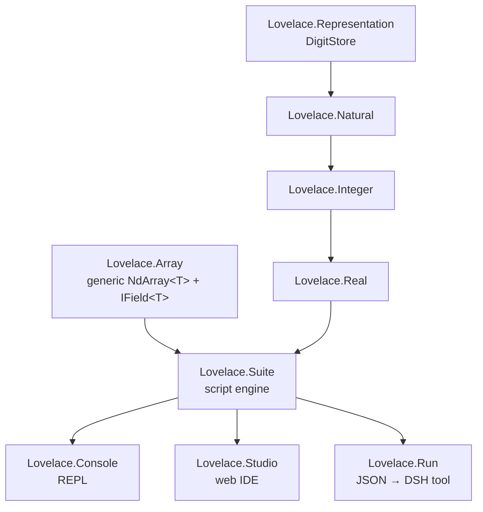

# LovelaceSharp

> **Arbitrary-precision math, end to end** — a scripting language, a .NET library, and a Lean proof
> that the digits are actually right.

Named after [Ada Lovelace](https://en.wikipedia.org/wiki/Ada_Lovelace), the first programmer.
LovelaceSharp computes with numbers of *any* size — no `long`, no `double`, no fixed precision
unless you ask for it — and it does so in a real scripting language with vectors, N-dimensional
arrays, and linear algebra built in.

---

## The language in 60 seconds

The REPL is the fastest way to meet it. Everything below is one engine — exact arithmetic,
arbitrary precision, functions, vectors, matrices, and plotting:

```text
> 1 / 3
= 0.(3) (Real)                        # exact repeating fraction — never rounded

> 2 ^ 100
= 1267650600228229401496703205376 (Natural)

> sqrt(2)
= 1.4142135623730950488… (Real)       # as many digits as you ask for

> func fib(n) { if (n < 2) { n } else { fib(n - 1) + fib(n - 2) } }
> fib(20)
= 6765 (Natural)

> v = 1..5
= [1, 2, 3, 4, 5] (Vector)
> v * 10
= [10, 20, 30, 40, 50] (Vector)       # element-wise, scalar broadcast
> sum(v ^ 2)
= 55 (Natural)

> m = [[1, 2], [3, 4]]                 # a matrix is a rank-2 array
= [[1, 2], [3, 4]] (Array)
> det(m)
= -2 (Integer)
> matmul(m, m)
= [[7, 10], [15, 22]] (Array)
> inv(m)
= [[-2, 1], [1.5, -0.5]] (Array)      # exact, not floating-point

> plot(v, v ^ 2, "squares")
= C:\…\plot.svg (Text)
```

It is a full scripting language, not a calculator: variables (with `_` always holding the last
result), user-defined functions, control flow, interpolation, and a first-class N-dimensional array
type. The complete, **machine-checked** reference — every example is doctested against the engine —
is [Lovelace.Suite/docs/Language.md](Lovelace.Suite/docs/Language.md).

---

## Run it

| Surface | Command | More |
|---|---|---|
| **REPL** (interactive calculator) | `dotnet run --project Lovelace.Console` | [Lovelace.Console/README.md](Lovelace.Console/README.md) |
| **Web IDE** (editor + variables/functions + inline SVG plots) | `make studio` | [Lovelace.Studio/README.md](Lovelace.Studio/README.md) |
| **DSH harness** (agent-callable `lovelace` tool) | `make runner` then load the plugin | [harness/README.md](harness/README.md) |

All three share one engine (`Lovelace.Suite`). The Studio and the DSH tool are thin projections of
the same `SuiteEngine` — no duplicated language logic.

---

## The language at a glance

**Values.** `Natural` · `Integer` · `Real` (exact periodic fractions) · `Boolean` · `Text` ·
`Vector` (rank-1) · `Array` (rank ≥ 2) · `Function` · `Void`. Numerics widen
`Natural → Integer → Real`.

**Operators.** `+ - * / % ^ !` · comparisons `== != > < >= <=` · assignment `=` · range `..`.

**Statements.** blocks `{ … }` · `if/else` · `while` · `for i in range` · `return` ·
`break`/`continue` · `func f(x) { … }` (or `func f(x) = expr`).

**Arrays (the headline feature).** Nested list literals build any rank — `[1,2,3]` is a vector,
`[[1,2],[3,4]]` a matrix, `[[[…] ]]` an N-D array. Multi-index `m[i, j]` (with partial indexing
returning sub-arrays), element-wise operators with scalar broadcast, and a full toolbox:

| Group | Built-ins |
|---|---|
| Reductions | `sum` `prod` `min` `max` `mean` `norm` — all elements, or along an `axis` |
| Linear algebra | `dot` `cross` `matmul` `det` `inv` `trace` |
| Construction | `zeros` `ones` `eye` `reshape` |
| Introspection | `shape` `rank` `numel` `len` |
| Manipulation | `flatten` `transpose` `squeeze` `concat` `append` |

**Other built-ins.** `abs` `inv` `divrem` `is_even` `is_odd` `sign` `sqrt` `pi`
`print` `plot`.

> Full syntax, precedence, and every built-in: [Lovelace.Suite/docs/Language.md](Lovelace.Suite/docs/Language.md).

---

## The numbers

Three arbitrary-precision types, each implementing the relevant .NET generic-math interfaces:

| Type | Domain | Highlights |
|---|---|---|
| `Natural` | ℕ₀ (≥ 0) | digit-by-digit `+ − × ÷`, `DivRem`, binary `Pow`, parallel `Factorial` |
| `Integer` | ℤ | sign + magnitude, signed `DivRem`, `Pow`, `Factorial` |
| `Real` | ℝ | arbitrary precision + **exact periodic fractions**, `Sqrt`, `Pi` |

Why that is fun:

- `1 / 3` is *exactly* `0.(3)` — division detects the repeating block and stores it compactly
  instead of rounding.
- `sqrt(2)` and `π` go to any number of digits — Newton–Raphson and the Chudnovsky algorithm,
  both parallelized.
- `100000!` works. It just takes a moment.

---

## How it fits together



| Project | Responsibility |
|---|---|
| `Lovelace.Representation` | `DigitStore` — the only project that touches the raw BCD `byte[]` (two decimal digits per byte). |
| `Lovelace.Natural` / `Integer` / `Real` | Arbitrary-precision naturals, signed integers, reals (each built on the one below). |
| `Lovelace.Array` | Generic `NdArray<T>` (shape/rank/strides, indexing, reshape/transpose/squeeze/concat) + all numeric algorithms, parameterized by an `IField<T>` so the element type stays abstract. |
| `Lovelace.Suite` | The scripting engine: tokenizer → parser → interpreter, the `SuiteEngine` introspection API, `Value` (wrapping `NdArray<Value>`), and SVG plotting. |
| `Lovelace.Console` | Interactive REPL front-end over `Lovelace.Suite`. |
| `Lovelace.Studio` | Browser IDE over `Lovelace.Suite`: editor, variables/functions workspace, inline SVG plots, logs bar. |
| `Lovelace.Run` | Non-interactive JSON script runner; the engine behind the DSH `lovelace` tool. |

Every library project has a matching `*.Tests` project (xUnit). A deeper, sourced map of module
boundaries and invariants lives in [.github/distilled/module-map.md](.github/distilled/module-map.md)
and [.github/distilled/system-overview.md](.github/distilled/system-overview.md).

---

## Proven, not just tested

The digit-by-digit algorithms are **formally proved** in Lean 4.
[Lovelace.Proofs/](Lovelace.Proofs/) is a core-only (no Mathlib) formalization of the schoolbook
base-`b` arithmetic in `White Paper.pdf`: representation, addition, subtraction, multiplication,
and division. Named theorems and build instructions: [Lovelace.Proofs/README.md](Lovelace.Proofs/README.md).

---

## Documentation map

The repo documents are deliberately split — this README is the map, the links below are the territory.

**Language & engine**
- [Lovelace.Suite/docs/Language.md](Lovelace.Suite/docs/Language.md) — the executable language reference (doctested).
- [Lovelace.Suite/README.md](Lovelace.Suite/README.md) — engine architecture + the `SuiteEngine` public API.
- Requirements: [Lovelace.Suite](.github/requirements/Lovelace.Suite.md) · [Lovelace.Suite.Arrays](.github/requirements/Lovelace.Suite.Arrays.md) · [Lovelace.Array](.github/requirements/Lovelace.Array.md).

**Numeric library** — per-project READMEs ([Natural](Lovelace.Natural/README.md) · [Integer](Lovelace.Integer/README.md) · [Real](Lovelace.Real/README.md) · [Representation](Lovelace.Representation/README.md)) and requirements ([Natural](.github/requirements/Lovelace.Natural.md) · [Integer](.github/requirements/Lovelace.Integer.md) · [Real](.github/requirements/Lovelace.Real.md) · [Sqrt](.github/requirements/Lovelace.Real.Sqrt.md) · [Pi](.github/requirements/Lovelace.Real.Pi.md) · [Representation](.github/requirements/Lovelace.Representation.md)).

**Proofs** — [Lovelace.Proofs/README.md](Lovelace.Proofs/README.md) · [Lovelace.Proofs/BREAKDOWN.md](Lovelace.Proofs/BREAKDOWN.md).

**Front-ends** — [Lovelace.Console/README.md](Lovelace.Console/README.md) · [Lovelace.Studio/README.md](Lovelace.Studio/README.md) · [harness/README.md](harness/README.md).

**Knowledge base** (journal-distilled, sourced) — [system overview](.github/distilled/system-overview.md) · [module map](.github/distilled/module-map.md) · [domain concepts](.github/distilled/domain-concepts.md) · [trusted facts](.github/distilled/trusted-facts.md) · [glossary](.github/distilled/glossary.md) · [dependencies](.github/distilled/dependencies.md).

---

## Build & test

Requires the [.NET 10 SDK](https://dotnet.microsoft.com/download/dotnet/10.0).

```bash
dotnet build        # build the whole solution
dotnet test         # run the test suites
make build          # publish the REPL as a Native AOT binary
make run            # run the published REPL
make runner         # publish the script runner as a Native AOT binary
make studio         # publish + run the web IDE as a Native AOT binary
```

A [Makefile](Makefile) wraps the common commands (`make build`, `make run`, `make runner`,
`make studio`, `make test`, `make clean`, `make help`). `make build`, `make runner`, and
`make studio` publish **Native AOT** binaries by default (single-file, self-contained, no JIT
warm-up). The Lean proofs use a separate toolchain (Lean 4.33.1, core-only):
`cd Lovelace.Proofs && lake build`.

### Native AOT

Every library project is marked `IsAotCompatible=true`, and the executables serialize their
JSON through source-generated contexts (no reflection), so the whole solution is Native
AOT–ready. `make build`, `make runner`, and `make studio` produce self-contained native
binaries:

```bash
make build    # → Lovelace.Console/bin/Release/net10.0/publish/Lovelace.Console.exe
make runner   # → Lovelace.Run/bin/Release/net10.0/publish/Lovelace.Run.exe
make studio   # → Lovelace.Studio/bin/Release/net10.0/aot/Lovelace.Studio.exe (then runs it)
```

This requires the C++ build tools (MSVC on Windows, clang on macOS/Linux).

---

## Legacy → C# migration

The C# codebase is a class-by-class migration of the C++ `Legacy/` source (originally in
Portuguese; identifiers are English here). The `VetorLovelace` / `VetorMultidimensionalLovelace`
legacy vector classes have now been migrated to the **`Lovelace.Array`** project. Migration aids
and method-name mappings live under [.github/prompts/](.github/prompts/).

---

## License

See [LICENSE](LICENSE) if present, or contact the repository owner.
