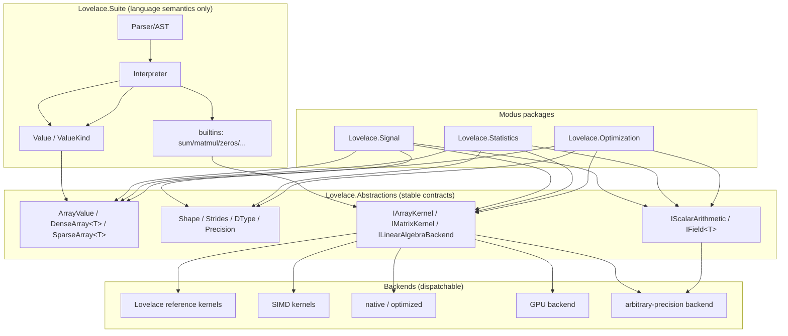

# Typed Array Requirements — Redesigning Lovelace's N-Dimensional Array Representation

> Status: Requirements / design investigation (no implementation)

> Scope: LovelaceSharp — replace the boxed `NdArray<Value>` / heterogeneous element model with homogeneous typed arrays, while preserving Lovelace's arbitrary-precision numeric identity, its language semantics, and its Modus-extension ambitions.

> Companion docs: `Lovelace.Suite/docs/Language.md` (executable language reference), `.github/requirements/Lovelace.Array.md`, `.github/requirements/Lovelace.Suite.Arrays.md`.

This document is the output of a repository-wide reconnaissance of the current array/vector representation. Every statement is grounded in the code paths, tests, and requirement docs cited inline (paths are relative to the repo root). It deliberately **does not** prescribe a final class layout; it derives requirements and flags the decisions that must be made before any implementation.

## 1. Current-state architecture

### 1.1 Project dependency topology (verified from .csproj files)

```
    Lovelace.Natural          (arbitrary-precision ℕ₀; binary limbs — see §1.3)
        ↑
    Lovelace.Integer          (ℤ = sign + Natural magnitude)
        ↑
    Lovelace.Real             (ℝ = Integer + decimal Exponent + period metadata)
        ↑
    Lovelace.Array            (GENERIC NdArray<T> + IField<T> + ArrayMath — no Value dependency)
        ↑
    Lovelace.Suite            (tokenizer → parser → interpreter → Value → SuiteEngine → plotting)
        ↑
    Lovelace.Console (REPL) · Lovelace.Studio (web IDE) · Lovelace.Run (JSON runner)
```

References: `Lovelace.Natural/Lovelace.Natural.csproj`, `Lovelace.Integer/Lovelace.Integer.csproj`, `Lovelace.Real/Lovelace.Real.csproj`, `Lovelace.Array/Lovelace.Array.csproj`, `Lovelace.Suite/Lovelace.Suite.csproj`, `Lovelace.Studio/Lovelace.Studio.csproj`, `Lovelace.Console/Lovelace.Console.csproj`.

The single most important architectural fact for this redesign: **`Lovelace.Array` is already generic and does not depend on `Value`.** `NdArray<T>`, `IField<T>`, and `ArrayMath` are parameterized by an element type `T` and an `IField<T>` that supplies element arithmetic (`Lovelace.Array/IField.cs`). The *only* concrete instantiation in the language is `NdArray<Value>` via `ValueField : IField<Value>` (`Lovelace.Suite/ValueField.cs`).

### 1.2 The boxed representation today

- `Value` is a boxed discriminated union: `ValueKind` + a single `object _inner` (`Lovelace.Suite/Value.cs`). Numeric kinds are `Natural → Integer → Real` (widening chain); container kinds are `Vector` and `Array`.

- `ValueKind.Vector` wraps `IReadOnlyList<Value>` (rank 1).

- `ValueKind.Array` wraps `NdArray<Value>` (rank ≥ 2).

- `ValueField : IField<Value>` bridges `ArrayMath`'s generic algorithms to `NumericOps` (`Lovelace.Suite/ValueField.cs`).

Conceptually:

```
    Value
     ├── Natural (Nat)
     ├── Integer (Int)
     ├── Real (Rl)
     ├── Boolean / Text / Function / Void
     ├── Vector  -> IReadOnlyList<Value>     (rank 1)
     └── Array   -> NdArray<Value>            (rank ≥ 2; each element is a separately boxed Value)
```

### 1.3 Scalar representation facts that constrain the design

- `Natural` stores binary 64-bit limbs (`ulong[] _limbs`) with a lazily-computed decimal string (`Lovelace.Natural/Natural.cs:41–44`). Despite stale docs (`.github/distilled/module-map.md`, `system-overview.md` still describe BCD `DigitStore`), the actual code uses binary limbs — the BCD→binary-limb rewrite is recorded in `.github/requirements/Lovelace.Natural.BinaryLimb.md`.

- `Real` extends `Integer` and adds `Exponent` (decimal), `PeriodStart`/`PeriodLength` (exact periodic-fraction metadata) — `Lovelace.Real/Real.cs:99–123`.

- Precision knobs are **global static** and **fractional-digit** counters (`Lovelace.Real/Real.cs:43–93`):

  - `Real.MaxComputationDecimalPlaces` (default 1000) — computation cap / irrational cutoff; also an internal `AsyncLocal` per-call-stack override via `WithLocalPrecision`.

  - `Real.DisplayDecimalPlaces` (default 100) — display fractional digits.

  - `Natural.DisplayDigits` (default -1 = unlimited) — `Lovelace.Natural/Natural.cs:57–61`.

- `Real` is **exact for rationals** (period detection) and **digit-truncated for irrationals** (`sqrt`, `pi`) — see `.github/requirements/Lovelace.Real.Precision.Benchmark.md:60–74`.

- The precision benchmark project `precbench` already compares `Real` at 8/16 significant digits against `float`/`double` with allocations (`precbench/Benchmarks.cs`); scalar micro-benchmarks live in `bench/Program.cs` and `mulbench/Program.cs`.

### 1.4 Data-flow / impact map (syntax → storage → execution → result)

```mermaid
    flowchart LR
        SRC[source text] --> TOK[Tokenizer<br/>Lovelace.Suite/Tokenizer.cs]
        TOK --> AST[AST<br/>Lovelace.Suite/Ast.cs]
        AST --> PAR[Parser<br/>Lovelace.Suite/Parser.cs]
        PAR --> INT[Interpreter<br/>Lovelace.Suite/Interpreter.cs]
        INT --> LIT[EvaluateLiteral<br/>'.'/'(' -> Real else Natural]
        INT --> LIST[BuildList<br/>flat -> Vector<br/>nested rectangular -> NdArray&lt;Value&gt;]
        INT --> BIN[EvaluateArrayBinary / EvaluateVectorBinary<br/>per-element NumericOps]
        INT --> IDX[IndexValue<br/>element | partial sub-array]
        INT --> BUILT[RegisterArrayBuiltins<br/>zeros/ones/eye/sum/matmul/...]
        LIT --> VAL[Value<br/>boxed union + ValueKind]
        LIST --> VAL
        VAL --> ARR[NdArray&lt;Value&gt;<br/>Lovelace.Array/NdArray.cs]
        BUILT --> KERN[ArrayMath + IField&lt;T&gt;<br/>Lovelace.Array/ArrayMath.cs]
        KERN --> VF[ValueField : IField&lt;Value&gt;<br/>Lovelace.Suite/ValueField.cs]
        VF --> NUM[NumericOps<br/>Lovelace.Suite/NumericOps.cs]
        NUM --> SCALAR[Natural / Integer / Real]
        ARR --> RESULT[result Value]
        RESULT --> FMT[ValueFormatter<br/>Lovelace.Suite/ValueFormatter.cs]
        RESULT --> REPL[REPL ReplSession]
        RESULT --> STUDIO[Studio EngineHost -> DTOs]
        RESULT --> RUN[Lovelace.Run JSON]
```

### 1.5 Coupling points that make replacing NdArray<Value> non-trivial

A grep across all `*.cs` (excluding `bin/`/`obj/`/`.worktrees/`) shows the `NdArray<Value>` and array/vector-kind coupling is concentrated and small, but load-bearing:

| Coupling | Files | Count |
|---|---|---|
| `NdArray<Value>` | `Lovelace.Suite/Interpreter.cs` (12), `Value.cs` (2), `ValueFormatter.cs` (1) | 15 |
| `AsArray()` | `Interpreter.cs` (10), `Value.cs` (1), `ValueFormatter.cs` (1), `ArrayTests.cs` (4) | 16 |
| `ValueKind.Array` | `Interpreter.cs` (8), `Value.cs` (2), `ValueFormatter.cs` (2), `ArrayTests.cs` (4) | 16 |
| `ValueKind.Vector` / `AsVector()` | `Interpreter.cs` (28), `Value.cs`, `ValueFormatter.cs`, tests | 58 |
| `IField<T>` | `ArrayMath.cs` (27), `IField.cs` (1), `ValueField.cs` (1), `NdArrayTests.cs` (1) | 30 |

Consequences:

1. The **representation is touched by exactly three production files** in `Lovelace.Suite` (`Value.cs`, `Interpreter.cs`, `ValueFormatter.cs`) plus `ValueField.cs`. This is a small, high-leverage seam — a migration can be staged without a flag-day rewrite.

2. The **serialization/API boundary is string-based and already decoupled** from the internal representation: Studio (`Lovelace.Studio/EngineHost.cs`) and `Lovelace.Run/Program.cs` project every variable/result to `Kind.ToString()` + `ValueFormatter.Format/FormatTyped` (nested-bracket strings). No DTO serializes `NdArray<Value>` structurally. **As long as `ValueKind` names and `ValueFormatter` output stay stable, a representation swap is invisible to Studio/Run.**

3. The **`Vector` vs `Array` split** (rank-1 `IReadOnlyList<Value>` vs rank-≥2 `NdArray<Value>`) is a pervasive semantic bifurcation: every builtin normalizes via `ToNdArray` and re-splits via `FromNdArray` (`Interpreter.cs`), and every operator/index/formatter branch handles both. A unified `ArrayValue` (rank 1..N in one type) would collapse ~half of these branches.

## 2. Current behavioral semantics (recovered, not assumed)

These are the observable behaviors the current implementation establishes. They are **compatibility constraints** unless a later section explicitly proposes to change them.

### 2.1 Literals and construction

| Input | Current result | Evidence |
|---|---|---|
| `42` | `Natural` | `Interpreter.cs:EvaluateLiteral`; `InterpreterLiteralTests.cs` |
| `3.14`, `0.(3)` (contains `.` or `(`) | `Real` | `Interpreter.cs:EvaluateLiteral` |
| `-7` | `Integer` (unary minus on Natural) | `InterpreterBinaryArithmeticTests.cs:222–231` |
| `[1, 2, 3]` | `Vector` (rank 1, `IReadOnlyList<Value>`) | `VectorTests.cs:9–18` |
| `[[1, 2], [3, 4]]` | `Array` rank 2, shape `[2,2]` | `ArrayTests.cs:17–24` |
| `[[[1,2],[3,4]],[[5,6],[7,8]]]` | `Array` rank 3, shape `[2,2,2]` | `ArrayTests.cs:27–33` |
| `[[1, 2], [3]]` | error (ragged) | `Interpreter.cs:BuildList`; `ArrayTests.cs:43–46` |
| `1..5`, `1..2..7` | `Vector` (inclusive range; step defaults to 1) | `Interpreter.cs:BuildRange` |
| `zeros(d…) / ones(d…) / eye(n)` | all-`Natural` array (seed `NumericOps.Zero/One`) | `Interpreter.cs:RegisterArrayBuiltins`; `ValueField.cs` |

### 2.2 Heterogeneity and coercion

- **Mixed scalar types are allowed per element.** `[1, 2.5, 3]` produces a `Vector` whose elements are `Natural(1), Real(2.5), Natural(3)` — there is **no array-level homogenization**. `BuildList`/`EvaluateListAsync` (`Interpreter.cs`) simply store each evaluated `Value`.

- This heterogeneity is **an incidental consequence of the boxed representation, not a documented language feature** — no requirement doc, README, or test asserts heterogeneous arrays as a goal. The docs describe arrays as "numeric"; nothing promises per-element type retention.

- **Numeric widening is per-element, at operation time**: `Value.WidenPair` widens each operand pair to `max(a.Kind, b.Kind)` along `Natural → Integer → Real` (`Value.cs:Widen/WidenPair`), then `NumericOps.Apply` dispatches (`NumericOps.cs:Apply`).

- **Subtraction auto-widens on underflow** (`NumericOps.cs:SubtractNatural`): `3 - 5` → `Integer`.

- **Division is exact**: `Natural / Natural` yields `Natural` when the quotient is exact, else `Real` with period detection (`NumericOps.cs:DivideNatural/DivideInteger`). `1 / 3` → `0.(3)`.

- **Comparisons require numeric scalars**: `NumericOps.Compare` throws on `Vector`/`Array` (`NumericOps.cs:Compare`). There is no elementwise comparison producing a Boolean array.

### 2.3 Indexing, slicing, shape algebra

- **0-based indexing** (`VectorTests.cs:20–28`); `m[i, j]` with one coordinate per dimension.

- **Partial index** (`a[i]` on rank ≥ 2) returns a lower-rank sub-array; a rank-1 result is re-wrapped as `Vector` (`Interpreter.cs:IndexValue`).

- **There is no stride/range slice syntax** (`a[i:j]` does not parse). `NdArray.Slice` is "leading partial index keeps trailing dimensions" (`NdArray.cs:Slice`) — it materializes a new `List<T>` of the contiguous trailing block.

- **`reshape`/`flatten`/`squeeze` share the existing `Data` reference** (they re-wrap the same `IReadOnlyList<T>` under a new shape) — `NdArray.cs:Reshape/Flatten/Squeeze`. Because `Data` is `IReadOnlyList<T>`, this is effectively a zero-copy view over immutable storage.

- **`transpose` materializes a fresh `List<T>`** — `NdArray.cs:Transpose` — even though the permutation could be represented as a stride/view.

- **Empty dimensions are not representable** in `NdArray<T>`: the constructor and `Product` throw on any dimension < 1 (`NdArray.cs` ctor, `Product`). The empty **vector** `[]` is a rank-1 `IReadOnlyList<Value>` of length 0 (`Interpreter.cs:BuildList`), but `sum([])`, `reshape(...,0)`, and `plot([])` all fail (reduction-on-empty error; dimension validation; `PlotTests.cs:45–51`).

### 2.4 Operations: elementwise vs algebraic

- **`+ - * / % ^` are elementwise** between arrays of the **same shape**, or broadcast a scalar across an array (`Interpreter.cs:EvaluateArrayBinary`). Mismatched shapes are an error.

- **`*` is NOT matrix product**; matrix/N-D product is the `matmul` builtin (`.github/requirements/Lovelace.Suite.Arrays.md` S-D2). `matmul` supports rank-2·rank-2, rank-2·rank-1, rank-1·rank-2, and batched rank ≥ 2, with rank-1·rank-1 delegated to `dot` (`ArrayMath.cs:MatMul`).

- **Reductions** `sum/prod/min/max/mean/norm` collapse all elements (→ scalar) or one axis (→ rank−1); `mean` is `sum / count` and is **exact** (`mean([1,2,3])` → `Natural 2`; `mean([1,2])` → `Real 1.5`) — `ArrayMath.cs:Mean`, `ArrayTests.cs:127–131`.

- **`dot`/`cross`/`det`/`inv`/`trace`** are algebraic; `det`/`inv` use exact Gaussian / Gauss–Jordan elimination over `ValueField` (`ArrayMath.cs:Det/Inverse`), so results are exact (`inv([[1,2],[3,4]])` → `[[-2,1],[1.5,-0.5]]`).

- **Scalar × array / array × scalar** is elementwise broadcast (`EvaluateArrayBinary`); there is no row/column/outer broadcasting.

### 2.5 Mutability, precision propagation, display

- **Arrays are immutable at the language level**: every operation returns a new array; there is no assignment-into-element (`a[i] = x` is not parsed as mutation; `AssignExpr` only binds names). `NdArray<T>` exposes `IReadOnlyList<T> Data`, no setter. (`NdArray.cs`; requirement doc L-D4/S-D3 "no in-place mutation".)

- **Precision is process-global static state**, not per-value or per-array: `setprecision(n)` sets both `Real.MaxComputationDecimalPlaces` and `Real.DisplayDecimalPlaces` (`Interpreter.cs` `setprecision` builtin). `Real` values do not carry their own precision.

- **Display** of a `Real` is governed by `DisplayDecimalPlaces` (`Real.cs:1238–1290`).

## 3. Problems with the current representation

1. **Per-element boxing and dispatch.** Every array element is a `Value` object holding an `object`; every elementwise op re-reads `ValueKind`, re-widens, and dispatches through `NumericOps` (`NumericOps.cs:Apply`). This is the dominant non-arithmetic cost for large arrays and it does not disappear by making `Real` faster (see §6).

2. **Heterogeneity is accidental, not intentional.** `[1, 2.5, 3]` silently produces a mixed-type vector; nothing in the language design asks for it, and it defeats any contiguous/typed storage.

3. **Rank-1 / rank-≥2 bifurcation.** `Vector` and `Array` are two different types with duplicated operator/index/builtin/formatter paths and a normalization shim (`ToNdArray`/`FromNdArray`).

4. **No views/strides in the general sense.** `transpose` copies; `slice` copies the trailing block; there is no `buffer + offset + shape + strides` abstraction, so zero-copy slicing, transpose, and sub-array views are impossible even though the row-major layout is already there.

5. **No general broadcasting.** Only same-shape + scalar; a scientific-computing array type needs N-dimensional broadcasting (already documented as deferred: `.github/requirements/Lovelace.Array.md` "Non-Goals": "General (NumPy-style) shape broadcasting").

6. **No empty dimensions.** Zero-length axes are unrepresentable, which blocks NumPy-style empty arrays, reshape-to-zero, and the empty cases of broadcasting/reductions.

7. **No dtype metadata.** Arrays do not record their element type as first-class metadata (it is implied by inspecting the boxed elements); plugins/backends cannot cheaply ask "what is the dtype and precision of this array?".

8. **`IField<T>` is an element-arithmetic seam, not a kernel/backend seam.** It is a good start but cannot express dispatch of `matmul`/`solve`/`LU`/`SVD`/`FFT` to SIMD/native/GPU/arbitrary-precision backends, nor views/strides, nor contiguous-materialization requests (§5).

## 4. Functional requirements

> Normative language: **MUST** (hard requirement), **SHOULD** (strong default, deviate only with a documented reason), **MAY** (optional/discretionary).

### 4.1 Homogeneous typed storage

- **ARR-001** — The array representation **MUST** support homogeneous typed arrays with a single element type for the whole array: `DenseArray<Real>`, `DenseArray<Integer>`, `DenseArray<Natural>` (and, eventually, `Complex`, `SparseArray<T>`, backend-specific arrays). *Rationale:* enables contiguous storage, SIMD-friendly iteration, and dtype metadata. *Impact:* replaces `NdArray<Value>` as the language's array payload.

- **ARR-002** — The language **MUST** still present a coherent single "array" type to users; storage specialization **MUST NOT** leak into language semantics (e.g. the user should not need to know whether an array is dense vs sparse to use `+` or `sum`). *Rationale:* task constraint; current `ValueKind.Vector`/`Array` names are the user-visible surface.

- **ARR-003** — `DenseArray<Real>` **MUST** be a legitimate primary numerical representation; the design **MUST NOT** be built around `double` as the default/canonical numeric type. *Rationale:* Lovelace's identity is arbitrary/configurable precision; `Real` at ~16 digits may already be a viable default (see `precbench` findings).

- **ARR-004** — The representation **MUST** record dtype/precision as first-class metadata accessible without boxing (`Shape`, `Rank`, `Numel`, `Strides`, `ElementType`/`DType`, `Precision`). *Rationale:* plugin/backend contract (§7) and introspection builtins (`shape`, `rank`, `numel`).

### 4.2 Contiguous storage / buffer abstraction

- **STO-001** — The array **MUST** be describable as `buffer + offset + shape + strides`, with a packed row-major (C-order) default so a dense array is a single contiguous `T[]`-backed buffer. *Rationale:* the current row-major `Data` + `Strides` (`NdArray.cs`) is the seed; make it first-class. *Impact:* enables views and zero-copy kernels.

- **STO-002** — A dense array **MUST** be able to report whether it is contiguous (`IsContiguous`) and to materialize a contiguous copy on demand (`AsContiguous`) for kernels that require it. *Rationale:* plugin kernels may not handle strides.

### 4.3 Views

- **STO-003** — `slicing` (stride/range slicing `a[i:j:k]`), `transpose`, and `reshape` (where contiguous) **SHOULD** be zero-copy views over the same buffer. *Rationale:* today `transpose` copies and slice syntax does not exist (`NdArray.cs:Transpose/Slice`). *Impact:* large matrices no longer pay O(n²) on every transpose.

- **STO-004** — The design **MUST** specify when materialization occurs (e.g. any op that requires contiguous memory, writing into a non-contiguous view, or a copy-on-write trigger). *Rationale:* avoid hidden O(n) copies and aliasing surprises.

- **STO-005** — `reshape` **MUST** remain zero-copy when possible (it already shares `Data` today, `NdArray.cs:Reshape`) and **MUST** materialize only when a non-contiguous stride set cannot be reshaped in place.

### 4.4 Broadcasting

- **BDC-001** — The array type **MUST** support general N-dimensional broadcasting with the standard right-aligned shape-compatibility rule (dimensions are equal, or one of them is 1). *Rationale:* currently only same-shape + scalar (`Interpreter.cs:EvaluateArrayBinary`); full broadcasting was explicitly deferred (`.github/requirements/Lovelace.Array.md`).

- **BDC-002** — The existing **scalar broadcast** (`v * 10`) **MUST** be preserved as a special case. *Impact:* no language-visible regression for the documented examples.

- **BDC-003** — The language layer **MUST** document the compatibility implications: same-shape mismatches that currently error will become legal broadcasts only where the rule permits; the "mismatched lengths error" message contract changes (`VectorTests.cs:61–67`). This is a **deliberate, documented** semantic expansion, not an accident.

### 4.5 Empty arrays

- **EMP-001** — The design **MUST** decide whether zero-length dimensions become first-class. Currently `NdArray<T>` forbids dims < 1 (`NdArray.cs` ctor) while `[]` is a valid empty vector (`Interpreter.cs:BuildList`). *Rationale:* required for broadcasting edges, reshape-to-0, and consistent reduction semantics.

- **EMP-002** — If supported, reduction/aggregate behavior over empty arrays **MUST** be specified (error vs identity) and tested; the current behavior is "throw on reduce-empty" (`ArrayMath.cs:ReduceAll`, `PlotTests.cs:45–51`).

### 4.6 Mutability

- **MUT-001** — Language-level array values **MUST** remain value-like and immutable (no in-place element assignment; every op returns a new array). *Rationale:* preserves the current contract (`NdArray.cs` "Values are immutable"; requirement L-D4), which Studio/REPL rely on.

- **MUT-002** — The implementation **MAY** use internal mutable buffers or copy-on-write (lazy materialization) behind the value-like façade, provided aliasing is never observable from Lovelace code. *Rationale:* performance without breaking semantics.

- **MUT-003** — If COW is adopted, the copy trigger **MUST** be specified and must not be observable (no `a`/`b` aliasing surprises when one is later "mutated" internally).

## 5. Kernel / backend separation requirements

> Goal: move from "one `ArrayMath` implementation per `IField<T>`" to "language semantics fixed, kernels dispatchable to specialized implementations", so `add`, `multiply`, `matmul`, `solve`, `LU`, `QR`, `SVD`, `FFT`, `convolution` can target the Lovelace reference implementation, SIMD, an optimized native backend, a GPU backend, or an arbitrary-precision backend.

- **KRN-001** — The language layer **MUST** define each array operation's **semantics** once (shape rules, promotion, exactness, error model) independently of any kernel implementation. *Rationale:* storage/execution optimizations must not leak into semantics (task constraint).

- **KRN-002** — The element-arithmetic seam (`IField<T>`) **SHOULD** be retained as the scalar building block (it already exists and works — `IField.cs`, `ValueField.cs`), but a separate **kernel/backend dispatch** layer **MUST** be introduced above it for whole-array operations.

- **KRN-003** — A backend **SHOULD** be selectable per operation/array (or via a process-wide default + explicit override), and **MUST** be fallible (a backend that cannot handle a given dtype/shape/precision declines, and the reference backend runs). *Rationale:* heterogeneous future (GPU/arbitrary-precision) without changing language results.

- **KRN-004** — Kernels **MUST** receive shape/dtype/precision/strides and **MAY** request a contiguous view; they **MUST NOT** be handed `Value`/interpreter/AST internals.

- **KRN-005** — Whether to adopt `IArrayKernel<T>` / `IMatrixKernel<T>` / `ILinearAlgebraBackend<T>` **SHOULD** be evaluated, not assumed; the requirement is the *capability* (dispatchable per-dtype-per-shape implementations), not a specific interface shape. *Impact:* `ArrayMath.cs` (`MatMul`/`Det`/`Inverse`/reductions) becomes the reference backend plus a dispatch table.

## 6. Performance requirements and benchmark plan

> Explicitly **not** derived from the π benchmark alone. The goal is to attribute cost between Value indirection, allocations, scalar dispatch, Real arithmetic itself, and iteration — so the team does **not** conclude "replace Real with double" when the real bottleneck is boxing/dispatch.

### 6.1 What to measure (time, allocations, peak memory)

| Group | Cases |
|---|---|
| Scalar `Real` arithmetic | add / multiply at P8, P16 (baseline continuity with `precbench`) |
| Elementwise add | 1K, 1M, 10M elements |
| Elementwise multiply | 1K, 1M, 10M elements |
| Scalar broadcasting | `array * scalar`, `scalar + array` |
| Slicing | contiguous sub-range, strided slice |
| Transpose | 100×100, 1000×1000 (copy vs view) |
| Array construction | `[1..n]`, `zeros(n)`, nested literal promotion |
| Matmul | 100×100, 1000×1000 |
| Reductions | `sum`, `min`, `max` (all + axis) |
| Conversions/promotion | Natural→Integer→Real array promotion, dtype coercion |

### 6.2 Cost attribution matrix (required)

For the elementwise-add and matmul cases, the benchmark **MUST** decompose the measured cost into (where measurable): (a) Value indirection/boxing, (b) allocations/GC, (c) scalar dispatch (Kind switch + widen), (d) `Real`/`Natural` arithmetic itself, (e) array iteration overhead, (f) algorithm complexity. Methodology: compare (1) current `NdArray<Value>` elementwise, (2) a `double`-`IField` reference over the same generic `NdArray<T>` (already exists in `NdArrayTests.cs:DoubleField`), (3) a `Real`-`IField` (P16), and (4) the proposed `DenseArray<Real>`/`DenseArray<double>` kernels. The delta (2)−(1) isolates `Value` boxing; (3)−(2) isolates `Real` arithmetic cost; (4)−(3) isolates storage/kernel improvements.

### 6.3 Tooling and continuity

- **PERF-001** — Reuse the repo's existing BenchmarkDotNet + `[MemoryDiagnoser]` + `[OperationsPerInvoke]` conventions (`precbench/Benchmarks.cs`) and the scalar `bench` harness (`bench/Program.cs`) for cross-checking; add an array-level project (e.g. `arraybench`) with deterministic seeds and machine-parseable output.

- **PERF-002** — The benchmark **MUST** be runnable before and after the migration to produce a before/after table with the same inputs and machine.

## 7. Type / promotion requirements

- **PRM-001** — The scalar widening lattice **MUST** remain `Natural → Integer → Real` (it is the documented, tested language contract — `Value.cs:Widen`, `NumericOps.cs`).

- **PRM-002** — Array construction **SHOULD** promote to a single dtype using that lattice: `[Natural, Natural] → DenseArray<Natural>`, `[Natural, Integer] → DenseArray<Integer>`, `[Integer, Real] → DenseArray<Real>`. This is a **language-design decision** (see §13-C): it changes `[1, 2.5, 3]` from "mixed Vector" to "`DenseArray<Real>`".

- **PRM-003** — The result dtype of an elementwise binary op **MUST** be determined by a **whole-array promotion rule** on (op, left dtype, right dtype), **not** by per-element runtime inspection. *Rationale:* homogeneous output requires one dtype; today each element widens independently (`NumericOps.Apply`).

- **PRM-004** — The rules **MUST** be made explicit for the underflow/exactness cases:

  - `DenseArray<Natural> - DenseArray<Natural>` — promote to `Integer` (conservative) or keep `Natural` and error/overflow on underflow? (Today `3-5` widens per-element, `NumericOps.cs:SubtractNatural`.)

  - `DenseArray<Natural> / DenseArray<Natural>` — promote to `Real` (conservative) or keep `Natural` with exact-only semantics? (Today non-exact widens to `Real`, `NumericOps.cs:DivideNatural`.)

  These are the highest-risk semantic shifts and **MUST** be decided by language design (§13-B/C), because a conservative promotion changes the observable Kind of results like `[5,3]-[4,2]` (currently `Natural` elements) or `[4,6]/[2,2]` (currently `Natural`).

- **PRM-005** — Reductions (`sum/prod/min/max/mean`) **MAY** retain runtime widening because they return a scalar `Value`, not an array (`ArrayMath.cs`), preserving exact `mean` semantics.

- **PRM-006** — Machine numeric types (`float`/`double` and SIMD-friendly types) **MAY** exist as optional/specialized backends or types, but **MUST NOT** become the default and **MUST NOT** change the arbitrary/configurable precision default. *Rationale:* task constraint.

## 8. Modus / plugin extension boundary requirements

> `Modus` is the intended mechanism for independently developed Lovelace extensions. **No Modus integration exists in this repo today** (grep for "Modus" returns nothing) — this section specifies the stable abstraction that would make `Lovelace.Signal`, `Lovelace.Statistics`, `Lovelace.Control`, `Lovelace.Optimization`, `Lovelace.Image`, `Lovelace.Geospatial` possible without touching interpreter internals.

- **MOD-001** — A small stable contract assembly (proposed: `Lovelace.Abstractions`) **MUST** own the public array/numerical contracts: typed-array interfaces, `Shape`/`DType`/`Precision` descriptors, element-type contracts, and the kernel/backend interfaces. *Rationale:* plugins must not depend on `Parser`, AST nodes, the interpreter, or the internal `Value` representation.

- **MOD-002** — Plugins **MUST** be able to: consume a typed array efficiently (read `T` values or a `ReadOnlySpan<T>`/contiguous buffer); return a typed array; inspect `shape`/`dtype`/`precision`; traverse views/strides; request a contiguous representation when needed.

- **MOD-003** — Plugins **MUST** be able to register array functions (exposed to the language as builtins) and register optimized kernels/backends for existing operations.

- **MOD-004** — The boundary **SHOULD** allow plugins to introduce new scalar or domain types (e.g. a complex or image type) through the same `DType`/element-contract mechanism, **MAY** initially restrict this to numeric types.

- **MOD-005** — The contracts **MUST** be serializable/AOT-friendly (`IsAotCompatible=true`, source-generated JSON) consistent with the rest of the repo (`StudioJsonContext.cs`, `RunJsonContext` in `Lovelace.Run/Program.cs`).

- **MOD-006** — The `IField<T>` element seam **SHOULD** be the minimal scalar contract plugins target, with kernel interfaces layered above it (§5); `ValueField` remains the language's implementation, not the contract.

## 9. Compatibility constraints

- **COMP-001** — The public `SuiteEngine` API surface **MUST** remain source-compatible for hosts (`EvaluateAsync`, `Variables`, `Functions`, `CaptureState`, `RegisterBuiltin`, `SetVariable`, events) — `SuiteEngine.cs`, `Lovelace.Suite/README.md`.

- **COMP-002** — The JSON API boundary (`Studio` DTOs, `Lovelace.Run` envelope) **MUST** remain stable: it serializes `Kind` + formatted strings (`ValueFormatter.Format/FormatTyped`), so a representation swap is transparent **provided** `ValueKind` names and formatter output do not change. Structured serialization of arrays (a future option) is additive.

- **COMP-003** — `ValueKind.Vector`/`Array` enum member names and their `.ToString()` values are part of the observable API (Studio variable `Kind`, Run `ResultDto.Kind`); rename only as a deliberate, documented migration.

- **COMP-004** — Documented `Language.md` examples and `ArrayTests`/`VectorTests` outputs (`[1,2]`, `[[1,2],[3,4]]`, `sum`, `mean`, `matmul`, `inv`, etc.) **MUST** keep their display forms — these are doctested (`LanguageDocumentationTests`).

- **COMP-005** — The following are **public semantic compatibility commitments** that must not silently change: 0-based indexing; `*` elementwise (not matrix product); `matmul` separate; exact division/period notation; `Natural`-seeded `zeros/ones/eye`; `mean` exact; reductions-all-default + optional axis; ragged literal is an error.

## 10. Proposed architectural boundaries



Invariants:

- `Lovelace.Suite` depends only on `Lovelace.Abstractions` (contracts) + the scalar numeric projects; it never reaches into a backend's internals.

- Backends depend on `Lovelace.Abstractions` + (for the reference backend) the scalar projects.

- Plugins depend on `Lovelace.Abstractions` only (plus scalar types if they add domain numerics), **not** on `Parser`/`Interpreter`/`Ast`/`Value`.

- `Value` retains its role as the language's value union; the array payload behind `ValueKind.Array` (and eventually `Vector`) becomes the typed `ArrayValue`.

## 11. Migration strategy (incremental, not flag-day)

The small coupling surface (§1.5) makes an incremental migration viable. Each stage has exit criteria and keeps the full test suite green.

**Stage 0 — Characterization (this document).** Lock requirements, promotion rules, benchmark harness. Exit: this doc approved + array benchmark project scaffolded with a current-`NdArray<Value>` baseline.

**Stage 1 — Introduce `ArrayValue` beside `Value`.** Add a typed `ArrayValue` (dtype + buffer + shape + strides + views) in `Lovelace.Abstractions` (or a new `Lovelace.Array` core), keeping `NdArray<Value>` fully working. No interpreter change. Exit: new unit tests green; existing `Lovelace.Array.Tests` + `Lovelace.Suite.Tests` green.

**Stage 2 — Adapter: `NdArray<Value>` ⇄ `ArrayValue`.** Implement a temporary adapter so the interpreter can be switched incrementally; `ValueKind.Array` can carry an `ArrayValue` while `AsArray()` synthesizes the old `NdArray<Value>` view (or vice versa) for the handful of call sites. Exit: `Value.cs`/`ValueFormatter.cs` migrated; formatter output byte-identical for all documented examples.

**Stage 3 — Interpreter elementwise/index/builtins on `ArrayValue`.** Move `EvaluateArrayBinary`, `IndexValue`, and `RegisterArrayBuiltins` to the typed path with whole-array promotion. This is where promotion semantics (§7 PRM-003/004) become observable; the mixed-type literal behavior changes here. Exit: updated `ArrayTests`/`VectorTests` + new promotion tests; Language.md updated; doctests green.

**Stage 4 — Views, strides, broadcasting, empty dims.** Land zero-copy slice/transpose/reshape views, N-D broadcasting, and empty-dimension support behind the same language surface. Exit: new semantics tests; benchmark shows the expected transpose/slice wins; compatibility notes (§4.4 BDC-003) documented.

**Stage 5 — Kernel/backend dispatch + Modus boundary.** Refactor `ArrayMath` into the reference backend + dispatch layer; expose `Lovelace.Abstractions` contracts; land a first Modus plugin (e.g. a statistics package) as the contract's proof. Exit: a plugin consumes/returns typed arrays, registers a builtin + an optimized kernel, with zero dependency on interpreter internals.

**Stage 6 — Retire the boxed path.** Remove `NdArray<Value>` instantiation and the adapter once no production code or test depends on it. Exit: grep shows no `NdArray<Value>` in `Lovelace.Suite`.

### 11.1 What must change vs stay stable vs break

- **Must change:** `Value.cs` array payload; `Interpreter.cs` array paths; `ValueFormatter.cs` `FormatArray` signature; `ValueField.cs` (replaced/supplemented by typed kernels); array builtins dispatch.

- **Can stay stable:** `SuiteEngine` façade, `ValueKind` names, Studio/Run JSON DTOs, `ValueFormatter` *output* (display strings), plotting (`PlotValue.ToReal`), the scalar numeric projects.

- **Tests that will break (expected, must be updated deliberately):** `ArrayTests.cs` (partial index/materialization assumptions), `VectorTests.cs` (mismatched-length error becomes broadcast), any test asserting per-element `Kind` after mixed-type literals, `NdArrayTests.cs` (transpose now a view; `Assert.Equal(a.Data, r.Data)` for reshape still holds).

- **Serialized formats:** JSON envelope is string-based → **no format break**. Any future structured array serialization is new/versioned.

- **Studio changes:** none required if `Kind` + formatter stay stable; a dtype column is additive.

- **Plugin compatibility:** none today (no Modus code); the first plugin is the proof of §8.

- **Adapter for old `NdArray<Value>` behavior:** yes — Stage 2 provides it; it can also serve as a public compatibility shim if any downstream host still constructs `NdArray<Value>` directly.

## 12. Requirements table

| ID | Requirement | Rationale | Impact |
|---|---|---|---|
| ARR-001 | Arrays MUST support homogeneous typed arrays (`DenseArray<Real/Integer/Natural>`, later `Complex`/`Sparse`/backend-specific). | Replace per-element boxed `Value`; enable contiguous/SIMD storage. | Replaces `NdArray<Value>` payload. |
| ARR-002 | Language MUST present one coherent array type; storage specialization MUST NOT leak into semantics. | Task constraint; keep user model stable. | Guard rails on public API. |
| ARR-003 | `DenseArray<Real>` MUST be a primary representation; MUST NOT default to `double`. | Preserve arbitrary/configurable precision identity. | Constrains "just use double" shortcuts. |
| ARR-004 | Arrays MUST expose `shape/rank/numel/strides/dtype/precision` as metadata. | Plugin/backend contract + introspection. | New metadata surface. |
| STO-001 | Arrays MUST be describable as `buffer+offset+shape+strides` with packed row-major default. | Seed exists (`NdArray.cs` `Data`+`Strides`). | Enables views/kernels. |
| STO-002 | Arrays MUST report `IsContiguous` and support `AsContiguous`. | Kernels may require contiguous memory. | New methods. |
| STO-003 | slice/transpose/reshape SHOULD be zero-copy views where possible. | `transpose` copies today (`NdArray.cs:Transpose`). | Perf; aliasing rules. |
| STO-004 | Materialization triggers MUST be specified. | Avoid hidden copies/aliasing. | Semantics documentation. |
| STO-005 | `reshape` MUST stay zero-copy when possible, materialize only when needed. | Already shares `Data` (`NdArray.cs:Reshape`). | Minimal change. |
| BDC-001 | N-D broadcasting MUST be supported (right-aligned, dim equal or 1). | Currently deferred; required for scientific use. | Semantics expansion. |
| BDC-002 | Scalar broadcast MUST be preserved. | Documented (`v * 10`). | No regression. |
| BDC-003 | Broadcasting compatibility implications MUST be documented. | Changes current mismatch-error contract. | Docs + tests. |
| EMP-001 | Zero-length-dimension support MUST be explicitly decided. | `NdArray` forbids dim<1; `[]` vector exists. | Type + builtins. |
| EMP-002 | Empty-array reduction behavior MUST be specified and tested. | Current: throw (`ReduceAll`). | Error/identity semantics. |
| MUT-001 | Language-level arrays MUST remain value-like/immutable. | Current contract; GUI/REPL reliance. | No in-place ops. |
| MUT-002 | Internal COW/mutable buffers MAY be used if aliasing is unobservable. | Performance without semantic break. | Implementation freedom. |
| MUT-003 | COW copy trigger MUST be specified and unobservable. | Correctness under views. | Spec + tests. |
| PRM-001 | Widening lattice MUST remain `Natural→Integer→Real`. | Documented, tested contract. | No change. |
| PRM-002 | Construction SHOULD promote to a single dtype on that lattice. | Homogeneous storage. | Mixed literals change. |
| PRM-003 | Elementwise result dtype MUST come from a whole-array promotion rule, not per-element. | Homogeneous output. | Central design change. |
| PRM-004 | Underflow/exact-division promotion rules MUST be explicit. | `NumericOps` widens per-element today. | Highest-risk semantics. |
| PRM-005 | Reductions MAY retain runtime widening (scalar result). | `mean` exactness preserved. | Minimal. |
| PRM-006 | Machine types MAY be optional backends, MUST NOT be default. | Preserve precision identity. | Optional specialization. |
| KRN-001 | Operation semantics MUST be defined once, independent of kernels. | Semantics ≠ execution. | Layering. |
| KRN-002 | Retain `IField<T>`; add kernel/backend dispatch above it. | `IField` is element-level only. | New layer. |
| KRN-003 | Backends MUST be selectable and fallible (decline → reference). | Heterogeneous future. | Dispatch protocol. |
| KRN-004 | Kernels MUST receive metadata, MAY request contiguous; MUST NOT see `Value`/AST/interpreter. | Decoupling. | Contract. |
| KRN-005 | Evaluate, not assume, `IArrayKernel/IMatrixKernel/ILinearAlgebraBackend`. | Don't over-lock interfaces. | Design review. |
| MOD-001 | `Lovelace.Abstractions` MUST own stable array/numerical contracts. | Plugins ≠ interpreter internals. | New assembly. |
| MOD-002 | Plugins MUST consume/return typed arrays + inspect shape/dtype/precision/strides/contiguity. | Extension capability. | Contract surface. |
| MOD-003 | Plugins MUST register builtins and optimized kernels. | Independent field development. | Registration API. |
| MOD-004 | Plugins SHOULD introduce new scalar/domain types via `DType`/element contract. | Image/complex/geospatial. | Extensibility. |
| MOD-005 | Contracts MUST be AOT-friendly/source-gen JSON. | Repo-wide AOT commitment. | Constraint. |
| MOD-006 | `IField<T>` SHOULD be the minimal scalar contract; `ValueField` stays the language impl. | Seam reuse. | Clean split. |
| PERF-001 | Reuse BDN + `MemoryDiagnoser` conventions; add array benchmark project. | Continuity with `precbench`. | New project. |
| PERF-002 | Benchmark MUST run before/after migration on same inputs/machine. | Attributable speedup. | Process. |
| COMP-001 | `SuiteEngine` public API MUST remain source-compatible. | Hosts (REPL/Studio/Run). | No breaking API. |
| COMP-002 | JSON API boundary MUST remain stable (string-based). | Studio/Run are thin projections. | Representation swap transparent. |
| COMP-003 | `ValueKind` names/`.ToString()` are observable; rename only deliberately. | API Kind fields. | Migration care. |
| COMP-004 | Documented Language.md examples + doctests MUST keep display forms. | Doctested reference. | Display stability. |
| COMP-005 | Public semantics (0-based, `*` elementwise, exact division, Natural `zeros`, exact `mean`, ragged error) MUST persist. | Documented language contract. | Constraint. |

## 13. A / B / C / D — what to lock now vs decide later

### A. Requirements we can confidently lock now

- `Lovelace.Array` is already generic and decoupled; the new representation belongs in the abstraction layer, not in `Value`/`Interpreter`.

- Homogeneous typed storage, `buffer+offset+shape+strides`, and dtype/precision metadata (§4.1–4.2).

- Immutability at the language level; internal COW allowed (§4.6).

- N-D broadcasting and zero-copy views are required capabilities (§4.3–4.4).

- `Real` stays the default numeric model; machine types are optional (§4.1, §7).

- Scalar widening lattice `Natural→Integer→Real` is fixed (§7).

- The JSON/Studio boundary is string-based and can be preserved verbatim (§9).

- An incremental migration with a temporary `NdArray<Value>` adapter is viable (§11).

### B. Decisions requiring benchmarks

Two of these are now **resolved by the Stage 0 baseline** (see `docs/architecture/typed-array-benchmark-baseline.md`, generated by `arraybench`):

- **[Resolved] Real at ~16 digits is NOT fast enough to be the *only* path to scientific throughput.** It is ~189× (add) / ~337× (mul) slower than `double`, allocating 356 B–1.8 KB per element. `Real` stays the default (correctness-first), but a fast path requires an optimized low-precision `Real` representation **or opt-in machine types** as a backend. This is a measured conclusion, not a pre-judgment of `double`.

- **[Resolved] The cost split is: Real arithmetic ~86–91%, boxing/dispatch ~9–15%, iteration ~0.4%.** The first optimization target is therefore `Real`'s scalar cost/allocation (a separate `Real` effort), not the array storage layer — the array redesign alone recovers only the ~9–15% boxing overhead.

Still open (require the new representation to measure):

- Transpose-as-view vs transpose-as-copy threshold (copy may still win for tiny arrays).

- Broadcast-materialization strategy (loop-over-view vs materialize) — benchmark per shape class.

### C. Decisions requiring language-design choices

- **Promotion of mixed literals:** does `[1, 2.5, 3]` become `DenseArray<Real>` (likely), or stay heterogeneous, or error? (PRM-002.)

- **Result dtype of subtraction/division** (`PRM-004`): conservative whole-array promotion (`Natural - Natural → Integer`; `Natural / Natural → Real`) vs exact-only-per-element — this changes the observable Kind of `[5,3]-[4,2]` and `[4,6]/[2,2]`.

- **`Vector` vs `Array`:** unify rank-1 into the same typed array (single `ArrayValue`) or keep the two-kind surface? Unifying collapses the `ToNdArray`/`FromNdArray` shim but changes internal (and possibly public) kind semantics.

- **Empty-dimension semantics** (§4.5) and **empty-reduction behavior** (error vs identity).

- **Broadcasting error surface** (§4.4): keep "same shape" errors or adopt right-aligned broadcast (and its new error messages).

- **Whether to expose a `dtype`/**`precision` argument on `zeros/ones/eye`** (currently `Natural`-seeded) and whether `setprecision` should become per-array/per-value rather than process-global.

### D. Implementation questions to deliberately leave open

- Exact interface shape for kernels/backends (`IArrayKernel<T>` vs a descriptor+delegate registry vs a generic-math approach) — decide after Stage 5 prototypes.

- Whether `Value` keeps `ValueKind.Vector/Array` as-is, adds a unified `ArrayValue` kind, or wraps `ArrayValue` inside the existing `Array` kind.

- The concrete buffer type (`T[]` vs `Memory<T>`/`ArrayPool<T>` vs a custom `IBuffer`) and its AOT/span implications.

- The exact `DType`/`Precision` descriptor model (enum vs first-class object; how per-array precision interacts with `Real`'s global/AsyncLocal knobs).

- Whether/where to expose a public structured array serialization (vs the current string-only boundary) and its versioning.

- Naming and namespace ownership of `Lovelace.Abstractions` and any split of `Lovelace.Array`.

## 14. Explicit non-goals

- **Do not implement the new arrays in this task** — this document is requirements only.

- **Do not make `double` the default/canonical numeric type.**

- **Do not assume MATLAB semantics are automatically correct** (e.g. `*` stays elementwise; `matmul` stays separate; no implicit column-vector semantics).

- **Do not require replacing `Real`** with a fixed-precision type; `Real` remains the primary scalar model.

- **Do not couple Modus plugins to parser/AST/interpreter/`Value` internals.**

- **Do not do a flag-day rewrite** — prefer the staged migration (§11).

- **Do not optimize around the π benchmark alone** — the benchmark suite in §6 is the gate.

- Out of scope for this redesign (revisit separately): transcendental functions (`sin/cos/exp/`...), sparse/symbolic array *algorithms*, eigen/SVD *implementations* (the kernel *dispatch* for them is in scope; the algorithms themselves are later), and formal proof obligations beyond preserving exact arithmetic.

## 15. Source index (cited files)

- `Lovelace.Array/NdArray.cs` — container, shape/strides, Slice/Reshape/Flatten/Transpose/Squeeze/Concat/Fill.

- `Lovelace.Array/ArrayMath.cs` — reductions + linear algebra over `IField<T>`.

- `Lovelace.Array/IField.cs` — element-arithmetic seam.

- `Lovelace.Suite/Value.cs` — boxed union, `ValueKind`, `Widen`/`WidenPair`.

- `Lovelace.Suite/ValueField.cs` — `IField<Value>` over `NumericOps`.

- `Lovelace.Suite/NumericOps.cs` — scalar widening/arithmetic (underflow + exact division).

- `Lovelace.Suite/Interpreter.cs` — literals, `BuildList`, elementwise/index, builtins.

- `Lovelace.Suite/ValueFormatter.cs` — array rendering, typed display.

- `Lovelace.Suite/Ast.cs`, `Parser.cs`, `Tokenizer.cs` — array/index/range syntax.

- `Lovelace.Suite/SuiteEngine.cs`, `Scope.cs`, `Functions.cs`, `Plotting.cs` — engine/public API.

- `Lovelace.Studio/EngineHost.cs`, `Dtos.cs`, `StudioJsonContext.cs` — Studio projection.

- `Lovelace.Console/Repl/ReplSession.cs` — REPL surface.

- `Lovelace.Run/Program.cs` — JSON runner boundary.

- `Lovelace.Real/Real.cs`, `Lovelace.Natural/Natural.cs`, `Lovelace.Integer/Integer.cs` — scalars.

- `bench/Program.cs`, `mulbench/Program.cs`, `precbench/Benchmarks.cs` — benchmark harnesses.

- `.github/requirements/Lovelace.Array.md`, `Lovelace.Suite.Arrays.md`, `Lovelace.Real.Precision.Benchmark.md`, `Lovelace.Natural.BinaryLimb.md` — prior requirements.

- `Lovelace.Suite/docs/Language.md` — doctested language reference.

- `Lovelace.Suite.Tests/ArrayTests.cs`, `VectorTests.cs`, `ValueTests.cs`, `InterpreterLiteralTests.cs`, `InterpreterBinaryArithmeticTests.cs`, `InterpreterComparisonTests.cs`, `PlotTests.cs`; `Lovelace.Array.Tests/NdArrayTests.cs` — semantics pins.

## 16. Risks and open questions

1. **Promotion observability (§7 PRM-004)** is the sharpest semantic risk: conservative whole-array promotion changes the `Kind` of results that are currently element-exact. Must be decided and doctested before Stage 3.

2. **Precision is global/static** today (`Real.MaxComputationDecimalPlaces`). Per-array or per-value precision (needed for a coherent `DType.Precision`) requires a `Real` change or a careful scoping strategy; `WithLocalPrecision` is currently `internal` (see `.github/requirements/Lovelace.Real.Precision.Benchmark.md` open decision 3).

3. **Docs are stale in places:** `module-map.md`/`system-overview.md` describe BCD `DigitStore` as `Natural`'s store, but the code uses binary limbs (`Lovelace.Natural/Natural.cs:41–44`). Any design decision based on "BCD digit store" must be re-verified against the limb implementation.

4. **Aliasing under COW/views** is a correctness minefield for the "unobservable aliasing" invariant (MUT-002/003); needs explicit tests.

5. **Broadcasting changes error surfaces** that tests and `Language.md` currently assert; migration must be deliberate and versioned in the docs.

6. **Modus has no presence in the repo** — the abstraction layer is greenfield; early validation with one plugin is essential to avoid over- or under-specifying the contract.

7. **Native AOT constraints** (source-gen JSON, no reflection) constrain any `DType`/kernel registry design that would otherwise lean on reflection-based discovery.

*End of requirements. This document is pre-implementation; it records the decision points (B/C/D) rather than resolving them, so the architectural choice can be made with the evidence in hand.*
