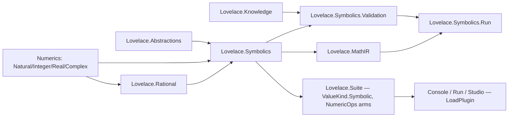

# Lovelace.Symbolics — Architecture

> **Status:** Implementation-grade architecture for the symbolic-numeric mathematical
> compiler kernel. Companion documents: [implementation-plan.md](implementation-plan.md),
> [testing-and-validation.md](testing-and-validation.md), [risk-register.md](risk-register.md),
> [dsh-execution-plan.md](dsh-execution-plan.md). Root summary: [SYMBOLICS-ROADMAP.md](../../SYMBOLICS-ROADMAP.md).

> **Post-cycle status:** the kernel described here is shipped and hardened (commits
> `f36dd06`, `13c61a0`, `1af7272`, `50ac339`). Sections marked `[POST-CYCLE]` were corrected
> to match the shipped implementation; the binding change log is
> [hardening-alignment-plan.md](hardening-alignment-plan.md).

> Raw inspection evidence for this document lives in
> [findings/numeric-hierarchy-aot-report.md](findings/numeric-hierarchy-aot-report.md) plus the
> three subsystem reports summarized in section 1. All file references below are to the current
> working tree.

---

## 1. Repository findings (A): reuse map and corrections

### 1.1 The pipeline the repo already implements

```text
Lovelace.Suite (SuiteEngine)         — tokenizer → recursive-descent parser → tree-walking
                                       interpreter over an immutable record AST (Ast.cs)
   ├── NumericOps.cs                 — scalar dispatch, widening Natural→Integer→Real
   ├── TypedArrayOps.cs              — array ops incl. det/inv/matmul over Value
   ├── ModusHost.cs                  — Value↔plugin-payload mapping (IModusPlugin seam)
   └── Value.cs                      — boxed tagged union (object _inner + ValueKind)
Lovelace.Array (NdArray<T>, ArrayMath) — generic N-D arrays + generic algorithms
Lovelace.Abstractions (IField<T>, DenseArray<T>, ArrayValue, DType, Modus contracts) —
                                       element seam + language array layer (IField moved here
                                       by the 2026-09-08 DSP remediation, E2)
Lovelace.Natural/Integer/Real/Complex — arbitrary-precision numerics (binary-limb Natural)
Lovelace.Knowledge(+.Run)           — MGIR behavioral graph discovery (Monte Carlo, boundaries)
Lovelace.Proofs                     — Lean 4 core-only proofs of digit arithmetic
Hosts: Lovelace.Console (REPL) · Lovelace.Run (JSON runner, DSH tool) · Lovelace.Studio (web IDE)
```

### 1.2 Classification of existing abstractions

| Abstraction | Verdict | Evidence | Consequence for Symbolics |
|---|---|---|---|
| `Natural` / `Integer` (binary-limb arbitrary precision) | **REUSE** as exact coefficients | `Lovelace.Natural/Natural.cs`, `Lovelace.Integer/Integer.cs`; immutable; `INumber<T>`; `DivRem`/`Pow`/`Factorial` | Coefficient type for polynomials/Rational. Note: the BCD `DigitStore` in `Lovelace.Representation` is legacy (Natural no longer uses it) |
| `Real` (exact periodic decimals + arbitrary precision) | **WRAP, do not reuse as exact coefficient** | `Lovelace.Real/Real.cs`; division with period detection; `AsyncLocal` precision; equality is string/precision-based | Use only as an *approximate* leaf constant (RealConstant). Never as a canonicalization key. Convert exact finite/periodic decimal literals to Rational at symbolic-construction time |
| `Complex` (pair of Reals) | **EXTEND** | `Lovelace.Complex/Complex.cs`: `IEquatable` only, operators +/−/×/÷, `Exp`; no log/sqrt/sin/cos/pow | Add complex elementary functions (needed by the numeric evaluator for complex samples); keep `LComplex64/128` fast paths untouched |
| `IField<T>` (`Lovelace.Abstractions/IField.cs` since the 2026-09-08 remediation) | **WRAP** (new `IField<Expr>`), not modify | same 11 members; production `NaturalField`/`IntegerField`/`RealField` landed alongside the move (`Lovelace.Natural/NaturalField.cs` etc.) — the exact pattern `SymbolicField` will follow | Gives `MatMul/Dot/Cross/Trace/Sum/Prod` for symbolic elements for free; `IsZero` must be conservative-structural; `Compare`/`Sqrt` throw or stay unevaluated |
| `NdArray<T>` / `ArrayMath` | **REUSE for safe ops, BYPASS for Det/Inverse** | `Lovelace.Array/ArrayMath.cs`: `Det` is division-based Gaussian elim (`:209-244`), `Inverse` Gauss–Jordan (`:247-298`); first-nonzero pivot via `IsZero` | Symbolic `det`/`inv`/`solve` need fraction-free (Bareiss) algorithms in Symbolics; generic division-based Gaussian is a liability for symbolic elements (expression swell, undecidable pivots) |
| `DenseArray<T>` / `ArrayValue` / `DType` | **REUSE** (language array container) | `Lovelace.Abstractions/DenseArray.cs`; language arrays are `DenseArray<Value>` (boxed) today | Symbolic values ride the existing boxed path as `Value(Symbolic)` elements; no `DType` change needed in v1 |
| Suite AST (`Ast.cs`) | **KEEP SEPARATE** | Immutable records; raw-text literals; no per-node spans; no Symbol node; `VariableExpr` is name lookup | The symbolic IR must be a dedicated semantic DAG in Lovelace.Symbolics. Suite AST stays the language/source representation; a *converter* (literal/variable/binary/call → symbolic nodes) bridges them |
| `Value` / `ValueKind` (`Value.cs:20-49`) | **EXTEND** (append `ValueKind.Symbolic`) | Boxed tagged union; widening `Natural→Integer→Real` by enum ordinal; `Complex` precedent as domain type outside the lattice | Append `Symbolic` after `Complex` as a non-widening domain kind; add `Value(Symbolic)`/`AsSymbolic()`; extend the `(op, kind)` switches in `NumericOps.cs` and the Modus payload mapping |
| Modus plugin seam (`IModusPlugin`/`IModusContext`, `ModusHost`) | **REUSE** for the language surface | `Lovelace.Abstractions/Modus.cs` — post-remediation shape: `IFieldKernel<T>` (no `unmanaged` constraint, field injected), `ScalarResult` channel, duplicate-registration guards (`ModusHost.cs:87`); `DspPlugin` precedent; compile-time-linked; AOT-safe; Suite holds zero Dsp refs | `SymbolicsPlugin : IModusPlugin` registers the CAS builtins; symbolic values are a *novel element type*, which the contract explicitly says requires a core bridge — exactly the `ValueKind.Symbolic` + `ModusHost` mapping this plan adds |
| `Lovelace.Knowledge` (MGIR) | **REUSE (adapt) as falsification engine** | `SplitMix64` (`Randomness.cs`), `Proposal` (sweeps/random/bisection/held-out probes), `ExactNumber` (BigInteger-based rational, +/- only), `Reducer` (finite-difference boundaries, guard fitting), `Convergence` (C1–C4), `Confidence` ladder, `Graph`/`GraphStore` | [POST-CYCLE] The falsifier shipped INSIDE `Lovelace.Symbolics.Tests` (`FalsificationTests.cs` boundary-biased rule attacks with `FuzzVerified` evidence labeling, `PropertyTests.cs` seeded suites, `DifferentialOracleTests.cs` SymPy oracle with skip-when-absent) rather than a separate `Lovelace.Symbolics.Validation` project; the Knowledge assembly was NOT linked — only its pattern was reused |
| `Lovelace.Proofs` (Lean) | **EXTEND (linkage manifest)** | Core-Lean 4.33.1; digit-list theorems; no C#↔proof linkage today | Add a `RuleId → (module, theorem, hash)` manifest + CI staleness check; first proofs: Rational normalization, canonicalization soundness, polynomial arithmetic |
| Benchmark house style | **REUSE** | BenchmarkDotNet 0.15.8 in `precbench`/`dspbench` with `[MemoryDiagnoser]`, precision-pinning `[GlobalSetup]`, 10-min build timeout | New `symbench`/`optbench` mirror `dspbench` conventions |
| Hosts / DSH tools | **REUSE + extend** | `Lovelace.Run` (JSON envelope, source-gen context), `harness/lovelace.host.js`, `harness/knowledge.host.js` (mgir tool) | New `Lovelace.Symbolics.Run` CLI + `symbolics.host.js` DSH plugin following the same pattern; Studio gains symbolic endpoints/panes |
| `ExactNumber` (`Lovelace.Knowledge`) | **Prior art, superseded** | BigInteger-based; only Add/Subtract/Negate/Abs/Compare | New `Lovelace.Rational` over `Integer` generalizes it; ExactNumber stays untouched (or later migrates) |

### 1.3 Corrections to the planning prompt (with evidence)

1. **`NdArray<T>` exists but is not what the language uses.** The prompt asked about `NdArray<T>`
   / field-like abstractions. Both exist, but they are disjoint: `ArrayMath` algorithms speak
   `NdArray<T>` while the language speaks `DenseArray<T> : ArrayValue`. The symbolic matrix layer
   must support the language path; kernel-level symbolic matrices should use their own small
   storage (or `NdArray<Expr>`) and bridge to `DenseArray<Value>` at the Suite boundary.
2. **`IField<T>` is a flat contract, not a trait hierarchy.** There is no `IRing`/`ISigned`/
   `IOrdered`. `IField` bundles ordering (`Compare`) and `Sqrt`. The polynomial engine should
   define its own small coefficient-ring contract rather than contort `IField`.
3. **The digit store is binary limbs, not BCD.** The distilled docs describe BCD
   (`DigitStore`), but `Natural` now stores `ulong[]` limbs with Karatsuba/NTT; `DigitStore` is
   dead code. Irrelevant to symbolics except as a warning that repo docs can lag the code.
4. **There is no GCD/LCM anywhere in the numeric stack** (verified by grep), and no public
   rational type or `Real.ToRational`. `Integer` is the exact coefficient type; GCD must be
   added (EXTEND Natural/Integer) and a new normalized `Rational` project created.
5. **`Real` equality is string-based and precision-dependent** — it must never be used for
   canonicalization/identity. Symbolic real constants carry their own canonical decimal
   identity.
6. **Complex exists but is minimal** (no INumber, no log/sqrt/sin/cos/pow, no IField). The
   symbolic evaluator needs these added as arbitrary-precision complex functions.
7. **There is no linear `solve` anywhere** (Suite has det/inv/matmul only; no LU/QR/eigen).
   Symbolic `solve` for linear systems is entirely new code — write it fraction-free from
   the start.
8. **Modus is real, compile-time-linked, and AOT-mandated** — not a runtime plugin loader. No
   reflection/Assembly.Load anywhere. Symbolics extensibility must follow the same model.
9. **The Knowledge system is behavioral-plane discovery, not generic sampling** — its
   sampling is operation-spec driven over Lovelace scripts. The falsification engine reuses its
   *pattern and primitives*, not its domain model verbatim.
10. **Suite AST is a syntax tree, not an IR.** The prompt asked whether to share it with the
    symbolic IR: do not. `LiteralExpr` keeps raw text, `VariableExpr` is a name reference,
    there are no spans, and control flow is present. The symbolic DAG is a different kind of
    object (semantic, canonical, interned); a small converter bridges them.
11. **Property testing did not exist at planning time** (no FsCheck/Hedgehog; xUnit only).
    [POST-CYCLE] It now ships as seeded deterministic suites over `System.Random` in
    `Lovelace.Symbolics.Tests/PropertyTests.cs`, keeping the zero-runtime-dependency policy.
12. **Studio is a minimal-API + vanilla-JS app** (not Blazor) — symbolic UI is new endpoints,
    DTOs, and a pane in `wwwroot/index.html` + `app.js`, plus `EngineHost.GetCompletions`.
13. **Post-remediation baseline (2026-09-08, after this plan was written).** The DSP plugin
    remediation (`docs/architecture/dsp-plugin-remediation-plan.md`) landed after this document
    and changed the seams it describes: (a) `IField<T>` moved from `Lovelace.Array` into
    `Lovelace.Abstractions` with production `NaturalField`/`IntegerField`/`RealField`;
    (b) the kernel seam is now `IFieldKernel<T>` (the `unmanaged`-constrained `IArrayKernel<T>`
    is gone); (c) `ScalarResult` landed as the typed return channel with the raw-`object`
    overload retained; (d) `ModusHost` rejects duplicate plugin/builtin registration;
    (e) plugin builtins now run under a default `Real.WithPrecision(30, 15)` scope whenever the
    session precision knob was not explicitly set. All of this is *favorable* to the plan —
    the seam this plan wanted already exists — with one new decision recorded in §18.1:
    symbolic evaluation must not silently inherit the plugin fast-standard precision.

---

## 2. Product pipeline and layer responsibilities

```text
mathematical source
    ↓  Suite tokenizer/parser (unchanged; no new grammar in v1)
Suite AST (Ast.cs)                     KEEP SEPARATE — language/source representation
    ↓  SuiteAstConverter (new, in Lovelace.Symbolics)
symbolic expression DAG (Expr)         immutable, hash-consed, canonical constructors
    ↓  assumption-aware canonicalization (kernel constitution, INV-*)
algebra / calculus / solving           deterministic algorithms over canonical forms
    ↓  rewrite engine (conditional rules, provenance)
equivalence-preserving optimization    deterministic passes (v1) → e-graph saturation (phase 6)
    ↓  lowering
MathIR (typed computational DAG)       versioned, serializable, AOT-safe
    ↓  execution
scalar / array / arbitrary-precision evaluation on Natural/Integer/Real/Complex
    (future: SIMD, GPU, distributed — MathIR must not block them)
```

Hard boundaries:
- Suite keeps zero knowledge of CAS algorithms. Suite gains exactly: `ValueKind.Symbolic`,
  a `Value(Symbolic)` constructor/accessor, operator-constructor arms in `NumericOps` that call
  into Lovelace.Symbolics, and Modus payload mapping for symbolic values (the Complex precedent).
- Lovelace.Symbolics references Numerics (Natural/Integer/Real/Complex), Abstractions (for the
  plugin), and nothing above. It never references Suite.
- Lovelace.MathIR references Lovelace.Symbolics (and Numerics transitively). Symbolics never
  references MathIR (the `lower` builtin ships from the MathIR side as a second plugin).

---

## 3. Core: the symbolic expression DAG

### 3.1 Representation decision (B: node representation, interning)

**Chosen:** an abstract `Expr` base with a closed set of ~16 `sealed` subclasses (immutable,
readonly fields), structurally hash-consed through factory functions on an explicit
`ExprContext`. Equality is **reference equality after canonical construction**.

```csharp
namespace Lovelace.Symbolics;

public abstract class Expr
{
    internal Expr() { }
    public NodeKind Kind { get; internal init; }   // cached; cheap switch
    internal int Hash { get; init; }               // cached structural hash
    internal int NodeCount { get; init; }          // cached size (for budgets)
    internal int Complexity { get; init; }         // cached term-order complexity
    // equality is sealed to reference semantics (interned instances)
    public sealed override bool Equals(object? obj) => ReferenceEquals(this, obj);
    public sealed override int GetHashCode() => Hash;
}

public enum NodeKind { Symbol, IntegerConstant, RationalConstant, RealConstant,
    ComplexConstant, NamedConstant, Add, Multiply, Power, Function, Relation,
    Piecewise, Derivative, Integral, RootOf }

// sealed subclasses (one file each under Expr/):
public sealed class SymbolExpr : Expr { public Symbol Symbol { get; } }
public sealed class IntegerConstantExpr : Expr { public Integer Value { get; } }
public sealed class RationalConstantExpr : Expr { public Rational Value { get; } }
public sealed class RealConstantExpr : Expr { public RealLiteral Value { get; } }   // §4.4
public sealed class ComplexConstantExpr : Expr { public Rational Re { get; } public Rational Im { get; } }
public sealed class NamedConstantExpr : Expr { public NamedConstant Constant { get; } } // Pi, E, I, Infinity
public sealed class AddExpr : Expr { public ImmutableArray<Expr> Terms { get; } }        // n-ary, ≥2
public sealed class MultiplyExpr : Expr { public ImmutableArray<Expr> Factors { get; } } // n-ary, ≥2
public sealed class PowerExpr : Expr { public Expr Base { get; } public Expr Exponent { get; } }
public sealed class FunctionExpr : Expr { public FunctionId Function { get; } public ImmutableArray<Expr> Arguments { get; } }
public sealed class RelationExpr : Expr { public RelOp Op { get; } public Expr Left { get; } public Expr Right { get; } }
public sealed class PiecewiseExpr : Expr { public ImmutableArray<PiecewiseBranch> Branches { get; } public Expr Otherwise { get; } }
public sealed class DerivativeExpr : Expr { public Expr Operand { get; } public ImmutableArray<Symbol> Variables { get; } }
public sealed class IntegralExpr : Expr { public Expr Operand { get; } public ImmutableArray<Symbol> Variables { get; } }
public sealed class RootOfExpr : Expr { public Polynomial< Rational> DefiningPolynomial { get; } public int RootIndex { get; } public RootIsolation? Isolation { get; } }
```

Rationale: sealed-class-per-kind gives typed accessors and C# pattern matching, keeps the
closed world explicit (AOT-friendly — no reflection, no MakeGenericType over node kinds), and
matches the repo's record-style immutability. Alternatives rejected: a single tagged class
with `object` payload (loses type safety; every access is a cast); `record` types with
value-equality (breaks the reference-equality invariant after interning and tempts code to
bypass factories); `struct` nodes (expressions are trees of shared nodes — a struct-based
recursive type needs allocation anyway and complicates interning).

Consequences/risks: reference equality is only sound if *every* construction goes through the
canonical factories — the factory surface (section 6) is the only public way to build nodes,
enforced by `internal` constructors. Interning uses memory proportional to distinct
subexpressions (mitigation: per-context pools, budgeted sweeps, §19).

### 3.2 Symbols, functions, named constants — interning identity

```csharp
public readonly struct Symbol : IEquatable<Symbol>
{
    internal Symbol(int id) { Id = id; }
    public int Id { get; }                    // dense id from the context symbol table
    public string Name => /* via context table */ ;
}

public readonly struct FunctionId : IEquatable<FunctionId> { public int Id { get; } }
public enum NamedConstant { Pi, E, I, Infinity }
```

`ExprContext` owns three interning tables: the **symbol table** (name → `Symbol` id), the
**function registry** (name → `FunctionId` → `FunctionDefinition`), and the **node pool**
(structural key → `Expr`). `Symbol`/`FunctionId` are value structs carrying dense ids —
equality and hashing are O(1), serialization is by name, and plugin-defined functions get ids
from the same table without new node classes. Identity rule: two `Symbol` values with the
same id are the same mathematical variable **within one context**; across contexts, identity
is by name (canonical names must be context-independent, INV-05).

### 3.3 The node pool (hash-consing)

```csharp
public sealed class ExprContext
{
    // node pool: ConcurrentDictionary<NodeKey, Expr> keyed by (Kind, structural payload)
    // NodeKey = readonly struct over (NodeKind, int hash, payload refs) with
    //           deterministic operand order (already canonical, §6)
    public Symbol InternSymbol(string name);
    public FunctionId InternFunction(string name);
    internal Expr Intern(NodeKey key, Func<Expr> create);
    public AssumptionStore Assumptions { get; }
    public RewriteRuleRegistry Rules { get; }
    public VariableOrder Order { get; set; }   // §9 monomial ordering
}
```

Thread safety: interned nodes are immutable and published safely via
`ConcurrentDictionary.AddOrUpdate`; readers never lock; construction-time canonicalization
happens before interning so pool keys are already canonical. Structural hash is computed once
at construction (cached on the node) from the canonical child order — never from .NET
`GetHashCode` of anything unordered. Determinism: the pool never iterates in hash order; all
iteration orders are the canonical term order (§6.3).

Serialization stability: canonical text form (print/parse, §6.6) is the stable interchange
format; node pool ids are never serialized.

---

## 4. Numeric domains (B: exact Rational)

### 4.1 New project: Lovelace.Rational

**Chosen:** a dedicated normalized exact rational type — `public sealed class Rational :
INumber<Rational>` in a new `Lovelace.Rational` project depending on `Lovelace.Integer`.

```csharp
namespace Lovelace.Rational;
public sealed class Rational : INumber<Rational>, IParsable<Rational>
{
    public Integer Numerator { get; }    // sign lives here (Denominator > 0 always)
    public Integer Denominator { get; }  // > 0, gcd(Numerator, Denominator) == 1
    public static Rational From(Integer n, Integer d);   // normalizes; d != 0
    public static Rational From(Integer n);              // n / 1
    // exact arithmetic: + - * / negate, Pow(int), Abs, Compare, IsZero/IsOne/IsMinusOne
    // conversions: ToInteger (exact when denominator == 1), ToReal(int digits) (exact for
    //              finite decimals, truncated otherwise), FromReal(Real) (exact for finite
    //              and periodic decimals — geometric-series period expansion)
    public static Rational Parse(string s);              // "p/q", "p", "p.q"
}
```

Rationale: the symbolic kernel's algebraic algorithms (polynomial GCD, cancellation, partial
fractions, Gröbner, Bareiss) require O(1)-normalized numerator/denominator pairs. `Real`'s
decimal-period model is the wrong tool: denominators with factors other than 2 and 5 have
infinitely long periods, and `Real` equality is string-based/precision-dependent —
unacceptable for canonical comparison. `Knowledge.ExactNumber` proves the num/den pattern but
is BigInteger-based and lacks Multiply/Divide. Alternatives rejected: reusing `Real` as the
coefficient type (period arithmetic, precision-dependent equality); BigInteger (the repo
deliberately keeps its own arbitrary-precision stack; conversions to/from BigInteger are stubs).

Dependencies: `Lovelace.Rational` needs **GCD on Natural/Integer** (Euclidean + binary GCD),
which does not exist today — EXTEND `Lovelace.Natural`/`Lovelace.Integer` with
`Gcd`/`Lcm`/`GcdExt` (Bézout coefficients for Integer) as package SYM-01. GCD also becomes
`Real`-level exact rational arithmetic later if desired (explicitly out of scope here).

### 4.2 Domain model

The four symbolic constant domains and their lattice:

```text
IntegerConstant  ⊂  RationalConstant  ⊂  RealConstant
                                     ⊂  ComplexConstant  (Gaussian rationals (a + b·i))
```

- **IntegerConstant** wraps `Integer` — the exact coefficient workhorse.
- **RationalConstant** wraps `Rational` — all exact arithmetic happens here.
- **RealConstant** wraps `RealLiteral` (§4.4) — the *approximate* leaf. It arises only from
  truncated numeric results (e.g. `sqrt(2)` evaluated to 50 digits, user literals that are
  not exact decimals). A finite or periodic decimal literal entered by the user becomes a
  `RationalConstant` at construction (1.25 → 5/4, 0.(3) → 1/3) — this is *more* exact than
  the numeric engine and is a documented semantic upgrade, not a compatibility break
  (INV-09).
- **ComplexConstant** stores exact rational components (v1: no approximate complex leaves;
  approximate complex values are pairs of RealConstant reached only during evaluation).

### 4.3 Exact vs approximate — the discipline

- Canonicalization and all algebraic algorithms see only Integer/Rational/Complex constants;
  a RealConstant poisons a subtree into the "approximate" tier: it is never absorbed into
  Rational arithmetic, never used as a Gröbner coefficient, and any comparison against it is
  flagged `Approximate`.
- Evaluation is the only place approximate arithmetic happens, always at an explicit
  precision through `Real.WithPrecision`/`MaxComputationDecimalPlaces` (the existing
  `AsyncLocal` machinery, `Lovelace.Real/Real.cs`).
- `Expr.IsExact` (computed property): true iff the subtree contains no RealConstant and no
  unevaluated transcendental value — the agent API exposes this so callers can distinguish
  "safe exact result" from "approximate".

### 4.4 RealLiteral — canonical identity for decimal approximations

```csharp
// canonical form: (Integer digits, int exponent10) with no trailing fractional zeros;
// identity/equality/ordering defined on this pair — NEVER via Real.Equals/ToString
public readonly struct RealLiteral : IEquatable<RealLiteral>
{
    public Integer Digits { get; }   // significand, no trailing zeros
    public int Exponent10 { get; }   // value = Digits × 10^Exponent10
    public static RealLiteral FromReal(Real value, int digits);
    public Real ToReal();
}
```

This sidesteps the `Real` string-based-equality hazard (INV-08).

### 4.5 Symbolic I and existing Complex

`I` is `NamedConstantExpr(NamedConstant.I)`; canonical rules fold `I^2 → -1`, `I^4 → 1`, and
`a + b·I` collapses into `ComplexConstant` when a, b are rationals. Evaluation maps
`ComplexConstant` onto the existing `Lovelace.Complex.Complex` (extended with the elementary
functions it lacks, package SYM-13b). Complex-elementary-function *symbolic* semantics
(branch conventions for log/sqrt/pow) are documented per function in the registry (§13) and
enforced by the falsification suite (§testing doc).

### 4.6 Algebraic numbers

`RootOfExpr` (defining polynomial with Rational coefficients + root index) is the v1 algebraic-
number representation. It supports exact equality (via defining polynomial + isolating
interval refinement), field-ish combination where safe (same defining polynomial), and
arbitrary-precision numeric evaluation via real-root isolation + Newton iteration reusing
`Real`'s precision machinery. Full algebraic-number arithmetic (QQbar) is a later milestone.

---

## 5. Assumption and domain engine (B: assumptions)

### 5.1 Representation

```csharp
namespace Lovelace.Symbolics;

public enum Tristate { True, False, Unknown }

public sealed class AssumptionSet : IEquatable<AssumptionSet>   // immutable, content-hashed
{
    public static readonly AssumptionSet Empty;
    public AssumptionSet Add(Assumption a);          // returns new set; throws on contradiction
    public Tristate Ask(AssumptionPredicate p);      // True/False/Unknown, memoized per scope
    public bool IsContradiction(Assumption a);
}

// atoms (closed set in v1):
public abstract record Assumption;
public sealed record SymbolDomain(Symbol S, Domain D) : Assumption;      // D ∈ {Integer, Rational, Real, Complex}
public sealed record SymbolProperty(Symbol S, SymbolPredicate P) : Assumption;
                                                          // P ∈ {Positive, Negative,
                                                          //      NonNegative, NonPositive,
                                                          //      NonZero, Even, Odd, Finite}
public sealed record SymbolRelation(Symbol S, RelOp Op, Expr Bound) : Assumption;  // x > 5, x ≤ n
public sealed record ExpressionProperty(Expr E, SymbolPredicate P) : Assumption;   // Positive(sqrt(x)) etc.
```

`ExprContext.Assumptions` holds the current set; scoping is push/pop over immutable sets:

```csharp
using var scope = ctx.Assumptions.Push( /* atoms */ );   // everything inside sees the extension
TResult WithAssumptions<TResult>(AssumptionSet extra, Func<TResult> body);
```

Query caching: (predicate, scope-identity) → Tristate memo; scopes are immutable so the cache
is never invalidated, only appended. Contradiction policy: `Assume` of a contradictory atom
throws `AssumptionContradictionException` (configurable to return a rejected set — the
default is throw, matching the repo's fail-loud style).

### 5.2 Inference rules (core, table-driven)

| From | Infer |
|---|---|
| Domain(ℤ) | Rational, Real, Finite |
| Domain(ℚ) | Real, Finite |
| Domain(ℝ) | Finite |
| Positive / Negative / NonNegative / NonPositive / NonZero | Real (plus Positive⇒NonNegative, NonZero; Negative⇒NonPositive, NonZero) |
| Even / Odd | Integer (Odd ⇒ NonZero) |
| SymbolRelation(x > 0) | Positive(x); SymbolRelation(x ≥ 0) ⇒ NonNegative(x); x ≠ 0 ⇒ NonZero(x) |
| FunctionValue(sqrt, NonNegative(arg)) | Real(sqrt(arg)) and NonNegative(sqrt(arg)) |
| FunctionValue(exp, Real(arg)) | Positive(exp(arg)) and NonZero |
| FunctionValue(abs, Real(arg)) | NonNegative(abs(arg)) |
| FunctionValue(log, Positive(arg)) | Real(log(arg)) |
| sin/cos/tan/sinh/cosh/tanh of Real | Real |
| asin/acos of arg in [-1,1] | Real |
| Piecewise branch guard provable | branch value domain (propagated through the selected branch) |
| Product: NonZero(a) ∧ NonZero(b) | NonZero(a·b); Even(a) ∨ Even(b) ⇒ Even(a·b); Odd(a) ∧ Odd(b) ⇒ Odd(a·b) |
| Power: Positive(a) | Positive(a^k) for integer k; NonNegative(a) ⇒ NonNegative(a^k) |

Each function contributes its inference table in its `FunctionDefinition` (§13) — inference is
extensible per function, not hard-coded in one switch.

### 5.3 The tri-state contract

- `Ask` returns **True** only when provable from the set by the inference closure; **False**
  only when the negation is provable; everything else **Unknown**. There is no closed-world
  assumption in v1.
- Transformations may only use True results. Unknown never licenses a rewrite.
- This is what makes `sqrt(x^2)` correct: with `Real(x)` → `abs(x)`; with `NonNegative(x)` →
  `x`; unconstrained → stays `sqrt(x^2)` (the safe complex-aware form). The exact behavior is
  encoded as rewrite rules with `ExpressionProperty` preconditions (§7.3).

### 5.4 Domain computation

`DomainOf(expr, ctx) → Domain` computes the best domain structurally (constants by kind;
symbols from assumptions; functions by their inference tables; arithmetic by the standard
closure rules, with Unknown for anything unprovable). It backs the typed wildcards of the
rewrite engine (`Pattern.Real`, `Pattern.Integer`, …) and the `is-integer`-style queries the
agent API exposes.

---

## 6. Canonicalization (B: canonical algebra)

### 6.1 Principle: canonicalization is eager, assumption-free, and small

Every public factory canonicalizes immediately: the node you hold is already in canonical
form. The rule set is deliberately small (the "kernel constitution") and **never consults
assumptions** — assumption-dependent transformations belong to the rewrite engine. This
separation is an invariant (INV-11): two contexts with different assumption sets produce
bit-identical canonical forms for the same input, so canonical equality is comparable
across contexts and teams.

### 6.2 Add invariants

```text
Add(a1, …, an) is canonical iff:
  A1  n ≥ 2; no child is itself Add (flat)
  A2  no child is IntegerConstant/RationalConstant/RealConstant, except at most one
      leading numeric constant term (all numeric constants folded, then placed first)
  A3  no child is the zero constant; the lone zero case is the zero constant itself
  A4  like terms merged: no two children share the same coefficient-stripped monomial
      (x + x → 2·x; 2·x + 3·x → 5·x) — coefficient extraction = strip the leading
      numeric factor of each term
  A5  children sorted ascending by the total term order (§6.3)
  A6  if n == 1 after flattening/merging, the node unwraps to that child
```

Division is represented inside terms as negative powers (a/b → a·b⁻¹), so a term's canonical
shape is `Multiply(coef, base₁^e₁, …, baseₖ^eₖ)` with coef a numeric constant (§6.4).

### 6.3 The total term order

A single deterministic total order over expressions, used for sorting (A5/M5), pattern-match
traversal order, and serialization stability:

```text
Compare(a, b):
  1. numeric constants before everything else, compared by exact numeric value
     (Integer < Rational < RealLiteral by exact decimal semantics; ComplexConstant
      ordered by (Re, Im) pairs)
  2. otherwise by node-kind rank (Symbol < NamedConstant < Function < Power < Multiply
     < Add < Relation < Piecewise < Derivative < Integral < RootOf)
  3. same kind: lexicographic over children by this same order, with special-cases:
     Symbol by name (ordinal); Function by (FunctionId, args); Power by (Base, Exponent);
     Multiply by factor sequence; Add by term sequence
```

The order must be total, transitive, deterministic, and AOT-serializable — it never uses
`GetHashCode`. This single order is the concurrency contract for parallel teams (INV-06).

### 6.4 Multiply invariants and coefficient conventions

```text
Multiply(a1, …, an) is canonical iff:
  M1  n ≥ 2; no child is itself Multiply (flat)
  M2  at most one numeric constant factor, and it is the first factor (folded)
  M3  no factor is 0 (→ 0) or 1 (dropped)
  M4  no two factors are Powers of the same base with integer exponents
      (x^a · x^b → x^(a+b)); [POST-CYCLE] merging fires only when the pole set is
      preserved — both exponents nonnegative, or the combined exponent negative.
      x·x⁻¹ and 0·x⁻¹ therefore stay visible (the constructor no longer defines them
      at 0); the originally planned blanket "rational exponents are NOT merged" rule was
      refined into this definedness guard
  M5  factors sorted ascending by the term order
  M6  if n == 1 after folding, unwrap
```

Negative representation: `-x` is the canonical `Multiply(IntegerConstant(-1), x)` — there is
no negation node. Coeffcient convention: coefficients of sums live as the leading numeric
factor of each term; `CoefficientOf(expr, monomial)` extracts them structurally.

### 6.5 Power invariants

```text
Power(b, e) is canonical iff:
  P1  b is canonical and is not itself a Power with integer exponent (folded:
      (x^a)^k → x^(a·k) for integer a, k); nested Powers with non-integer exponents stay
  P2  e is canonical
  P3  e = 0 → 1;  e = 1 → b;  b = 1 → 1
  P4  b = 0: e positive rational → 0;  e = 0 or negative → UNEVALUATED (Power(0, e))
  P5  integer e: b = -1 handled by parity ((-1)^2k → 1, (-1)^(2k+1) → -1)
  P6  rational e: p/q stored with gcd(p, q) = 1, q > 0; sqrt(x) arrives as
      Power(x, Rational(1,2)) — the language-level sqrt() function canonicalizes to
      this form, so there is exactly one square-root representation
  P7  no base-dependent constant folding beyond numeric bases
      (numeric base + rational exponent folds only when the result is exact in
      Rational or Gaussian rationals: 4^(1/2) → 2; 2^(1/2) stays)
```

When expressions should remain unevaluated: `Derivative`, `Integral`, `RootOf`, relations,
and `Piecewise` are never touched by canonicalization (only their children are canonical).
`sqrt(x^2)` and `log(x·y)` remain unevaluated — the rewrite/simplify layer decides them under
assumptions.

### 6.6 Definedness conventions (documented, INV-10)

Expressions denote values over the complex field under standard totalizations: every function
has a documented principal-branch convention (log's cut on the negative real axis, sqrt's
principal branch, 0⁰ and 0^negative undefined-but-represented). Consequently `x·0 → 0` and
`x/x → 1` are accepted canonical rules (undefinedness is not a first-class value in v1; the
assumption engine's `Finite`/domain predicates plus `Unevaluated` nodes are the honesty
mechanism instead). Any identity that genuinely needs "x ≠ 0" carries that as an explicit
rule precondition and as solver conditions — never as a silent canonical rule.

### 6.7 Printing/parsing (canonical text form)

`CanonicalPrint(expr)` emits a fully-parenthesized, order-stable form (the §6.3 order), and
`CanonicalParse(text, ctx)` is its exact inverse. This form is:
- the stable interchange format (versioned: first line `#!lovelace-sym 1`);
- what the agent APIs and Studio transport when JSON DTOs would be lossy;
- what the differential oracles (SymPy/AngouriMath) exchange, so both sides compare
  structurally on canonical text rather than pretty-print.

A separate `PrettyPrint(expr, style)` (human-oriented: infix, unicode, LaTeX subset for
Studio/KaTeX later) is display-only and never used for identity.

---

## 7. Pattern matching and conditional rewrite engine (B: rewrite engine)

### 7.1 Patterns

```csharp
namespace Lovelace.Symbolics.Rewriting;

// patterns are built from ordinary Expr constructors plus wildcard markers:
public static class Pattern
{
    public static readonly Expr Any;                       // matches one node
    public static Expr Typed(Func<Expr, ExprContext, Tristate> predicate);
    public static readonly Expr Real, Integer_, Rational_, NonZero_;   // domain-typed wildcards
    public static Expr Sequence(Expr wildcard);            // matches 0..n siblings inside
                                                            // Add/Multiply (n-ary nodes)
}
```

Matcher: recursive structural match over canonical nodes; bindings are a small persistent
map; `Sequence` wildcards match contiguous sibling runs (greedy, deterministic, leftmost-
first). Patterns compile once (a pattern AST of marker nodes), so hot loops never re-parse.

### 7.2 Rules

```csharp
public readonly record struct RuleId(string Value);        // stable, namespaced: "algebra.pow.sqrt-square"

public sealed class RewriteRule
{
    public RuleId Id { get; }
    public string Name { get; }
    public Expr Pattern { get; }
    public Func<Match, ExprContext, bool> Precondition { get; }   // assumption queries land here
    public Func<Match, ExprContext, Expr> Replacement { get; }
    public RuleDirection Direction { get; }               // Forward / Both
    public RuleMetadata Metadata { get; }                 // evidence level, falsification config, proof ref
}

public sealed class RewriteRuleRegistry
{
    public void Register(RewriteRule rule);               // before Freeze() only
    public void Freeze();                                 // determinism: late registration throws
    public IEnumerable<RewriteRule> Group(string groupId);// ordered, registration order
}
```

Rule IDs are compile-time constants in a `RuleIds` static class so they are grep-able, stable
across refactors, and mechanically referenceable from tests, provenance, and Lean manifests
(INV-13).

### 7.3 Worked example (the sqrt-square family)

```csharp
// RuleId: pow.sqrt-square-real
// Pattern: sqrt(x^2)   (= Power(Power(x, 2), Rational(1, 2)))
// Precondition: ctx.Assumptions.Ask(ExpressionProperty(x, Real)) == Tristate.True
// Replacement: abs(x)  (= Function(abs, x))
//
// RuleId: pow.sqrt-square-nonnegative
// Pattern: sqrt(x^2)
// Precondition: NonNegative(x) provable
// Replacement: x
```

Both rules live in group `power`; with no assumptions neither fires and `sqrt(x^2)` survives.

### 7.4 The rewrite loop

```text
Rewrite(expr, group, budget):
  repeat:  bottom-up traversal in canonical child order
           for each node: try rules in registration order; first match whose
              precondition evaluates True fires; rebuild canonical node from result
  until:   fixed point, or budget exhausted (MaxSteps / MaxNodeCount-growth / time)
```

- **Loop protection:** a rule may not re-fire on its own output at the same node (the
  engine compares the replacement to the input structurally — identical output short-
  circuits); rule pairs that oscillate are caught by the step budget and reported with
  their rule IDs in the trace (agents triage these; never silently accept).
- **Budgets:** `RewriteBudget { MaxSteps, MaxNodes, MaxDepth, Timeout }`; exceeding any
  budget returns the best-so-far expression plus a diagnostic — a first-class, debuggable
  outcome, not an exception (INV-12).
- **Determinism:** traversal order, rule order, and matching are all fixed; there is no
  hash-order dependence anywhere (§6.3 order everywhere).

### 7.5 Phases: Simplify is an ordered composition of rule groups

```text
simplify(expr) =
   g1  canonical constructors (always on)
   g2  arithmetic/rational folding (number identities, rational simplification)
   g3  power rules (assumption-aware: sqrt-square, exp-log inverses, power laws)
   g4  trig identities (pythagorean, angle sums, periodicity — conservative set)
   g5  exp/log identities (conservative, branch-safe set)
   g6  rational-function compression (together + cancel on detected rational forms)
   g7  Piecewise/abs/sign conditional rules (guard evaluation under assumptions)
```

Phases give order-of-application without a global priority swamp: each group is internally
fixed-pointed with its own budget, groups run in sequence. `SimplifyOptions` (§19) controls
which groups run at which effort level.

---

## 8. Equality saturation / e-graph (B: e-graph decision)

**Decision: build a purpose-built minimal e-graph, but stage it (Phase 6).** v1 ships the
deterministic optimizer (CSE + Horner + power-chain + identity rules via the rewrite engine);
the e-graph layer lands after the canonical kernel, rewrite engine, and cost models are
proven. No third-party e-graph dependency: the .NET ecosystem has no mature AOT-safe, 
dependency-free e-graph library, and the repo's zero-runtime-dependency + Native AOT policy
makes a small in-house engine (~2–3k LOC) the right call.

### 8.1 Design (so the interface exists from day one)

```csharp
public interface IOptimizer
{
    Expr Optimize(Expr expr, IReadOnlyCollection<Symbol> parameters, CostModel cost, Budget budget);
}
public sealed class DeterministicOptimizer : IOptimizer { … }   // v1 (Phase 6a)
public sealed class EqualitySaturationOptimizer : IOptimizer { … } // Phase 6b

public abstract class CostModel
{
    public abstract long Cost(Expr node);                       // node-level cost
    public static readonly CostModel HumanReadable;             // smallest term count, shallowest
    public static readonly CostModel ScalarCpu;                 // op count; transcendental weight ×100
    public static readonly CostModel HighPrecision;             // arbitrary-precision weighting (digits²)
    public static readonly CostModel ArrayExecution;            // vectorization-friendly bias
    // future: SimdCpu, Gpu, Distributed — the interface must not change
}
```

### 8.2 E-graph internals (Phase 6b)

- e-class: union-find id; e-node: (kind, operand class-ids) memoized per class; congruence
  closure via standard rebuild on union; iteration = match rules + union + rebuild, with
  `MaxClasses`/`MaxIterations`/`MaxNodeCount` caps (INV-12 budgets apply).
- analysis per e-class: cheapest-known constant value (folded), term count, cost vectors.
- extraction: bottom-up greedy per cost model + a simple ILP-free "pick best child" with
  loop-aware term limiting; CSE falls out of extraction naturally (shared e-classes).
- assumption-aware legality: rules carry preconditions evaluated against the *context*
  assumptions once at saturation start (assumptions do not vary during saturation), so
  saturating under `a > 0` may add rules that saturation without assumptions may not — the
  optimizer records which assumptions the result depends on (provenance).

---

## 9. Polynomial and rational-function engine (B: polynomial representation)

### 9.1 Separate representation (not the expression DAG)

```csharp
namespace Lovelace.Symbolics.Algebra;

public readonly struct Monomial : IEquatable<Monomial>   // sorted (symbolIndex, exponent) pairs
public sealed class Polynomial<T>                        // sparse: SortedDictionary<Monomial, T>
    where T : notnull
{
    public VariableOrder Variables { get; }              // explicit Symbol[] order (interned per context)
    public int TotalDegree { get; }
    public T this[Monomial m] { get; }
    public static Polynomial<T> Add(Polynomial<T> a, Polynomial<T> b, ICoefficientRing<T> ring);
    public static Polynomial<T> Mul(Polynomial<T> a, Polynomial<T> b, ICoefficientRing<T> ring);
    public Expr ToExpression();                          // back into the DAG
}

public interface ICoefficientRing<T>                     // Symbolics' own ring contract
{
    T Zero { get; }  T One { get; }  T FromLong(long v);
    T Add(T a, T b); T Negate(T a); T Multiply(T a, T b);
    bool IsZero(T a); bool IsOne(T a);
    T ExactDivide(T a, T b);                             // throws when not exact
    T Gcd(T a, T b);                                     // euclidean domains only
}
```

Closed instantiations only: `Polynomial<Rational>`, `Polynomial<Integer>`, and
`Polynomial<Expr>` (coefficient expressions — used by Bareiss-style matrix algorithms and
series with symbolic coefficients). All instantiations are statically known (AOT-safe; no
open reflection instantiation). `IField<T>` is **not** reused here: it bundles Compare/Sqrt
and lacks Gcd/ExactDivide — a separate small ring contract keeps both seams honest
(KEEP SEPARATE).

### 9.2 Monomial orders and variable orders

- `VariableOrder`: the fixed sequence of variables a polynomial lives in (canonical form
  sorts monomials by it).
- `MonomialOrder { Lex, GrLex, GrRevLex }`: a *parameter of algorithms* (division, Gröbner),
  never stored in the polynomial — the same polynomial object is order-neutral; algorithms
  receive the order explicitly (this is what lets teams test order-dependent behavior
  deterministically).

### 9.3 Algorithm set and layering

```text
foundational (Phase 2a):
  sparse add/mul · univariate div/rem · multivariate div/rem (Buchberger-style)
  content/primitive part · univariate Euclidean GCD (subresultant PRS) · LCM
  square-free decomposition (univariate) · expr↔poly conversion with size budgets
layered (Phase 2b):
  together/cancel/partial-fractions (rational functions over ℚ(x))
  resultants (Sylvester) + subresultant GCD
  factorization over ℚ: square-free → Kronecker/Hensel-lite univariate;
    multivariate via recursive content + univariate factoring
  Gröbner bases: Buchberger (normal strategy, sugar, pair elimination);
    default GrRevLex; F4 deferred
```

Expression↔polynomial conversion (`ToPolynomial`/`ToExpression`) detects polynomiality
structurally with an expansion budget: exceeding `MaxExpansionTerms` returns a typed
failure (`NotPolynomial`) instead of exploding (INV-12). Expression swell controls: sparse
storage, monomial-order choice per algorithm, and the shared budgets of §19.

### 9.4 Why Gröbner is in v1

Buchberger is ~300 focused LOC, is deterministic, and unlocks polynomial-system solving,
elimination, ideal membership, and implicitization — the multivariate core of the solving
story. It is a Phase 2b package with its own benchmark (cyclic-n) and oracle checks, and it
is explicitly allowed to stay "correct but not F4-fast".

---

## 10. Calculus architecture (B: calculus)

### 10.1 Differentiation

```csharp
public static Expr Diff(Expr expr, Symbol x, ExprContext ctx);        // memoized per (node, x)
public static Expr Diff(Expr expr, IEnumerable<Symbol> xs, ExprContext ctx);   // mixed partials
public static SymbolicMatrix Gradient(Expr f, IReadOnlyList<Symbol> xs, ExprContext ctx);
public static SymbolicMatrix Jacobian(IEnumerable<Expr> f, IReadOnlyList<Symbol> xs, ExprContext ctx);
public static SymbolicMatrix Hessian(Expr f, IReadOnlyList<Symbol> xs, ExprContext ctx);
public static Expr DirectionalDerivative(Expr f, Symbol x, Expr direction, ExprContext ctx);
```

Engine: recursive over canonical nodes — sums/products/quotients/powers by the standard
rules; functions by their registry derivative templates (`d/dx f(g(x)) = f'(g(x))·g'(x)` with
`f'` supplied by the `FunctionDefinition`); constants → 0. Memoization is a per-call
dictionary keyed by `(interned node, symbol)` — reference-keyed, cheap, and deterministic.
Each produced node goes through the canonical factories (automatic light simplification:
terms like `1·x` and `0·x` never appear). Full `simplify` is a *separate, optional* step —
differentiation stays fast and its output stays predictable.

### 10.2 Series

```csharp
public sealed class Series
{
    public Symbol Variable { get; }
    public Expr Point { get; }
    public int Order { get; }
    public ImmutableArray<Expr> Coefficients { get; }   // c0 … c_{n-1};  O((x-x0)^n) implied
    public static Series Of(Expr f, Symbol x, Expr x0, int order, ExprContext ctx);
    // ring ops: Add/Subtract/Multiply/Divide/Compose/Invert/Derivative/Integrate
}
```

`Series.Of` derives coefficients by iterated differentiation (memoized) for general
expressions, with fast paths for registry functions that supply series generators (exp/sin/
cos/log/(1+x)^a…). Laurent-style leading-negative powers are supported via negative start
index when the expansion point is a pole. Series is the shared substrate for limits, local
simplification near points, and asymptotic reasoning.

### 10.3 Limits

```csharp
public sealed record LimitResult
{
    public LimitStatus Status { get; }     // Value | PlusInfinity | MinusInfinity |
                                            // Unevaluated | OneSidedOnly | Failed
    public Expr? Value { get; }
    public LimitResult? FromLeft { get; }  public LimitResult? FromRight { get; }
    public string? FailureReason { get; }
}
public static LimitResult Limit(Expr f, Symbol x, LimitPoint point, LimitDirection dir, ExprContext ctx);
```

Ladder: (1) direct substitution when the domain machinery proves continuity at the point;
(2) one-sided evaluation at known discontinuities; (3) rational-function asymptotics via
leading-term comparison; (4) series expansion at the point to enough order and coefficient
limit; (5) infinite limits via t = 1/x substitution. Failure semantics are explicit:
`Unevaluated` (safe, no claim), `Failed(reason)` (attempted and gave up), never a guess.

### 10.4 Integration (bounded, tiered, self-checking)

```text
tier 0  canonical + linearity            ∫(a·f + b·g) = a·∫f + b·∫g
tier 1  polynomial / monomial table      ∫x^n, ∫x^a for rational a ≠ -1, ∫x^-1 → log|x| (with branch note)
tier 2  rational functions               partial fractions over ℚ (square-free denominators)
tier 3  elementary table                 ∫sin, cos, exp, 1/(1+x²), sec², … (registry-driven)
tier 4  linear substitution              ∫f(a·x + b)
tier 5  u-substitution patterns          detect f'(g(x))·g'(x) heuristically (derivative
                                          matching, bounded search)
tier 6  integration-by-parts patterns    ∫x·e^x, ∫x·sin(x), ∫xⁿ·ln(x), … (registry-driven)
tier 7  trig/exponential families         conservative identities (half-angle, e^{ix} forms)
fallback                                first-class Integral node, preserved unevaluated
```

**Mandatory internal verification:** every tier result is differentiated and checked against
the integrand by canonical equality before being returned (the integrator verifies itself;
cheap because canonicalization already merged like terms). Any mismatch demotes to the next
tier — a structural guard against rule bugs that runs on every call, not just in tests.
The unevaluated `Integral` node carries its integrand and variables and is itself
differentiable/series-expandable.

---

## 11. Equation and system solving (B: solver architecture)

```csharp
public sealed class SolutionSet
{
    public SolutionKind Kind { get; }     // Exact | Underdetermined | Empty | Unevaluated
    public ImmutableArray<Solution> Solutions { get; }
    public ImmutableArray<Symbol> FreeParameters { get; }   // Underdetermined only
    public AssumptionSet Conditions { get; }   // side conditions attached to the set
}
public sealed record Solution(Expr Value, AssumptionSet Conditions);   // RootOfExpr is a valid Value

public static SolutionSet Solve(Expr equationOrInequality, Symbol x, SolveOptions options, ExprContext ctx);
public static SolutionSet SolveSystem(IEnumerable<Expr> equations, IReadOnlyList<Symbol> vars, ExprContext ctx);
```

### 11.1 Dispatch by mathematical structure

```text
solve(eq, x):
  normalize to expr(x) == 0  (relation canonical move); collect w.r.t. x
  if degree ≤ 1 in x                → linear: exact solve; denominator conditions attached
  else if polynomial in x           → univariate polynomial path (§11.2)
  else if rational in x             → clear denominators; add denom ≠ 0 conditions; recurse
  else if elementary-composable     → invertible-function decomposition (§11.3)
  else                              → Unevaluated (Solve(expr, x) preserved)
```

### 11.2 Univariate polynomial path

factor over ℚ → solve each irreducible factor:

| degree | method |
|---|---|
| 1 | exact |
| 2 | quadratic formula (discriminant handling, exact) |
| 3 | Cardano (real/imaginary case distinction; exact radicals or RootOf per effort level) |
| 4 | Ferrari (Aggressive effort only; else RootOf) |
| ≥ 5 | RootOf(poly, index) with numeric isolating interval (real roots first, then complex pairs) |

[POST-CYCLE] RootOf contract as shipped: `RootOf(p, i)` is the i-th REAL root (ascending)
of the SQUARE-FREE part of the univariate polynomial (auto-normalized at construction).
Complex algebraic numbers are deferred — there is no complex-pair indexing. The solver
emits exactly the Sturm count of real roots, so degree ≥ 4 with no real roots reports
"no real roots" instead of inventing indices.

`RootOf` numerical evaluation: `N(rootOf, digits)` — isolation via exact Sturm sequences
(sign-variation counts with left-limit endpoint handling) and bisection over rational
intervals, not a sampling grid; verified by back-substitution. Conditions travel with solutions (e.g. the classic `x² - 2 = 0` over
reals returns both roots; `sqrt`-introduced solutions are never silently dropped).

### 11.3 Elementary compositions and systems

- `solve(exp(u(x)) = c, x)` → `u(x) = log(c)` + condition `c ≠ 0`-aware domain checks;
  invertibility comes from each function's registry `Inverse` hook with its domain
  restrictions (`log`: argument must be Positive; `asin`: |arg| ≤ 1 …).
- Linear systems: exact via fraction-free Gaussian elimination on symbolic matrices (§12) —
  the Suite/ArrayMath Gaussian path is **not** reused (division-based, `IsZero`-pivot-
  dependent). Rank checks distinguish Empty vs Underdetermined (free parameters named).
- Polynomial systems: Gröbner basis (GrLex for elimination) → triangular set → univariate
  solver per chain + consistency filtering.

---

## 12. Symbolic matrices and arrays (B: symbolic arrays)

```csharp
public sealed class SymbolicMatrix : IEquatable<SymbolicMatrix>
{
    public int Rows { get; }  public int Columns { get; }
    public Expr this[int r, int c] { get; }
    public static SymbolicMatrix Add/Multiply/Transpose/Trace/…
    public static Expr Det(SymbolicMatrix m, ExprContext ctx);          // Bareiss (fraction-free)
    public static SymbolicMatrix Inverse(SymbolicMatrix m, ExprContext ctx); // Bareiss adjugate
    public static SolutionSet Solve(SymbolicMatrix a, SymbolicMatrix b, …);   // fraction-free
}
```

- **Kernel storage:** flat `Expr[]` (row-major) with rows/cols — simple, AOT-safe, allocation-
  friendly; a view over `NdArray<Expr>`/`DenseArray<Value>` is provided for the array layer.
- **Algorithms:** determinant via **Bareiss fraction-free elimination** (exact division by
  previous pivots; stays in the polynomial ring; O(n³)); inverse via Bareiss adjugate
  (`adj/det`); linear solve fraction-free with symbolic pivot heuristics (prefer low-complexity
  nonzero pivots; structural zero = the zero constant or provable zero). The division-based
  Gaussian in `ArrayMath.Det/Inverse` is explicitly bypassed for symbolic elements (and is
  documented as unsuitable — expression swell + undecidable `IsZero` pivots).
- **Zero detection:** pivots are chosen by a `SymbolicZero` tri-state test —
  `ProvablyZero` (structural/canonical or assumption-provable), `ProvablyNonZero`,
  `Unknown`; elimination proceeds with Unknown pivots but records the assumption "pivot ≠ 0"
  as a condition on the result (INV-12-style honesty: solutions carry their pivot conditions).
- **IField<Expr> adapter** (`SymbolicField`) is provided so `MatMul/Dot/Cross/Trace/Sum/Prod`
  work through `ArrayMath` as-is; `Min/Max/Norm/Det/Inverse` are redirected to the symbolic
  path. It follows the post-remediation production pattern of
  `Lovelace.Natural/NaturalField.cs`, `Lovelace.Integer/IntegerField.cs`, and
  `Lovelace.Real/RealField.cs` (singleton, AOT-safe, decline-with-`NotSupportedException` for
  unsupported members — the same policy a symbolic field uses for `Compare`/`Sqrt`).
- **Suite surface:** symbolic elements travel as `Value(Symbolic)` inside the existing
  `DenseArray<Value>` arrays; `det`/`inv`/`matmul`/`dot` builtins dispatch to the symbolic
  algorithms when any element is symbolic. `gradient`/`jacobian`/`hessian` builtins return
  arrays of symbolic values (rendered via the symbolic formatter).
- **Matrix differentiation:** Jacobian/Hessian materialize as SymbolicMatrix;
  `diff(mat, x)` is elementwise; v1 has no matrix-valued function calculus (d(tr)/dA
  etc.) — deferred.

---

## 13. Elementary function registry (B: plugin/extensibility model)

A central, data-driven registry — no giant switches scattered through algorithms.

```csharp
namespace Lovelace.Symbolics;

public sealed class FunctionDefinition
{
    public FunctionId Id { get; }
    public string Name { get; }                       // canonical: "sin", "arcsin", "log", …
    public int Arity { get; }
    public Func<Expr, Expr>? Derivative { get; }       // f'(x) as an expression template
    public AssumptionInference[] Inferences { get; }   // §5.2 table entries
    public SeriesGenerator? Series { get; }            // coefficients at a point (fast path)
    public InverseDescriptor? Inverse { get; }         // solving hook: domain restrictions
    public RewriteRule[] Rules { get; }                // identities contributed to rule groups
    public DomainRestriction[] Restrictions { get; }   // e.g. log: arg ∈ (0, ∞) principal branch
    public MathIrLowering Lowering { get; }            // which MathIR node/sequence it lowers to
    public Func<IReadOnlyList<Number>, ExprContext, Number>? NumericEvaluator { get; }
}
```

| v1 function set | sqrt (→ Power(x,1/2)), exp, log, sin, cos, tan, asin, acos, atan, sinh,
| | cosh, tanh, asinh, acosh, atanh, abs, sign, floor, ceil, min, max |
| constants | Pi, E, I, Infinity (NamedConstant) |
| later | gamma, erf, bessel… — same registration path, no core changes |

`CoreFunctions.Register(registry)` installs the v1 set at context creation (compile-time,
like `Interpreter.RegisterBuiltins`). Extensions register more functions programmatically
before freezing the context — determinism preserved because registration order is explicit
and late registration is rejected (§7.2 Freeze pattern). `Function(id, args…)` construction
canonicalizes: arity check, argument canonicalization, and any unconditional evaluation
rules the definition carries (e.g. `abs` of a numeric constant). Unknown function names
create opaque `Function` nodes (no rules, no derivative) so serialization round-trips and
forward compatibility hold; opaque functions evaluate only if a NumericEvaluator exists.

**AOT:** the registry is a plain object graph assembled at startup; no reflection, no
source-generation ceremony needed (a source generator is a later optimization if hook
counts explode). Plugin-defined functions ship as part of the plugin's `Register` call —
the same compile-time-linked model as `DspPlugin`.

---

## 14. Relations, Piecewise, and conditional mathematics

### 14.1 Relations

`RelationExpr(RelOp, Left, Right)` with `RelOp { Eq, Ne, Lt, Le, Gt, Ge }`. Children are
canonical; the relation itself is not algebraically normalized (a logical atom). The
assumption engine can hold relations on symbols (`SymbolRelation`); `SimplifyRelation`
(rewrite group g7) does safe movement (a < b → a - b < 0 under field assumptions, sign-aware
multiplication only under provable signs). In the language, comparisons on symbolic values
produce RelationExpr values instead of booleans — the minimal surface change that makes
`assume(a > 0)` and `solve(x^2 == 4, x)` readable (§18.2).

### 14.2 Piecewise

```csharp
public sealed record PiecewiseBranch(Expr Guard, Expr Value);
// PiecewiseExpr(Branches, Otherwise) — first-true-branch semantics (documented),
// canonical form: guards simplified/deduplicated; branches whose guard is provably false
// under the context assumptions are dropped; overlapping guards keep first-match order.
```

Uses: derivatives of `abs`/`sign`/`min`/`max` (abs'(x) = Piecewise(x≥0 → 1, x<0 → -1));
solver results with side conditions; domain-restricted rewrites (log(x²) → 2·log(x) only
for x > 0, expressed as a conditional rewrite). Under assumptions, branch selection is
deterministic: provable guard ⇒ evaluate that branch; provable-false guards are removed;
unknown guards remain symbolic.

### 14.3 The bridge to the MGIR behavior-plane model

`Piecewise` is structurally a *behavior-plane description*: branches are planes, guards are
boundaries. A Phase-8 export maps `PiecewiseExpr → Knowledge.Graph` (`Plane` per branch,
`BoundaryEdge`+`Guard` per adjacent branch pair) so the existing `mgir` tooling can visualize
and the falsification engine can probe the guards — symbolic mathematics and behavioral
discovery share one vocabulary. This is an integration of representations, not a
re-implementation of either.

---

## 15. Transformation provenance and verification (B: provenance)

[POST-CYCLE] This section shipped with small naming differences: the records are
`RewriteStep(RuleId, RuleClassification, Before, After, Conditions)` and
`TransformResult(Expression, Conditions, Steps)` (returned by `Simplify.Transform`); rule
classification is the `RuleClassification` enum (Universal / Conditional / DomainSpecific /
Approximate / OptimizationOnly); `EffortLevel`/`MaxNodes`/`MaxDepth` were NOT shipped
(v1 has `MaxSteps` only). Collection is still opt-in in the engine (`Apply(..., trace)`) but
`Simplify.Transform` always collects so its Conditions are populated. The sketch below
remains the design reference.

```csharp
public sealed record RewriteStep(
    int Sequence,
    RuleId Rule,
    string CanonicalBefore,
    string CanonicalAfter,
    IReadOnlyList<string> Preconditions);   // rendered assumption atoms that licensed the step

public sealed class TransformTrace
{
    public ImmutableArray<RewriteStep> Steps { get; }
    public static TransformTrace Collect(…);   // bounded: MaxSteps / MaxBytes budgets
}

public sealed record SimplifyOptions(
    bool Trace = false,
    EffortLevel Effort = EffortLevel.Standard,
    int MaxSteps = 400, int MaxNodes = 200_000, int MaxDepth = 64);
```

- **Trace is opt-in**: off by default → zero overhead on hot paths. When on, every rewrite
  engine step records (rule id, before/after canonical text, assumptions used). Budgeted —
  a runaway trace truncates with a marker, never OOMs.
- **Stable rule IDs** are compile-time constants (`RuleIds` class, INV-13); they appear in
  traces, tests, falsification reports, and Lean manifests.
- **Rendering:** Studio's transformation panel renders steps before/after; the agent API
  returns the trace as structured JSON (§18.4).
- **Linkage:** `RuleId → (Lean module, theorem, hash)` in a checked-in manifest (§testing
  doc §8); CI verifies manifest staleness.

---

## 16. Mathematical optimization (B: MathIR/optimization)

### 16.1 Passes (all equivalence-preserving, assumption-conditional where needed)

```text
o1  constant folding            (canonical constructors + rational arithmetic)
o2  common subexpression sharing (interning gives structural sharing for free;
                                 CSE additionally recognizes value-equal forms via
                                 canonicalization and, in Phase 6b, via e-classes)
o3  algebraic simplification     (rewrite groups g2–g7, budgeted)
o4  Hornerization                collect w.r.t. parameters → Horner nesting
                                 (a·x⁵ + b·x⁴ + … + f  →  f + x·(e + x·(d + …)))
o5  power-chain reduction        x⁸ → t1 = x·x; t2 = t1·t1; t3 = t2·t2  (addition-chain)
o6  strength reduction           x² → x·x at MathIR level; integer powers by binary
                                 exponentiation; a/b by reciprocal when |a|,|b| cheap
o7  dead-expression elimination  unreferenced IR nodes after extraction/CSE
o8  reassociation                only where provably legal (associative ops on exact
                                 domains; floating-point reassociation stays OFF by default)
o9  target-specific extraction   cost-model-driven choice among equivalent forms
                                 (deterministic optimizer uses fixed heuristics;
                                 e-graph optimizer does real exploration, Phase 6b)
```

### 16.2 Cost models

`CostModel` (§8.1) weights: operation count; transcendental calls ×100 (matches the observed
arbitrary-precision cost cliffs in `precbench-report.md` — Sqrt ~19 000× a float add);
arbitrary-precision digits² scaling; allocation/temporary count; vectorization potential
(uniform elementwise structure); future backend-specific tables. `Optimize(expr, parameters,
cost, budget)` returns the optimized expression plus provenance of every applied step.

---

## 17. MathIR (B: MathIR)

### 17.1 Shape

- **Expression DAG, not an SSA CFG**: mathematical kernels are side-effect-free DAGs; a
  control-flow-graph form buys nothing in v1. CSE *is* the sharing structure (o2);
  `Select(cond, a, b)` carries the only branching (Piecewise lowering). Explicitly deferred:
  loops, general control flow, tensor-shaped values (documented in the IR version notes).
- **Typed temporaries:** each node has a value type (`IrType { ScalarReal, ScalarComplex }`
  in v1; tensor types arrive with a later IR version, not by mutation).

```csharp
namespace Lovelace.MathIR;

public enum IrOpKind { Constant, Parameter, Add, Sub, Mul, Div, Negate, Reciprocal,
    PowInt, Sqrt, Exp, Log, Sin, Cos, Tan, Asin, Acos, Atan, Sinh, Cosh, Tanh,
    Abs, Sign, Floor, Ceil, Min, Max, Select }

public sealed class IrProgram
{
    public int FormatVersion { get; }          // stable, monotonic (INV-14)
    public IrConstantPool Constants { get; }   // deduplicated literals (Rational/RealLiteral)
    public ImmutableArray<IrParameter> Parameters { get; }
    public ImmutableArray<IrNode> Nodes { get; }  // topological order, operands by index
    public long[] DebugSourceMap { get; }      // optional: node → symbolic node id
}

public sealed record IrParameter(string Name, IrType Type, PrecisionHint Precision);
public sealed record IrNode(IrOpKind Op, int[] Operands, IrType Type, PrecisionHint Precision);
```

### 17.2 Lowering rules

- Constants → constant pool (Rational/RealLiteral; precision metadata attached per constant).
- Parameters → explicit parameter slots (the optimization targets; bound at evaluation).
- Function(id, args) → its `FunctionDefinition.Lowering` (e.g. `abs` → `Abs`; `min/max` →
  `Min/Max`; `Piecewise` → nested `Select`).
- Assumptions are **erased** at lowering — they licensed the transformations and are
  recorded in the `Optimize` provenance; the IR itself is assumption-free (evaluable on any
  inputs, with the caveat that condition-licensed optimizations are only valid where their
  conditions hold — the provenance carries that contract).
- Precision metadata is advisory, never semantic: execution honors the evaluation-site
  precision scope (`Real.WithPrecision`), matching the engine's per-session model.

### 17.3 Execution backends (v1)

1. **Interpreter** (`MathIrEvaluator`): recursive switch over nodes, per-operation dispatch
   into `Real`/`Complex` numerics — the portable reference (also the testing oracle).
2. **Parameter-array mode**: evaluate over `IReadOnlyList<IReadOnlyDictionary<string,
   Number>>` batches (loop-based; loop-invariant hoisting via the DAG order). This is the
   "compiled expression evaluated at many points" product path (break-even benchmarks).
3. **Source emitter (C# text)** — deferred: generates a `.cs` evaluator compiled at host
   build time (no Reflection.Emit; Native AOT-safe by construction).

Future backends (C emitter, LLVM, WASM, SIMD, GPU, distributed) are **non-goals for v1 but
non-blocked**: the IR is backend-neutral, versioned, and serializable; nothing in v1
precludes them.

---

## 18. Runtime, Suite, Studio, and agent integration

### 18.1 Suite core changes (small, additive — the Complex precedent)

| File | Change |
|---|---|
| `Lovelace.Suite/Value.cs` | append `ValueKind.Symbolic` after `Complex` (non-widening domain kind); `Value(SymbolicExpr)` ctor; `AsSymbolic()`; display branch in `Value.ToString` |
| `Lovelace.Suite/NumericOps.cs` | `(op, ValueKind.Symbolic)` arms in `Apply`/`Compare`/`Negate`/`IsZero` delegating to `Lovelace.Symbolics` constructors; comparisons on symbolic operands build `RelationExpr` (in `Interpreter`'s comparison path) |
| `Lovelace.Suite/Interpreter.cs` | `ValueKind.Symbolic` cases in unary/postfix/display dispatch; no new grammar |
| `Lovelace.Suite/ModusHost.cs` | unwrap/wrap `SymbolicExpr` payloads (the plugin never sees `Value`); symbolic values are the "novel element type" the post-remediation `ScalarResult` contract explicitly routes to a core bridge — this mapping *is* that bridge. Mind the new duplicate-registration guards (`ModusHost.cs:87`) when loading `SymbolicsPlugin` next to `DspPlugin` |
| `Lovelace.Suite/ValueFormatter.cs` | `Format`/`FormatTyped` branches for symbolic values (canonical or pretty print) |
| `Lovelace.Suite/Lovelace.Suite.csproj` | add `Lovelace.Symbolics` project reference (mirrors the existing Complex/Array references) |
| `Lovelace.Suite/docs/Language.md` | symbolic section with doctests (the language reference is machine-checked — ships with the feature) |

Hosts (`Lovelace.Console`, `Lovelace.Run`, `Lovelace.Studio`) opt in with
`engine.LoadPlugin(new SymbolicsPlugin())` — exactly the `DspPlugin` pattern
(`Lovelace.Run/Program.cs:106`).

**Plugin precision governance (post-remediation fact, decision required).**
`ModusHost.RegisterBuiltin` wraps every plugin builtin in a default
`Real.WithPrecision(30, 15)` scope whenever the session precision knob was not explicitly set
(`Interpreter.PrecisionExplicitlySet`, `ModusHost.cs:97-99`). Decision: `SymbolicsPlugin` must
**not** let symbolic results silently inherit that plugin fast-standard. Exact symbolic
operations are unaffected (they never touch `Real` precision); for evaluation builtins
(`evalf`/`evaluate`), the implementation opens its own inner precision scope — explicit
`digits` argument, else the session precision (explicitly set or engine default 1000) — and the
plugin documents the deviation from the shared plugin standard. This is tested explicitly
(package SYM-10): `evalf(..., 50)` must agree to 50 digits regardless of the plugin wrapper.

### 18.2 Language ergonomics (no new grammar in v1)

```text
x = symbol("x");  y = symbol("y");  n = symbol("n")
assume(x > 0)                       # x > 0 yields a symbolic Relation value; assume() adds it
assume(n is Integer)                # domain atom (or assume_integer(n) — final spelling decided
                                    # by the doctest package)
f = x^3 + 2*x^2 + 5*x + 7           # operator dispatch: symbolic + numeric → symbolic
g = diff(f, x)                      # 3*x^2 + 4*x + 5
simplify(g) · expand(...) · factor(...) · collect(...) · together(...) · cancel(...)
subs(f, x, 10) · evalf(f, {x: 10}, 50)   # exact substitution vs precision-bound evaluation
solve(f == 0, x) · integrate(2*x*cos(x^2), x) · series(sin(x)/x, x, 0, 10) · limit(...)
H = hessian((x^2 + y^2) * exp(-(x+y)), [x, y])
A = [[x, 1], [y, x]];  d = factor(det(A))          # symbolic arrays through the existing
                                                    # array literal path
k = optimize(g, [x]);  ir = lower(k);  evalf(ir, {x: 1.25})   # MathIR round-trip
```

Mixed symbolic/numeric operations widen numerics into exact symbolic constants
(Natural/Integer/Real → IntegerConstant/RationalConstant; truncated Reals → RealConstant);
comparisons on numeric operands keep their current boolean semantics — backward
compatibility is preserved everywhere the current engine has defined behavior.

### 18.3 Studio surface (deferred polish, planned seams now)

| Piece | Where | v1-essential vs later |
|---|---|---|
| Symbolic value rendering (canonical + pretty) | `ValueFormatter` → `Studio/Dtos.cs` strings | essential (free once formatter lands) |
| Transformation trace panel | new pane in `Studio/wwwroot/index.html` + `app.js` render fn + `POST /api/symbolic` endpoint + `StudioJsonContext` DTOs | high-value, small (mirror `renderPlot`) |
| simplify/diff/solve quick actions | autocomplete catalog (`EngineHost.GetCompletions`) + builtins | later polish (builtins are already available) |
| Assumption panel | session-scoped assumption store exposed via `GET/PUT /api/assumptions` | later |
| MathIR inspection / cost comparison | IR JSON view + side-by-side before/after | later |
| E-class graph visualization | reuses the MGIR graph-render tooling (`out/graph-render`) | later (Phase 6b+) |

### 18.4 Agent / DSH surface (deterministic, structured)

A new `Lovelace.Symbolics.Run` CLI (JSON-over-stdio, source-generated context — the
`Lovelace.Run` pattern) plus a `symbolics.host.js` DSH plugin (the `lovelace.host.js`
pattern). Operations (each a command or a language builtin — both surfaces expose the same
kernel):

```text
parse · simplify · expand · factor · collect · together · cancel · subs · diff ·
gradient · jacobian · hessian · integrate · series · limit · solve · assumptions ·
verify(rule) · optimize · lower · evaluate(precision) · compare · provenance(trace)
```

Every response distinguishes status explicitly:

```text
proven-symbolic | conditional (with AssumptionSet) | unevaluated | heuristic |
numeric-approximation | failed(reason)
```

All values cross as canonical text (round-trippable), optional pretty text, and structured
JSON DTOs; all inputs take a seed/determinism contract; all operations are budget-bound
(INV-12). The agent-facing guarantee: same input + same options + same seed ⇒ byte-
identical output, across platforms.

---

## 19. Performance controls and expression-explosion budgets (INV-12)

Every potentially-unbounded operation takes an explicit budget; exhaustion is a *typed
result*, not an exception or a hang:

```csharp
public sealed record Budget(
    int MaxSteps = 400, long MaxNodes = 200_000, int MaxDepth = 64,
    long MaxExpansionTerms = 50_000, int MaxRewriteIterations = 40,
    int MaxEgraphClasses = 100_000, int MaxEgraphIterations = 30,
    int MaxFactorDegree = 12, int MaxSolverBranching = 256,
    int MaxProvenanceBytes = 1 << 20, TimeSpan? Timeout = null);

public enum EffortLevel { Fast, Standard, Aggressive }   // presets over Budget + rule-group
                                                        // selection (documented numeric
                                                        // values per preset — no hidden
                                                        // behavior)
```

Budgets cover: expansion size, rewrite step/iteration counts, e-graph node/class counts,
solver branching, integration recursion depth, factorization degree/effort, polynomial
conversion limits, simplification cost, provenance storage, and CSE thresholds. The effort
levels are justified: they map to the repo's existing precision-knob culture (a single
visible knob per axis) and give the agent APIs an explicit cost/quality trade.

---

## 20. Architectural decisions (B) — condensed ADRs

The full design is in sections 3–19. This table is the decision register:

| # | Decision | Alternatives considered | Chosen | Rationale | Consequences / Risks |
|---|---|---|---|---|---|
| B1 | Node representation | tagged class w/ object payload; records w/ value equality; structs | sealed class hierarchy (~16 kinds) under abstract `Expr` | typed accessors, pattern matching, AOT-closed world; records tempt value-equality bypassing factories; structs complicate interning | reference equality only safe with factory-only construction (enforced); risk: someone constructs nodes directly (mitigated by internal ctors + review rule) |
| B2 | Interning | none (structural equality); weak tables; per-arena | per-`ExprContext` strong hash-consing (`ConcurrentDictionary`) | deterministic identity, fast equality/hash, shared DAG memory; weak tables make equality nondeterministic; no-interning makes equal subtrees distinct | memory retention in long-lived contexts (mitigated by context lifetime + budgeted sweeps, §risk register) |
| B3 | Exact rationals | reuse `Real` periods; BigInteger; `Knowledge.ExactNumber` | new `Lovelace.Rational` over `Integer` (GCD-normalized) + GCD added to Natural/Integer | O(1) normalized num/den required by all algebraic algorithms; Real's decimal-period model + string equality are unfit; repo stack stays internal | new project + new GCD surface (small, well-understood); ExactNumber left as-is |
| B4 | Assumptions | global store (SymPy-style); expression annotations | immutable `AssumptionSet` scopes on `ExprContext` + tri-state `Ask` + per-function inference tables | explicit scoping matches engine sessions; tri-state honesty is the core correctness mechanism | query caching complexity; contradiction semantics must be frozen early (INV-07) |
| B5 | Canonicalization | lazy; assumption-dependent; large rule set | eager, assumption-free, small fixed constitution (A1–A6, M1–M6, P1–P7) | deterministic cross-context forms; assumption-dependent transforms belong to rewriting | canonical forms can be larger than optimal display forms (pretty-print is separate) |
| B6 | Rewrite engine | ad-hoc visitors; Prolog-style; full e-graph rewriting only | compiled patterns + preconditions + ordered rule groups + budgets + provenance | first-class, auditable, extensible; visitors scatter logic; e-graph alone over-kills the canonical tier | rule authoring discipline required (ids, preconditions, groups) |
| B7 | E-graph | third-party library; skip entirely; build now | purpose-built minimal engine, staged Phase 6b behind the deterministic optimizer | no AOT-safe zero-dep lib exists; deterministic optimizer delivers v1 value; interface (`IOptimizer`/`CostModel`) fixed now | Phase 6b risk isolated behind an interface (see risk register) |
| B8 | Polynomials | expression DAG only; dense arrays | sparse `Polynomial<T>` + `ICoefficientRing<T>` + explicit variable/monomial orders | expression DAG is the wrong granularity for GCD/Gröbner; dense arrays explode; sparse + closed instantiations is AOT-safe | conversion budgets needed (INV-12); generic instantiations must stay closed |
| B9 | Calculus | one big CAS visitor; recursive local algorithms | recursive canonical algorithms + registry-driven function tables + memoization | decomposition matches agent work packages; registry keeps functions data-driven | differentiation output size; memoization memory (per-call dictionaries) |
| B10 | Integration | Risch now; giant table only | tiered heuristic engine with mandatory self-verification (diff-of-result) and unevaluated `Integral` fallback | bounded scope, honest failures, correctness guard on every result | incompleteness (accepted; unevaluated results are first-class) |
| B11 | Solvers | reuse ArrayMath Gaussian; all-formula-all-degrees | structure dispatch + fraction-free linear path + degree≤3 formulas (+4 opt-in) + `RootOf` fallback + conditions | matches capability target; ArrayMath Gaussian is division-based/unsafe for symbolic pivots | RootOf numerics need real-root isolation (Real machinery reused) |
| B12 | Symbolic arrays | force symbolic elements through ArrayMath | `SymbolicMatrix` with Bareiss/fraction-free algorithms + `IField<Expr>` adapter for safe ArrayMath ops + Suite dispatch | generic pivoting/division would explode symbolically; the safe subset still reuses the existing seam | dual paths (symbolic vs numeric) in Suite builtins must stay consistent |
| B13 | MathIR | SSA CFG; bytecode; direct interpreter binding | typed expression DAG + `Select` + constant pool + interpreter/param-array backends | kernel math is a DAG; CFG adds nothing now; interpreter is AOT-safe and portable; C# source emitter deferred (no Reflection.Emit) | no general control flow in v1 (documented IR limitation) |
| B14 | AOT strategy | runtime plugins; reflection registries | compile-time-linked registries + source-gen JSON + canonical-text interchange; IsAotCompatible everywhere | repo's existing, proven model (DspPlugin, RunJsonContext); reflection-free by construction | every new serialization surface needs its source-gen context (process rule) |
| B15 | Extensibility | Suite-internal CAS functions; runtime loading | kernel registries (functions/rules) + `SymbolicsPlugin : IModusPlugin` for the language surface; Suite core gains only the domain kind | keeps Suite CAS-free (Dsp precedent), keeps kernel open for library users, AOT-safe | Modus payload channel gains a symbolic case (ModusHost change, additive) |
| B16 | Provenance | always-on recording; none | opt-in budgeted `TransformTrace` with stable RuleIds | zero overhead default; debuggable and agent-inspectable when needed | trace budgets (INV-12); ids must never be renamed (INV-13) |
| B17 | Proof linkage | none; runtime proof objects | checked-in `RuleId → (module, theorem, hash)` manifest + CI staleness gate | keeps Lean out of runtime; makes the link auditable without verifying the whole CAS | manifest drift without CI discipline (add the CI job) |

---

## 21. Project / module layout (C)

```text
Lovelace.Rational                      NEW  exact rationals (depends Integer; +Gcd/Lcm EXTEND
                                            Natural/Integer — package SYM-01)
Lovelace.Symbolics                     NEW  Expr DAG, interning, canonicalization, assumptions,
                                            rewrite engine, function registry, simplify/expand/
                                            factor/collect, calculus, solvers, polynomials,
                                            symbolic matrices, optimization, SymbolicsPlugin
                                            (depends: Rational, Integer, Real, Complex,
                                            Abstractions — for IModusPlugin)
Lovelace.Symbolics.Validation          NEW  rewrite-rule falsification engine (depends Symbolics
                                            + Knowledge — reuses SplitMix64/Proposal/ExactNumber/
                                            Reducer/Confidence patterns)
Lovelace.MathIR                        NEW  IR node set, lowering, evaluators, versioned
                                            serialization, MathIRPlugin (depends Symbolics)
Lovelace.Symbolics.Run                 NEW  JSON-over-stdio agent CLI (depends Symbolics, MathIR,
                                            Validation; source-gen JSON context) — the
                                            symbolics.host.js DSH tool backend
Lovelace.Symbolics.Tests / .MathIR.Tests / .Rational.Tests / .Validation.Tests   NEW  xUnit
symbench · optbench                     NEW  BenchmarkDotNet 0.15.8 projects (dspbench house style)

EXTENDED: Lovelace.Natural/Integer (Gcd/Lcm/GcdExt), Lovelace.Complex (elementary functions),
Lovelace.Suite (ValueKind.Symbolic + NumericOps arms + ModusHost payload + formatter + doctests),
Lovelace.Run/.Console/.Studio (LoadPlugin(SymbolicsPlugin) + Studio endpoints/pane),
harness/ (symbolics.host.js), Lovelace.Proofs (Symbolics/ manifest + new .lean modules),
Makefile (symrun/symfalsify publish targets), .github/workflows (CI additions).
```

Dependency direction (no cycles):



Why this boundary: the smallest split that (1) gives Rational an independent numeric-domain
home per repo convention, (2) keeps the kernel separate from the validation machinery
(Knowledge stays falsification-only), (3) versions MathIR independently (it is the stable
execution contract), and (4) mirrors the repo's thin-CLI pattern for the agent surface.
Fallback if boundaries prove heavy: fold Validation into Symbolics (one assembly) and ship
the CLI as `Lovelace.Run` commands — noted as an allowed contraction, not the default.

---

## 22. Public API sketch (D)

```csharp
// ---- context & construction (Lovelace.Symbolics) ----
var ctx = new ExprContext();                       // pools, assumptions, rule registry
Symbol x = ctx.Symbol("x"), y = ctx.Symbol("y");
Expr f = x.Pow(3) + 2 * x.Pow(2) + 5 * x + 7;      // operator overloads → canonical factories
Expr r = Expr.Parse("x^3 + 2*x^2 + 5*x + 7", ctx); // canonical parser
string s = r.CanonicalPrint();                     // round-trip stable

// ---- assumptions ----
using (ctx.Assumptions.Push(new SymbolProperty(x, SymbolPredicate.Positive)))
{
    var t = ctx.Assumptions.Ask(new SymbolProperty(x, SymbolPredicate.NonNegative)); // True
    Expr e = Sqrt(x.Pow(2)).Simplify(ctx);        // → x   (assumption-licensed)
}

// ---- algebra ----
Expr g = f.Expand(ctx).Collect(x, ctx).Factor(ctx);
Expr h = Rationals.Together(expr, ctx);  Rationals.Cancel(expr, ctx);
Expr s = expr.Substitute(x, R(10));              // exact

// ---- calculus ----
Expr d  = Calculus.Diff(f, x, ctx);
SymbolicMatrix H = Calculus.Hessian(f, new[]{x, y}, ctx);
Series ser = Series.Of(Sin(x)/x, x, 0, 10, ctx);
LimitResult L = Limits.Limit(Sin(x)/x, x, 0, LimitDirection.TwoSided, ctx);
Expr integ = Integration.Integrate(2*x*Cos(x.Pow(2)), x, ctx);   // sin(x^2)

// ---- solving ----
SolutionSet roots = Solvers.Solve(f == 0, x, ctx);       // conditions attached
var nr = Roots.N(x.RootOf(), 50, ctx);                  // RootOf numeric evaluation

// ---- optimization & execution ----
Expr kernel = Optimizer.Optimize(g, new[]{x}, CostModel.ScalarCpu, Budget.Standard, ctx);
IrProgram ir = MathIrLowering.Lower(kernel, ctx);       // Lovelace.MathIR
Number v = MathIrEvaluator.Evaluate(ir, new Dictionary<string,Number>{["x"]=R(1.25)}, 128);
// batch: MathIrEvaluator.EvaluateBatch(ir, IReadOnlyList<…> points, 128)

// ---- provenance ----
TransformTrace trace = f.Simplify(ctx, new SimplifyOptions{Trace = true});

// ---- matrices ----
SymbolicMatrix A = SymbolicMatrix.From(new[]{new[]{x, 1}, new[]{y, x}});
Expr detA = A.Det(ctx).Factor(ctx);
```

Suite-facing surface: `symbol`, `assume` (+ domain atoms), `diff`, `integrate`, `simplify`,
`expand`, `factor`, `collect`, `together`, `cancel`, `apart`, `series`, `limit`, `solve`,
`subs`, `evalf`, `gradient`, `jacobian`, `hessian`, `optimize`, `lower`, `evalir`, `nroots`,
`assumptions`, `traceof`. All registered via `SymbolicsPlugin`; all doctested in
`Language.md`.

---

## 23. Core invariants (E) — frozen before parallel implementation

[POST-CYCLE] Invariants INV-01..15 hold as shipped with these corrections: equality is
structural and hash-consing is per-context (reference equality holds only within one
context; cross-context equality is structural — INV-01 as written overstates the
reference-equality scope); power merging (INV-03/M4/P1) carries the definedness guard
noted in §6; `Ask` (INV-07) additionally ships Even/Odd ⇒ Integer (never the reverse) and
Im-interval condition atoms; series truncation now carries an explicit O((x−x₀)ⁿ) term.

| # | Invariant |
|---|---|
| INV-01 | **Equality:** two `Expr` values are equal iff they are the same interned reference; structural equality coincides with reference equality because every construction goes through the canonical factories. `Expr.Equals`/`GetHashCode` are sealed accordingly. |
| INV-02 | **Hashing:** the cached structural hash is computed from canonical child order only; never from `object.GetHashCode`, dictionary iteration, or `Real.ToString`. |
| INV-03 | **Canonical Add/Mul/Power:** A1–A6, M1–M6, P1–P7 (§6) hold for every node an algorithm can observe; factories are the only construction path (`internal` constructors). |
| INV-04 | **Rational normalization:** `Denominator > 0`, `gcd(Num, Den) = 1`, sign on numerator; zero is `0/1`. |
| INV-05 | **Symbol identity:** within a context, `Symbol` identity = interned name (ordinal compare); across contexts, identity = name; names are canonical (no whitespace/case normalization surprises — normalization is defined once). |
| INV-06 | **Function identity:** `FunctionId` = interned canonical name; two functions are the same mathematical function iff same id; the registry is frozen before any algorithm runs. |
| INV-07 | **Assumption semantics:** `Ask` returns True/False only when provable/provably-negated; Unknown never licenses a transform; contradiction on `Add` throws by default. |
| INV-08 | **Exact vs approximate:** `IntegerConstant/RationalConstant/ComplexConstant` are exact; `RealConstant` is approximate and is never absorbed into exact arithmetic; `IsExact` is structural. |
| INV-09 | **Literal conversion:** finite and periodic decimal literals convert to exact `RationalConstant` at symbolic construction; only truncated values become `RealConstant`. |
| INV-10 | **Definedness conventions:** principal-branch totalizations documented per function; no silent NaN-style values; domain honesty via assumptions/conditions/unevaluated nodes. |
| INV-11 | **Canonicalization is assumption-free:** canonical forms are identical across contexts and assumption sets (rewriting is the only assumption-licensed layer). |
| INV-12 | **Budgets are results:** every unbounded operation takes a budget; exhaustion yields a typed, debuggable outcome (never a hang, never an exception for "too big"). |
| INV-13 | **Stable rule IDs:** `RuleId`s are compile-time constants, never renamed; they appear in traces, tests, falsification reports, and proof manifests. |
| INV-14 | **Serialization versioning:** canonical text form is versioned (`#!lovelace-sym 1`); MathIR carries `FormatVersion`; agent JSON DTOs carry a schema version. Parsers reject unknown versions loudly. |
| INV-15 | **Determinism:** same input + same context state + same options + same seed ⇒ byte-identical output everywhere (no hash-order iteration, no culture dependence, no reflection). |

These fifteen invariants are the architectural choke points: any change to one is an
architecture re-review (see dsh-execution-plan.md §3), not a routine PR.

---

## 24. Non-goals for the first serious release

- Full Risch integration; exhaustive special-function library; symbolic ODEs at
  Mathematica scale; theorem proving; tensor calculus/differential geometry; full symbolic
  probability/statistics; noncommutative algebra; quantum algebra packages;
- Every code-generation backend (C/LLVM/WASM/GPU/distributed) — MathIR must not block
  them, but only the interpreter + parameter-array backends ship;
- Automatic distributed execution; runtime plugin loading; reflection-based anything;
- Algebraic-number field arithmetic beyond `RootOf` evaluation/equality;
- General control flow in MathIR (Select only); matrix-valued function calculus.

---

## 25. Acceptance scenario walkthrough (does the design close it?)

```text
assume(a > 0)                                     → SymbolRelation(a, Gt, 0) added to the
                                                    session assumption set
f = exp(-a*x^2) * sin(b*x) / (1 + x^2)            → canonical DAG; division as ·(…)^-1
g = simplify(diff(f, x))                          → chain/product rules via registry; simplify
                                                    runs budgeted rule groups; trace optional
H = hessian((x^2 + y^2) * exp(-(x+y)), [x, y])    → SymbolicMatrix of canonical expressions
p = factor(x^4 - 5*x^2 + 4)                       → square-free + univariate factoring over ℚ
roots = solve(p == 0, x)                          → degree-2 via substitution; exact ±1, ±2
s = series(sin(x) / x, x, 0, 10)                  → registry series generators + ring ops
L = limit(sin(x) / x, x, 0)                       → series ladder → 1
I = integrate(2*x*cos(x^2), x)                    → u-sub tier; self-verified by diff → sin(x^2)
A = [[x, 1], [y, x]]                              → existing array path, symbolic elements
d = factor(det(A))                                → Bareiss fraction-free → x^2 - y
kernel = optimize(g, [x, a, b])                   → CSE + Horner + power-chain under budgets
ir = lower(kernel)                                → MathIR, versioned, CSE-shared DAG
result = evaluate(ir, {x:1.25, a:3.0, b:2.0}, 128) → interpreter/param-array backend over
                                                    Real/Complex at 128 digits
```

Every step returns correct symbolic results, explicit conditions, first-class unevaluated
nodes where no safe closed form is known, optional provenance, and an optimized executable
representation evaluated at arbitrary precision — on the repo's existing numerics, under
Native AOT, through the repo's existing plugin/host/agent seams.
