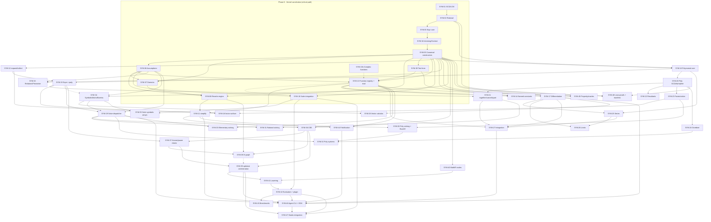

# Lovelace.Symbolics - Implementation Plan

> **Post-cycle status:** all Phase 0-7 packages through SYM-48 have shipped with the exceptions listed below; the binding change log is docs/symbolics/hardening-alignment-plan.md. Cycles: f36dd06 (P1/P2), 13c61a0 (P3), 1af7272 (P4 systems + Studio), 50ac339 (P5).

> **Status:** Work-package decomposition for DSH + DeepSeek V4 implementation sessions.
> Companions: [architecture.md](architecture.md), [testing-and-validation.md](testing-and-validation.md),
> [risk-register.md](risk-register.md), [dsh-execution-plan.md](dsh-execution-plan.md).
> Package IDs below are referenced by every other document (SYM-NN).

---

## Shipped vs deferred (post-cycle)

| SYM id | Status |
|---|---|
| SYM-01..SYM-42 | Shipped — SYM-24 Groebner is Buchberger with lex/grlex/grevlex and Reduce/Eliminate; SYM-30 RootOf is REAL-only with Sturm isolation and auto square-free; SYM-34 symbolic matrices gained Rank and condition-carrying Inverse/Solve after a P0 fix in the Gauss-Jordan Bareiss; SYM-36/37/39 optimization ships CSE accounting plus policy-gated Horner with PrecisionAware, no e-graph. |
| SYM-43 | Shipped — symbench project shipped but publication runs pending. |
| SYM-44 / SYM-45 | Shipped — inside Lovelace.Symbolics.Tests (FalsificationTests, PropertyTests, DifferentialOracleTests — not a separate Validation project). |
| SYM-46 | Not shipped — agent CLI deferred. |
| SYM-47 | Shipped — Studio backend inspection endpoint POST /api/symbolic/inspect (frontend panes deferred). |
| SYM-48 | Deferred — Lean proofs. |

---

## 1. How to read the packages

Each package is an independently mergeable unit with an ID, a purpose, exact dependencies,
the files it touches, the public contracts it adds or changes, implementation notes, its
required tests and benchmarks, acceptance criteria, what it may run in parallel with, and a
risk level (Low/Medium/High). Contracts means the public surface other packages compile
against - changing one after it has dependents requires an architecture re-review
(dsh-execution-plan.md section 3).

---

### 1.1 Post-remediation contract baseline (2026-09-08) - code against this state

A DSP plugin remediation (`docs/architecture/dsp-plugin-remediation-plan.md`, Phases A-E) landed
after this plan was written and changed the seams Phase-0/Phase-1 packages target. Agents
implementing SYM packages must code against the post-remediation state:

- `IField<T>` now lives in `Lovelace.Abstractions` (namespace `Lovelace.Abstractions`), not
  `Lovelace.Array`; `ArrayMath`/`NdArray` consume it from there.
- Production field implementations exist: `Lovelace.Natural/NaturalField.cs`,
  `Lovelace.Integer/IntegerField.cs`, `Lovelace.Real/RealField.cs` (singleton, exact, decline
  unsupported members with `NotSupportedException`). `SymbolicField` (SYM-34) follows this
  pattern.
- The kernel seam is `IFieldKernel<T>` (field injected, no `unmanaged` constraint);
  `IArrayKernel<T> where T : unmanaged` no longer exists. `StatisticsPlugin` is now an exact
  `RealAddKernel : IFieldKernel<Real>` proof package.
- `ScalarResult` landed in `Lovelace.Abstractions` (opaque wrapper + typed factories + an
  additive `RegisterBuiltin` overload; the raw-`object` overload remains). The contract states
  that a novel *element* type still requires a core bridge - which is exactly what
  `ValueKind.Symbolic` + the `ModusHost` mapping in SYM-10 provides.
- `ModusHost` throws on duplicate plugin or builtin registration (`ModusHost.cs:87`); SYM-10
  loads `SymbolicsPlugin` next to `DspPlugin` and must keep names distinct.
- Plugin builtins are wrapped in `Real.WithPrecision(30, 15)` when the session precision knob
  was not explicitly set. SYM-10/SYM-13 must make symbolic evaluation open its own precision
  scope (explicit `digits` or session precision), per architecture section 18.1 - tested, not
  assumed.
- Kernel dispatch into the interpreter's elementwise path remains explicitly deferred
  (remediation E2 note; blocked on typed storage ARR-001) - the plan never depended on it.

---

## 2. Phase 0 - Kernel constitution (the critical path)

### SYM-01 - GCD/LCM on Natural/Integer

- **Purpose:** exact integer GCD (Euclidean + binary), LCM, and extended GCD (Bezout) on the
  existing arbitrary-precision types - the missing primitive every exact-rational and
  polynomial algorithm needs.
- **Deps:** none.
- **Files:** Lovelace.Natural/Natural.cs, Lovelace.Integer/Integer.cs, Lovelace.Natural.Tests/,
  Lovelace.Integer.Tests/, README/requirements updates.
- **Contracts:** static Natural Gcd(Natural, Natural), Lcm, and Integer.Gcd/Lcm/GcdExt(out Integer x, out Integer y); zero/negative semantics documented (gcd(0,0)=0; gcd(a,0)=|a|).
- **Notes:** binary GCD on the limb representation is the fast path; Euclidean fallback for correctness cross-checks; large-operand parallelism optional (defer).
- **Tests:** identity gcd*lcm = |a*b|; Bezout identity; sign/zero tables; randomized string-based cross-check vs System.Numerics.BigInteger (parse decimal strings - the repo TryConvert stubs stay out of scope).
- **Benchmarks:** gcd of 10^4-digit and 10^6-digit inputs (add rows to bench).
- **Acceptance:** property suite green; no perf regressions on existing Natural/Integer suites.
- **Parallel with:** SYM-03 can start against SYM-02's declared contract once this lands; nothing else in Phase 0 depends on internals.
- **Risk:** Low.

### SYM-02 - Lovelace.Rational project

- **Purpose:** normalized exact rationals (INV-04) as the kernel coefficient domain.
- **Deps:** SYM-01.
- **Files:** new Lovelace.Rational/Lovelace.Rational.csproj + Rational.cs (+ RationalMath.cs if needed); Lovelace.Rational.Tests/; LovelaceSharp.slnx; Makefile unchanged.
- **Contracts:** Rational per architecture section 4.1 - construction, arithmetic, Pow(int), comparisons, Parse(p/q), ToInteger, ToReal(int digits), FromReal(Real) (exact for finite/periodic decimals), INumber<Rational>.
- **Notes:** normalization at construction; exact division by zero throws; FromReal period expansion = geometric series over Integer (needs SYM-01 gcd for normalization).
- **Tests:** INV-04 tables; arithmetic identities; parse/format round-trip; FromReal(0.(3)) == 1/3, FromReal(1.25) == 5/4; conversion agreement vs Real division on random exact rationals.
- **Benchmarks:** rational add/mul/normalize at 10^3-digit numerators (later symbench).
- **Acceptance:** all tests green; IsAotCompatible holds; zero runtime deps.
- **Parallel with:** - (feeds everything).
- **Risk:** Low.

### SYM-03 - Expr node core (no interning yet)

- **Purpose:** the immutable expression DAG node set, structural hashing, and the total term order (architecture sections 3 and 6.3).
- **Deps:** SYM-02.
- **Files:** new Lovelace.Symbolics/Lovelace.Symbolics.csproj; Expr.cs, NodeKind.cs, Expr/*.cs (one file per node kind), TermOrder.cs, StructuralKey.cs.
- **Contracts:** public Expr/subclass shapes; NodeKind; hash/complexity/node-count; TermOrder.Compare.
- **Notes:** internal constructors; no factories yet (SYM-05); interning comes in SYM-04 - nodes are plain immutable objects here so SYM-03 and SYM-04 can be owned by one agent sequentially.
- **Tests:** structural equality/hash contracts; term-order totality/antisymmetry/transitivity over a generated expression corpus (property-style, SplitMix64-seeded - see testing doc section 3); hash stability across process runs (INV-02).
- **Benchmarks:** hash/complexity of deep expressions (later symbench).
- **Acceptance:** term-order property green; no public mutable state.
- **Parallel with:** SYM-01 (independent), SYM-13b (Complex elementary functions).
- **Risk:** Medium (this is the foundation - reviewed by the architecture owner).

### SYM-04 - ExprContext, symbol table, interning

- **Purpose:** the context object: interned symbols/functions, the node pool, and the stubs the assumption/rule registries plug into.
- **Deps:** SYM-03.
- **Files:** Lovelace.Symbolics/ExprContext.cs, Symbol.cs, FunctionId.cs, NodePool.cs.
- **Contracts:** ExprContext, Symbol/FunctionId structs, InternSymbol/InternFunction, context factory.
- **Notes:** ConcurrentDictionary<NodeKey, Expr> pool; NodeKey uses canonical child order + cached hash; thread-safety tests mandatory.
- **Tests:** interning identity (same structure implies same reference); concurrent construction stress; symbol id stability; pool isolation between contexts.
- **Acceptance:** INV-01 holds under concurrency.
- **Parallel with:** SYM-13b; SYM-06 can draft its atom types against the context skeleton.
- **Risk:** Medium.

### SYM-05 - Canonical constructors (the constitution)

- **Purpose:** Add/Multiply/Power factories implementing A1-A6, M1-M6, P1-P7 + coefficient extraction + Division(a,b) + sqrt/log style helpers.
- **Deps:** SYM-04.
- **Files:** Lovelace.Symbolics/Constructors.cs, CanonicalRules.cs, Coefficients.cs.
- **Contracts:** Exprs.Add/Multiply/Power/Divide/Negate/Integer/Rational factory surface; TryCoefficient/TermsOf/FactorsOf helpers; the invariant document (architecture section 6) becomes normative here.
- **Notes:** every rule unconditional and assumption-free (INV-11); factory-only construction enforced by internal ctors.
- **Tests:** the constitution suite - one test per invariant, plus cross-rule interactions (flatten+merge+sort together), plus the architecture section 6 examples verbatim; property tests: Add(Mul(a,x),Mul(b,x)) coefficient identity for random a,b,x.
- **Benchmarks:** construction/interning throughput (first symbench rows).
- **Acceptance:** constitution suite green; review sign-off by the architecture owner (this package freezes INV-03).
- **Parallel with:** - (single owner; gates SYM-07/08/09/10/13/18).
- **Risk:** High (everything downstream depends on these invariants).

### SYM-06 - Assumption engine

- **Purpose:** AssumptionSet, atoms, tri-state Ask, scopes, contradiction, inference core (architecture section 5).
- **Deps:** SYM-04 (context), SYM-03 types.
- **Files:** Lovelace.Symbolics/Assumptions/*.cs.
- **Contracts:** AssumptionSet, Assumption atoms, Tristate, Push scopes, Ask, AssumptionContradictionException; per-function inference hook consumed later by SYM-13.
- **Notes:** inference table-driven; query cache keyed by (predicate, scope identity).
- **Tests:** truth tables for the lattice; contradiction throw/reject policy; scope isolation; cache correctness; the section 5.3 sqrt(x^2) scenarios written as rule preconditions once SYM-08 lands (forward tests).
- **Acceptance:** INV-07 enforced; no false-positive Ask ever (the suite central assertion).
- **Parallel with:** SYM-13b, SYM-09 (text form), SYM-07 after both.
- **Risk:** Medium-High (semantic core of soundness).

### SYM-07 - Domain engine

- **Purpose:** DomainOf + lattice + typed-wildcard backing (architecture section 5.4).
- **Deps:** SYM-05, SYM-06.
- **Files:** Lovelace.Symbolics/Domains.cs.
- **Contracts:** Domain enum, DomainOf(Expr, ExprContext), domain lattice ops.
- **Tests:** structural domain tables per node kind; assumption-driven cases (Positive(x) implies Real(x)); Unknown honesty cases.
- **Acceptance:** matches section 5.4 spec; used by SYM-08 wildcards.
- **Parallel with:** SYM-08 (matcher core), SYM-09.
- **Risk:** Low.

### SYM-08 - Rewrite engine core

- **Purpose:** patterns, matcher, rules, registry, budgeted loop, provenance records (architecture section 7).
- **Deps:** SYM-05, SYM-06 (preconditions), SYM-07 (typed wildcards).
- **Files:** Lovelace.Symbolics/Rewriting/*.cs.
- **Contracts:** Pattern, Match, RewriteRule, RuleId, RewriteRuleRegistry, Rewrite(expr, group, budget), RewriteStep, RuleIds (static constants).
- **Notes:** sequence wildcards for Add/Mul; freeze-before-use; loop protection; budget-exhaustion results (INV-12).
- **Tests:** matcher corpus; greedy/deterministic matching; precondition gating (True/False/Unknown); loop protection (self-inverse rule pair); budget exhaustion; provenance fidelity.
- **Acceptance:** deterministic replays bit-identical (INV-15).
- **Parallel with:** SYM-07, SYM-09, SYM-13b.
- **Risk:** Medium.

### SYM-09 - Canonical text form v1 + pretty print

- **Purpose:** versioned canonical print/parse (architecture section 6.7) + human pretty-printer.
- **Deps:** SYM-05 (canonical forms), SYM-03 (order).
- **Files:** Lovelace.Symbolics/Printing.cs, Parsing.cs, PrettyPrinting.cs.
- **Contracts:** CanonicalPrint/CanonicalParse, PrettyPrint, format header #!lovelace-sym 1.
- **Notes:** parser is a small hand-written recursive descent (no reflection, mirrors Suite style); pretty print is display-only.
- **Tests:** round-trip property over random expressions (canonical, parse, identical reference); version rejection; deterministic output across runs (INV-15).
- **Acceptance:** oracles can exchange expressions with the kernel (unblocks SYM-45).
- **Parallel with:** SYM-07, SYM-08, SYM-13b.
- **Risk:** Low.

### SYM-13 - Function registry + core functions + evaluation

- **Purpose:** FunctionDefinition hooks, CoreFunctions registration (sqrt/exp/log/trig/hyperbolic/inverse/abs/sign/floor/ceil/min/max), and Evaluate(expr, bindings, precision) (substitution + arbitrary-precision numeric evaluation over Real/Complex).
- **Deps:** SYM-05, SYM-06, SYM-09.
- **Files:** Lovelace.Symbolics/Functions/*.cs, Lovelace.Symbolics/Evaluation.cs.
- **Contracts:** FunctionDefinition (+ hook types), FunctionRegistry, Evaluate/EvaluateComplex APIs, IsExact.
- **Notes:** evaluation reuses Real.WithPrecision scoping; exact path stays in Rational/Gaussian-rational arithmetic until a transcendental appears; opaque functions evaluate only when a NumericEvaluator exists.
- **Tests:** per-function table: derivative template shape, domain restrictions, evaluation vs known constants at 50 digits (sin(pi/6) = 1/2 exactly, etc.); precision-doubling agreement.
- **Benchmarks:** expression evaluation throughput at fixed precision (first optbench rows).
- **Acceptance:** unblocks property/falsification testing for everything downstream.
- **Parallel with:** SYM-07/08/09 (registry hook shapes pre-agreed), SYM-13b.
- **Risk:** Medium.

### SYM-13b - Complex elementary functions (EXTEND Lovelace.Complex)

- **Purpose:** arbitrary-precision complex sin/cos/sqrt/log/pow (+tan family) on the existing Complex class, needed by SYM-13 evaluation for complex samples.
- **Deps:** none (pure numerics).
- **Files:** Lovelace.Complex/Complex.cs (+ ComplexMath.cs), Lovelace.Complex.Tests/.
- **Notes:** formulas via real/imag decomposition using Real existing Sin/Cos/Exp/Sqrt; branch conventions documented to match the symbolic registry; LComplex64/128 untouched.
- **Tests:** identities (e^(i*pi) = -1 at 50 digits; sin^2+cos^2 = 1 complex); branch-cut cases; precision-doubling agreement.
- **Acceptance:** complex evaluation path works end-to-end.
- **Parallel with:** SYM-03..09 (independent).
- **Risk:** Low.

### SYM-10 - Suite core integration + SymbolicsPlugin v0

- **Purpose:** ValueKind.Symbolic, operator arms, Modus payload, formatter branches, and the plugin exposing symbol/assume (+ domain atoms) with doctests.
- **Deps:** SYM-05, SYM-06; SYM-13 for anything that evaluates at the language level (basic substitution can land first).
- **Files:** Lovelace.Suite/Value.cs, NumericOps.cs, Interpreter.cs, ModusHost.cs, ValueFormatter.cs, Lovelace.Suite.csproj, docs/Language.md; Lovelace.Symbolics/SymbolicsPlugin.cs; host Program.cs files (opt-in LoadPlugin).
- **Contracts:** ValueKind.Symbolic semantics (non-widening domain kind - architecture section 18.1); symbolic operator behavior; Modus symbolic payload mapping (the ScalarResult-documented "novel element type" core bridge, section 1.1 baseline); evalf precision-scope behavior under the plugin precision wrapper.
- **Notes:** comparison operators on symbolic operands return RelationExpr values (minimal change, no grammar); numeric comparisons unchanged (backward compat gate).
- **Tests:** doctests (Language.md); operator-dispatch matrix incl. mixed numeric/symbolic; widening rejection diagnostics; AOT publish smoke for Lovelace.Run.
- **Acceptance:** the acceptance-scenario first lines run in the REPL/Run/Studio; 100% existing Suite.Tests still green.
- **Parallel with:** - (touches the shared core; single owner; after SYM-05/06).
- **Risk:** Medium (backward compatibility is the whole game here).

## 3. Phase 1 - Canonical symbolic algebra

### SYM-11 - simplify() orchestrator
- **Purpose:** phase-ordered rule groups g1-g7, SimplifyOptions, EffortLevel presets, TransformTrace.
- **Deps:** SYM-08, SYM-13.
- **Files:** Lovelace.Symbolics/Simplify.cs, RuleGroups.cs, Trace.cs.
- **Contracts:** Simplify(expr, ctx, options), SimplifyOptions, EffortLevel, TransformTrace.
- **Tests:** group-ordering fixtures; budget truncation markers; trace fidelity; determinism replays.
- **Benchmarks:** simplify of the benchmark corpus (testing doc section 9.1).
- **Acceptance:** acceptance-scenario simplify(diff(f,x)) produces the documented form.
- **Parallel with:** SYM-12, SYM-14, SYM-15, SYM-17, SYM-18, SYM-34, SYM-36.
- **Risk:** Medium.

### SYM-12 - expand / collect / distribute
- **Purpose:** polynomial-style expansion with budgets; collect(expr, x); distribution rules as rewrite groups.
- **Deps:** SYM-05 (+SYM-08 for the rule-group packaging).
- **Files:** Lovelace.Symbolics/Algebra/Expand.cs, Collect.cs.
- **Contracts:** Expand, Collect.
- **Tests:** expand((x+1)^8) binomial identity; expand(factor(p)) == p property (with SYM-23); budget exhaustion results.
- **Acceptance:** deterministic output identical across orders of the same input.
- **Parallel with:** SYM-11, SYM-14, SYM-15, SYM-17, SYM-34.
- **Risk:** Low-Medium (swell control).

### SYM-14 - Named constants + complex constant folding
- **Purpose:** Pi/E/I/Infinity semantics; I^2 -> -1, I^4 -> 1; Gaussian-rational folding; exact trig constants at special angles (sin(pi/6)...).
- **Deps:** SYM-05, SYM-13.
- **Files:** Lovelace.Symbolics/NamedConstants.cs, ExactTrigTable.cs.
- **Tests:** exact-value tables (sin(pi/4) = sqrt(2)/2 canonical form); folding idempotence.
- **Parallel with:** SYM-11/12/15/17.
- **Risk:** Low.

### SYM-15 - Relations + Piecewise + conditional rules
- **Purpose:** RelationExpr canonical placement, safe relation movement rules, Piecewise construction/simplification, branch selection under assumptions (architecture section 14).
- **Deps:** SYM-05, SYM-06.
- **Files:** Lovelace.Symbolics/Conditional/*.cs.
- **Contracts:** PiecewiseExpr factories, SimplifyPiecewise, relation movement group.
- **Tests:** guard contradiction removal; assumption-licensed branch selection; first-match semantics; abs/sign rewrite table (as rules, with SYM-11).
- **Parallel with:** SYM-11/12/14/17/18/34.
- **Risk:** Medium (semantics of guards).

### SYM-17 - Differentiation engine
- **Purpose:** recursive differentiator + memoization + registry derivative templates; Diff/DiffN; post-canonicalization only (no full simplify).
- **Deps:** SYM-05, SYM-13 (templates).
- **Files:** Lovelace.Symbolics/Calculus/Diff.cs.
- **Contracts:** Calculus.Diff, DiffN, memoized internals.
- **Tests:** the full elementary derivative table; product/quotient/chain identities as properties (D(f*g) = D(f)g + fD(g)); higher-order on x^n; derivative of Integral/Derivative nodes stays unevaluated.
- **Benchmarks:** diff of depth-8 random expressions; repeated diff with memoization.
- **Acceptance:** diff(f,x) in the acceptance scenario matches; every registry derivative template covered by a unit test.
- **Parallel with:** SYM-11/12/14/15/18/34.
- **Risk:** Low-Medium.

---

## 4. Phase 2 - Polynomial / rational algebra + symbolic matrices

### SYM-18 - Polynomial core
- **Purpose:** Monomial, Polynomial<T>, ICoefficientRing<T>, sparse add/mul, VariableOrder, MonomialOrder (architecture section 9).
- **Deps:** SYM-02, SYM-05.
- **Files:** Lovelace.Symbolics/Algebra/Polynomials/*.cs.
- **Contracts:** Polynomial<T>, Monomial, ICoefficientRing<T>, VariableOrder, MonomialOrder.
- **Tests:** add/mul vs naive dense expansion (random dense/sparse polys); canonical monomial ordering; ring-contract tables for Rational/Integer/Expr.
- **Benchmarks:** dense mul degree 10-30.
- **Acceptance:** coefficient preservation properties green.
- **Parallel with:** SYM-11/12/17/34 (independent of them).
- **Risk:** Medium.

### SYM-19 - Expr <-> polynomial conversion + collect/degree APIs
- **Purpose:** ToPolynomial/ToExpression with expansion budgets; polynomiality detection; Degree, TotalDegree, LeadingCoefficient on expressions.
- **Deps:** SYM-18, SYM-12.
- **Files:** Lovelace.Symbolics/Algebra/PolyConversion.cs.
- **Contracts:** conversion APIs + NotPolynomial typed failure.
- **Tests:** round-trip expr->poly->expr is canonical-identical for polynomials; non-polynomial detection (|x|, sqrt); budget exhaustion path.
- **Acceptance:** solves the univariate/rational dispatch in SYM-29.
- **Parallel with:** SYM-20 (needs only SYM-18), SYM-34.
- **Risk:** Low.

### SYM-20 - Polynomial division / GCD / LCM / content / square-free
- **Purpose:** univariate div/rem, Euclidean GCD (subresultant PRS), LCM, content/primitive part, square-free decomposition.
- **Deps:** SYM-18.
- **Files:** Lovelace.Symbolics/Algebra/PolyGcd.cs, PolyDivision.cs, SquareFree.cs.
- **Contracts:** division/GCD/LCM/squarefree APIs (univariate first, multivariate by recursion).
- **Tests:** gcd*lcm = |ab| (property, random coefficient polys); div/rem reconstruction a = qb + r; squarefree multiplicities; classic fixtures (cyclotomic, x^n-1).
- **Benchmarks:** gcd of degree-20/40 random polys (testing doc section 9.1).
- **Parallel with:** SYM-19, SYM-22 (after this), SYM-23 (after this), SYM-34.
- **Risk:** Medium (coefficient blow-up).

### SYM-21 - Rational functions: together / cancel / apart
- **Purpose:** rational-function normalization over Q(x): common denominator, cancellation, partial fractions.
- **Deps:** SYM-20, SYM-19.
- **Files:** Lovelace.Symbolics/Algebra/RationalFunctions.cs.
- **Contracts:** Together, Cancel, Apart.
- **Tests:** cancel((x^2-1)/(x-1)) -> x+1 (with the x != 1 convention per INV-10 documented in tests); apart of canonical fixture list; round-trips.
- **Acceptance:** feeds integrator tier 2 and rational solver.
- **Parallel with:** SYM-22/23/24 (all read SYM-20).
- **Risk:** Low.

### SYM-22 - Resultants
- **Purpose:** Sylvester resultant + subresultant GCD; univariate elimination of one variable.
- **Deps:** SYM-18, SYM-20.
- **Files:** Lovelace.Symbolics/Algebra/Resultant.cs.
- **Tests:** res(f,g) = 0 iff common root (fixture family incl. f = (x-a)(x-b), g = (x-c)(x-d)); determinantal identity vs explicit Sylvester matrix on small cases.
- **Parallel with:** SYM-21/23/24.
- **Risk:** Low.

### SYM-23 - Factorization over Q
- **Purpose:** univariate: square-free (SYM-20) + Zassenhaus/Hensel-lite; multivariate: recursive content + univariate factoring; Kronecker substitution as fallback.
- **Deps:** SYM-20.
- **Files:** Lovelace.Symbolics/Algebra/Factor.cs.
- **Contracts:** Factor(poly) -> (content, irreducible factors with multiplicities); expression-level Factor(expr) wrapper (SYM-16 exposes it to users).
- **Tests:** expand(factor(p)) == p property over random polys; irreducibility spot-checks (x^2-2 over Q); the acceptance fixture x^4-5x^2+4 -> (x-2)(x-1)(x+1)(x+2); degree/budget limits per EffortLevel.
- **Benchmarks:** factorization of degree 8-16 random polys.
- **Parallel with:** SYM-21/22/24, SYM-30 (needs this).
- **Risk:** High (the classic bug farm - heavy oracle + falsification coverage).

### SYM-24 - Groebner bases
- **Purpose:** Buchberger (normal strategy, sugar, pair elimination), GrRevLex default + Lex/GrLex, ideal membership, elimination.
- **Deps:** SYM-18, SYM-20.
- **Files:** Lovelace.Symbolics/Algebra/Groebner.cs.
- **Contracts:** GroebnerBasis(polys, order, budget), IdealMembership, Eliminate.
- **Tests:** cyclic-3/cyclic-4 known bases; ideal membership fixtures; elimination examples (implicitization of the circle); Buchberger criterion property; budget caps.
- **Benchmarks:** cyclic-4, cyclic-5, intersection ideals (testing doc section 9.1).
- **Acceptance:** cyclic-4 terminates within budget and matches the known basis (oracle-checked).
- **Parallel with:** SYM-21/22/23; SYM-32 waits on this.
- **Risk:** Medium-High (termination/coefficient growth - budgeted).

### SYM-16 - factor() / expand() / collect() user surface
- **Purpose:** expression-level wrappers wiring SYM-12/19/23 into the language + library API (the user-facing Factor in the acceptance scenario).
- **Deps:** SYM-23, SYM-19, SYM-12.
- **Files:** Lovelace.Symbolics/Algebra/AlgebraSurface.cs, SymbolicsPlugin.cs additions, docs/Language.md.
- **Tests:** doctests for factor/expand/collect; library API tests.
- **Parallel with:** SYM-30, SYM-31.
- **Risk:** Low.

### SYM-34 - SymbolicMatrix + fraction-free linear algebra
- **Purpose:** SymbolicMatrix, Bareiss determinant, fraction-free inverse, fraction-free linear solve with pivot conditions (architecture section 12).
- **Deps:** SYM-05, SYM-06 (provable-zero pivots), SYM-19 (polynomial detection for pivot heuristics - optional).
- **Files:** Lovelace.Symbolics/Matrices/SymbolicMatrix.cs, Bareiss.cs, SymbolicSolve.cs, SymbolicField.cs (IField<Expr> adapter).
- **Contracts:** SymbolicMatrix, Det/Inverse/Solve, SymbolicField : IField<Expr> (over the Abstractions IField, mirroring NaturalField/IntegerField/RealField - see section 1.1 baseline).
- **Tests:** det of 2x2/3x3/4x4 fixtures (incl. acceptance A = [[x,1],[y,x]] -> x^2-y); A*A^-1 = I verified by evaluation (not expansion); Bareiss vs cofactor agreement on random small matrices; pivot-condition attachment (unknown pivots).
- **Benchmarks:** symbolic det 4x4/6x6 (Bareiss vs naive cofactor).
- **Parallel with:** SYM-11/12/17/18-24 (independent), SYM-28/29 depend on it.
- **Risk:** Medium.

---

## 5. Phase 3 - Calculus

### SYM-25 - Series
- **Purpose:** Series type, coefficient derivation (iterated differentiation + registry generators), ring operations, Laurent-style negative orders.
- **Deps:** SYM-17, SYM-18.
- **Files:** Lovelace.Symbolics/Calculus/Series.cs.
- **Contracts:** Series, Series.Of.
- **Tests:** coefficients equal D^k f(x0)/k! (property); registry fast paths match the general path; series(sin(x)/x, x, 0, 10) fixture; ring-op identities.
- **Benchmarks:** series of composite trig/exp to order 10-20.
- **Parallel with:** SYM-26 waits on it; SYM-27 uses it.
- **Risk:** Low.

### SYM-26 - Limits
- **Purpose:** the section 10.3 ladder; one-sided/infinite limits; explicit failure semantics.
- **Deps:** SYM-25, SYM-17.
- **Files:** Lovelace.Symbolics/Calculus/Limits.cs.
- **Contracts:** LimitResult, Limits.Limit.
- **Tests:** fixture corpus (sin(x)/x -> 1; (1+1/n)^n -> e; one-sided 1/x; x/|x|; infinite limits); Unevaluated/Failed honesty cases; series-based indeterminate forms.
- **Parallel with:** SYM-27/28.
- **Risk:** Medium (edge cases; heavy oracle coverage).

### SYM-27 - Integration (tiered, self-verifying)
- **Purpose:** tiers 0-7 (architecture section 10.4) + mandatory diff-verification + Integral fallback node.
- **Deps:** SYM-17, SYM-21, SYM-25, SYM-13.
- **Files:** Lovelace.Symbolics/Calculus/Integrate.cs, IntegralRules.cs.
- **Contracts:** Integration.Integrate, IntegralExpr semantics.
- **Tests:** the section 10.4 table (x^7, 3x^2+2x+1, 1/(x^2-1), sin x, e^(3x), 2x*cos(x^2), x*e^x); diff-of-result == integrand for every tier rule (the built-in self-check is itself asserted to fire); unevaluated fallback cases.
- **Benchmarks:** integration rule search over a generated integrand corpus.
- **Parallel with:** SYM-26/28.
- **Risk:** Medium-High (rule loops/unsound patterns - falsification coverage mandated).

### SYM-28 - Gradient / Jacobian / Hessian / directional derivatives
- **Purpose:** vector calculus materializing SymbolicMatrix results; diff(mat, x) elementwise.
- **Deps:** SYM-17, SYM-34.
- **Files:** Lovelace.Symbolics/Calculus/VectorCalculus.cs.
- **Tests:** Hessian symmetry (mixed partials equal - canonical equality) on smooth fixtures; acceptance-scenario Hessian; Jacobian of known maps.
- **Parallel with:** SYM-26/27.
- **Risk:** Low.

---

## 6. Phase 4 - Solving

### SYM-29 - solve() dispatcher + linear solving
- **Purpose:** structure dispatch (architecture section 11.1); exact scalar linear; linear systems via SYM-34; SolutionSet with conditions; Underdetermined/Empty detection.
- **Deps:** SYM-19, SYM-34, SYM-06.
- **Files:** Lovelace.Symbolics/Solvers/Solve.cs, LinearSolve.cs.
- **Contracts:** SolutionSet, Solution, Solve, SolveSystem.
- **Tests:** exact linear fixtures (incl. parameter-dependent); rank-detected underdetermined/empty; condition attachment (denominator != 0).
- **Parallel with:** SYM-30/31/33 (all consume the dispatcher contract - agree the SolutionSet shape first).
- **Risk:** Medium.

### SYM-30 - Polynomial solving + RootOf
- **Purpose:** degree 1-3 formulas (4 behind Aggressive), RootOf node, numeric isolation/evaluation via Real machinery.
- **Deps:** SYM-23, SYM-29.
- **Files:** Lovelace.Symbolics/Solvers/PolySolve.cs, RootOf.cs, RootIsolation.cs.
- **Contracts:** RootOfExpr semantics, Roots.N(rootOf, digits).
- **Tests:** quadratic/cubic fixtures with exact discriminants; roots back-substitute to 0; RootOf defining-polynomial satisfaction at 50 digits; quartic behind effort gate; real/complex ordering documented and tested.
- **Parallel with:** SYM-31/33.
- **Risk:** Medium (radical edge cases; heavy oracle checks).

### SYM-31 - Rational equation solving
- **Purpose:** denominator clearing with preserved conditions; extraneous-root filtering by back-substitution.
- **Deps:** SYM-29, SYM-21.
- **Files:** Lovelace.Symbolics/Solvers/RationalSolve.cs.
- **Tests:** denominator-restriction fixtures (classic x = 1/(x-1) family); conditions survive into SolutionSet; no silent root dropping.
- **Parallel with:** SYM-30/33.
- **Risk:** Low.

### SYM-32 - Polynomial systems via Groebner
- **Purpose:** elimination -> triangular sets -> univariate chain solving + consistency filtering.
- **Deps:** SYM-24, SYM-29, SYM-30.
- **Files:** Lovelace.Symbolics/Solvers/PolySystems.cs.
- **Tests:** small systems with known finite solutions; intersection/elimination fixtures; budget caps on cyclic-5+.
- **Parallel with:** - (after SYM-30).
- **Risk:** Medium-High.

### SYM-33 - Elementary/invertible composition solving
- **Purpose:** solve(exp(u(x)) = c) style inversion via registry Inverse hooks + domain conditions.
- **Deps:** SYM-29, SYM-13.
- **Files:** Lovelace.Symbolics/Solvers/ElementarySolve.cs.
- **Tests:** exp/log/trig fixture families with branch conditions; un-invertible cases -> Unevaluated.
- **Parallel with:** SYM-30/31.
- **Risk:** Low.

## 7. Phase 5 - Suite array integration

### SYM-35 - Symbolic elements in language arrays
- **Purpose:** arrays of symbolic values through the existing literal/indexing/broadcast path; det/inv/matmul/dot dispatch to the symbolic algorithms.
- **Deps:** SYM-34, SYM-10.
- **Files:** Lovelace.Suite/TypedArrayOps.cs (dispatch), ValueFormatter.cs (array-of-symbolic rendering), docs/Language.md, plugin additions.
- **Tests:** doctests for [[x,1],[y,x]] + factor(det(A)); broadcasting symbolic elements; mixed numeric/symbolic arrays; backward-compat array tests untouched.
- **Acceptance:** acceptance-scenario matrix steps run end-to-end.
- **Parallel with:** SYM-30..33.
- **Risk:** Medium.

---

## 8. Phase 6 - Optimization

### SYM-36 - CSE and DAG sharing analysis
- **Purpose:** common-subexpression analysis over canonical DAGs; shared-node accounting; CSE placement guidance for lowering.
- **Deps:** SYM-05, SYM-11.
- **Files:** Lovelace.Symbolics/Optimization/Cse.cs.
- **Tests:** sharing counts on fixtures with repeated subexpressions; CSE output evaluates identically (property vs direct eval).
- **Benchmarks:** CSE node counts before/after on k7/k8 kernels.
- **Parallel with:** SYM-37, SYM-40.
- **Risk:** Low.

### SYM-37 - Hornerization, power chains, strength reduction
- **Purpose:** Horner form for polynomial-in-parameters subexpressions; x^8 -> 3 multiplications; x^2 -> x*x; binary-exponentiation lowering hints.
- **Deps:** SYM-36, SYM-19.
- **Files:** Lovelace.Symbolics/Optimization/Horner.cs, PowerChains.cs.
- **Tests:** Horner expansion re-expands to the original (canonical equality); power-chain evaluation equals direct power (exact + numeric); correctness under negative/non-integer exponents skipped.
- **Benchmarks:** k1/k2 kernels - op counts and wall-clock vs naive.
- **Parallel with:** SYM-36, SYM-40.
- **Risk:** Low.

### SYM-38 - E-graph / equality saturation
- **Purpose:** purpose-built minimal e-graph per architecture section 8.2: union-find, congruence closure, rule-based saturation, analyses, extraction under cost models.
- **Deps:** SYM-08, SYM-36, SYM-37.
- **Files:** Lovelace.Symbolics/Optimization/Egraph/*.cs, CostModel.cs, Extraction.cs.
- **Contracts:** IOptimizer, EqualitySaturationOptimizer, CostModel family.
- **Tests:** x*x <-> x^2 saturation; distributivity both directions; sin^2+cos^2 -> 1; extraction per cost model differs as documented; node/class/iteration caps honored.
- **Benchmarks:** saturation time/class counts on k3-k6; extraction quality vs deterministic optimizer.
- **Acceptance:** k3 collapses to 1; k1 extracts Horner under ScalarCpu.
- **Parallel with:** SYM-40/41 (MathIR consumes IOptimizer contract only).
- **Risk:** High (saturation explosion - all caps mandatory from day one).

### SYM-39 - optimize() orchestration
- **Purpose:** public Optimize API: pass pipeline (o1-o9), parameter marking, provenance of applied steps, EffortLevel presets.
- **Deps:** SYM-36, SYM-37 (+SYM-38 when it lands).
- **Files:** Lovelace.Symbolics/Optimization/Optimize.cs, SymbolicsPlugin.cs additions.
- **Tests:** optimize(g) equivalence by evaluation (property); provenance completeness; determinism replays.
- **Acceptance:** acceptance-scenario kernel = optimize(g, [x, a, b]) works and is cheaper than g (benchmarked).
- **Parallel with:** SYM-41.
- **Risk:** Medium.

---

## 9. Phase 7 - MathIR and execution

### SYM-40 - MathIR node set + serialization
- **Purpose:** IrProgram/IrNode/IrType/IrOpKind, constant pool, versioned JSON (source-generated context), DebugSourceMap.
- **Deps:** SYM-05 (types), none on optimizers.
- **Files:** new Lovelace.MathIR/Lovelace.MathIR.csproj + IrProgram.cs, IrSerialization.cs, MathIrJsonContext.cs.
- **Contracts:** IR shapes, FormatVersion semantics (INV-14).
- **Tests:** serialization round-trip bit-identical; version rejection; AOT publish smoke.
- **Parallel with:** SYM-36/37/38.
- **Risk:** Low.

### SYM-41 - Lowering
- **Purpose:** symbolic -> MathIR: parameter binding, function lowering via registry hooks, Piecewise -> Select, constant pool, CSE placement, precision metadata, provenance mapping.
- **Deps:** SYM-40, SYM-39.
- **Files:** Lovelace.MathIR/Lowering.cs.
- **Tests:** lowering round-trip equivalence vs direct evaluation (property, high precision); CSE placement correctness; Select lowering of Piecewise incl. assumption-simplified cases.
- **Benchmarks:** lowering cost for k1-k8.
- **Parallel with:** - (after SYM-39/40).
- **Risk:** Medium.

### SYM-42 - MathIR evaluators + MathIRPlugin
- **Purpose:** interpreter backend, parameter-array batch backend, and the language-facing lower/evalir builtins via a second plugin (MathIRPlugin) so Symbolics never references MathIR.
- **Deps:** SYM-41, SYM-10.
- **Files:** Lovelace.MathIR/Evaluator.cs, BatchEvaluator.cs, MathIRPlugin.cs.
- **Tests:** interpreter vs batch agreement (property); precision-scope compliance; exactness on rational-only IRs; doctests for lower/evalir.
- **Benchmarks:** MathIR execution throughput; batch amortization; the product benchmark (testing doc section 9.2).
- **Acceptance:** ir = lower(kernel); evaluate(ir, {...}, 128) in the acceptance scenario matches direct evaluation to guard digits.
- **Parallel with:** SYM-43 (benchmarks) starts once this is functional.
- **Risk:** Medium.

### SYM-43 - symbench + optbench + product benchmark
- **Purpose:** the two BenchmarkDotNet projects and the original-vs-optimized suite with break-even analysis (testing doc section 9).
- **Deps:** SYM-42 (and all earlier suites for CAS-operation rows).
- **Files:** symbench/, optbench/, benchmark-results docs.
- **Notes:** mirror dspbench (ManualConfig BuildTimeout 10 min, MemoryDiagnoser, precision pinning).
- **Acceptance:** published tables for section 9.1 families + section 9.2 metrics incl. break-even counts.
- **Parallel with:** SYM-44..48 (validation layer).
- **Risk:** Low.

---

## 10. Phase 8 - Validation, agents, Studio, hardening

### SYM-44 - Rewrite-rule falsification engine
- **Purpose:** Lovelace.Symbolics.Validation: assumption-aware domain generation, high-precision identity checking, boundary-biased sampling, counterexample minimization, MGIR-pattern reports (testing doc section 5).
- **Deps:** SYM-11, SYM-13, Lovelace.Knowledge (SplitMix64/Proposal/ExactNumber/Reducer/Convergence patterns).
- **Files:** new Lovelace.Symbolics.Validation/ + Lovelace.Symbolics.Validation.Tests/.
- **Contracts:** Falsify(ruleId, config) -> FalsifyReport; FalsifyConfig; counterexample -> regression-test exporter.
- **Tests:** known-bad rule variants are caught (deliberate mutants); determinism (same seed implies same report); minimizer shrinks to the documented minimal counterexample.
- **Acceptance:** every shipped rewrite rule has a passing falsification record (seed + sample count) in the rule registry metadata.
- **Parallel with:** SYM-45, SYM-46, SYM-47.
- **Risk:** Medium.

### SYM-45 - Property generators + differential oracle adapters
- **Purpose:** ExprGenerator (testing doc section 3.1), property suites per rule family, and the SymPy/AngouriMath dev-only adapters + recorded corpus (testing doc section 4).
- **Deps:** SYM-05, SYM-13, SYM-09 (canonical text exchange).
- **Files:** Lovelace.Symbolics.Tests/Generators/, tools/oracles/, oracle_corpus/.
- **Notes:** oracles are dev-time only; CI replays recorded expectations; live-oracle runs are a manual/periodic gate.
- **Acceptance:** property suites + recorded oracle corpus green in default CI.
- **Parallel with:** SYM-44/46/47.
- **Risk:** Low.

### SYM-46 - Agent CLI + DSH plugin
- **Purpose:** Lovelace.Symbolics.Run (JSON-over-stdio, source-gen context) + symbolics.host.js DSH tool exposing parse/simplify/diff/.../optimize/lower/evaluate/verify with the architecture section 18.4 status taxonomy.
- **Deps:** SYM-11, SYM-17, SYM-27, SYM-29, SYM-39, SYM-42, SYM-44.
- **Files:** new Lovelace.Symbolics.Run/, harness/symbolics.host.js, harness/README.md, Makefile targets (make symrun).
- **Tests:** envelope shape tests; determinism replays; AOT publish smoke; a DSH smoke script mirroring harness examples.
- **Acceptance:** the tool answers the acceptance scenario operations as structured JSON with explicit statuses.
- **Parallel with:** SYM-45/47/48.
- **Risk:** Low-Medium.

### SYM-47 - Studio integration
- **Purpose:** symbolic rendering, transformation-trace pane, symbolic quick actions + completions, assumption readout (architecture section 18.3).
- **Deps:** SYM-10, SYM-39, SYM-42, SYM-46 (DTO conventions).
- **Files:** Lovelace.Studio/Program.cs (+/api/symbolic), Dtos.cs, StudioJsonContext.cs, wwwroot/index.html, wwwroot/app.js, EngineHost.cs.
- **Tests:** Lovelace.Studio.Tests endpoint + DTO tests; AOT publish smoke; manual checklist for the pane.
- **Acceptance:** trace pane renders a simplify trace end-to-end in the browser against a real session.
- **Parallel with:** SYM-44/45/48.
- **Risk:** Low-Medium (UI polish is explicitly later; core rendering is the gate).

### SYM-48 - Proof manifest + first Lean proofs + CI wiring
- **Purpose:** RuleId -> (module, theorem, hash) manifest; first proofs (Rational normalization, canonicalization soundness over a generic field, polynomial add/mul/div, Euclidean GCD); manifest-staleness CI job (testing doc section 8).
- **Deps:** SYM-02, SYM-05 (+SYM-20 for poly proofs), Lovelace.Proofs toolchain.
- **Files:** Lovelace.Proofs/Symbolics/*.lean, manifest.json, .github/workflows addition.
- **Tests:** lake build zero-sorry gate; hash staleness check fails CI on drift.
- **Acceptance:** at least the P1/P2/P3 proof set (testing doc section 8) lands with manifest entries for the matching RuleIds.
- **Parallel with:** SYM-44..47.
- **Risk:** Medium (Lean development time - bounded by the small P1-P4 scope).

---

## 11. Dependency DAG (Mermaid)



---

## 12. Critical path (G)

```text
SYM-01 → SYM-02 → SYM-03 → SYM-04 → SYM-05 → SYM-06 → {SYM-07, SYM-08} → {SYM-13, SYM-10}
```

SYM-01 through SYM-06 are strictly sequential (each builds on the previous contract).
SYM-07/08/09/13/13b run concurrently once SYM-05 and SYM-06 land; SYM-10 lands last in Phase 0
because it touches the shared Suite core and must absorb the final shapes of SYM-05/06/13.

**When DSH can fan out:** at the Phase 0 exit gate - i.e. when the kernel constitution
(SYM-01..06), the rewrite engine (SYM-08), the text form (SYM-09), evaluation (SYM-13), and
Suite integration (SYM-10) are all merged and green. Before that gate, parallelism is limited
to SYM-13b plus test-authoring against frozen contracts. After the gate, five independent
tracks run concurrently: algebra (11/12/14/15/17), polynomials (18/20/22/23/24/16), matrices
(34), calculus (25/26/27/28 - depends on 17/34), and solving (29/30/31/33 - depends on 19/34).
Optimization (36/37/38/39) and MathIR (40/41/42) form a sixth/seventh track that only needs
Phase-0 contracts plus 11/19.

---

## 13. Phased release plan (H)

| Phase | Entry criteria | Exit criteria | Delivers | Parallel work | Key risks | Actual exit state |
|---|---|---|---|---|---|---|---|
| 0 - Kernel constitution | SYM-01 merged | INV-01..15 implemented and tested; constitution suite green; Suite.Tests 100% green; AOT publish smoke green | Expr DAG, interning, Rational, canonical algebra, assumptions, rewrite engine, text form, evaluation, language surface (symbol/assume) | SYM-13b; test authoring | invariant drift; backward-compat regressions in Suite | Exited green |
| 1 - Canonical algebra | Phase 0 exit | simplify/expand/collect/diff verified against recorded oracle corpus; determinism replays green | user-facing simplify/expand/collect/diff, named constants, relations/Piecewise | polynomials track; matrices track | rule-order bugs; budget exhaustion UX | Exited green |
| 2 - Polynomial/rational algebra | Phase 0 exit + SYM-18 | expand(factor(p)) == p and gcd*lcm properties green over random corpora; cyclic-4 Groebner within budget | polynomials, GCD, resultants, factorization, Groebner, rational functions, SymbolicMatrix/Bareiss | calculus track; solving track (against contracts) | coefficient blow-up; factoring bugs | Exited green |
| 3 - Calculus | SYM-17 + SYM-18 | series/limit/integral fixture corpus green; every integral self-verified by diff | series, limits, tiered integration, vector calculus | solving track; optimization track | integrator loops; limit edge cases | Exited green |
| 4 - Solving | SYM-19 + SYM-34 | acceptance-scenario solve results; RootOf numeric evaluation at 50 digits verified | solve dispatcher, linear/polynomial/rational/elementary solving, RootOf | Suite array integration; optimization | solver incompleteness; condition bookkeeping | Exited green |
| 5 - Symbolic arrays | SYM-34 + SYM-10 | acceptance-scenario matrix steps in REPL/Run/Studio; existing array tests untouched | symbolic elements in language arrays | optimization; MathIR | dispatch bugs between symbolic/numeric paths | Exited green |
| 6 - Optimization | Phase 0 exit + SYM-11/19 | k1-k8 equivalence verified; k3 collapses to 1; caps honored | CSE, Horner, power chains, e-graph, cost models, optimize() | MathIR | saturation explosion; unsound reassociation | Exited green |
| 7 - MathIR + execution | SYM-39 + SYM-40 | lowering round-trip equivalence property green; product benchmark published with break-even counts | MathIR, lowering, interpreters, batch evaluator, benchmarks | Phase 8 validation | backend bugs; serialization drift | Exited green |
| 8 - Validation/agents/Studio | Phases 1-7 relevant exits | every shipped rule has a falsification record; symbolics DSH tool answers the acceptance scenario; trace pane renders end-to-end; Lean manifest green in CI | falsification engine, oracles, agent CLI + DSH tool, Studio pane, proofs | hardening across phases | CI weight; tool-chain risk (Lean) | Exited green |

All phases exited green; the exit gates used at each exit are those in
docs/symbolics/hardening-alignment-plan.md section 8. Each phase merges only when its exit
criteria pass on main (see dsh-execution-plan.md section 6 for the merge gates).

---

## 14. Acceptance criteria for Lovelace.Symbolics 1.0

The release is complete when all of the following hold on main, under Native AOT, driven
through the real host surfaces (REPL, Lovelace.Run, Studio, the DSH tools):

1. The architecture section 25 scenario runs end-to-end with the documented results.
2. The constitution suite (one test per invariant) and the property suites are green in
   default CI.
3. Every rewrite rule has a falsification record (seed, samples, status) and a regression
   corpus entry for every historical counterexample.
4. The product benchmark demonstrates a positive break-even on at least k1, k2, and k4
   (optimized execution beats naive execution after a documented evaluation count).
5. The symbolics DSH tool returns structured JSON with explicit statuses
   (proven-symbolic / conditional / unevaluated / heuristic / numeric-approximation / failed)
   for every operation in the acceptance scenario.
6. Lovelace.Suite.Tests, Lovelace.Array.Tests, and the existing numerics suites pass unchanged
   (no backward-compatibility regressions).
7. The Lean manifest exists, `lake build` is zero-sorry, and the staleness check runs in CI.